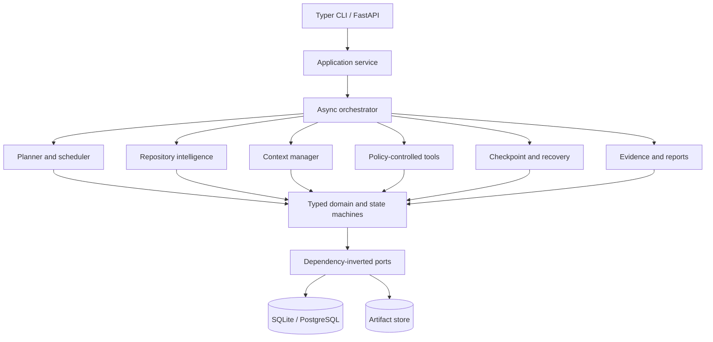

# Durable Coding and Research Agent

Durable Agent is a local-first execution platform for long-running repository work and
evidence-based research. It turns an objective into a validated task graph, records all
durable state in SQL, runs permissioned tools at safe boundaries, survives restarts, and
produces Markdown and JSON reports whose material claims cite immutable evidence IDs.

The default runtime is deterministic and offline: no paid model or network service is
needed. Provider protocols allow an LLM, embeddings, or external search to be added
without coupling those choices to the domain.



## Quick start

Python 3.12 is the production baseline. The code also supports 3.10/3.11 so the
repository can be inspected on older operator hosts.

```bash
python3.12 -m venv .venv
. .venv/bin/activate
python -m pip install --constraint requirements.lock -e '.[dev,pdf,postgres]'
alembic upgrade head
durable-agent doctor
durable-agent index tests/fixtures/sample_service
durable-agent run --objective-file examples/retry-limit-objective.md
durable-agent status RUN_ID
durable-agent report RUN_ID
```

Configuration uses `DURABLE_AGENT_` environment variables. Copy `.env.example` for
development; see [configuration](docs/configuration.md). SQLite and a restricted tool
policy are the secure defaults.

## Lifecycle examples

Pause is cooperative and occurs only between tool calls:

```bash
durable-agent run --objective "Inspect the sample service" --steps 1
durable-agent pause RUN_ID --reason "maintenance"
durable-agent resume RUN_ID
```

On restart, resume acquires a renewable lease, validates the configuration and
repository fingerprints, verifies checkpoint hashes, reconciles any persisted tool
intent, and continues only incomplete work. `durable-agent cancel RUN_ID` follows the
same safe-boundary rule and generates a partial report.

To exercise failure recovery and every lifecycle path:

```bash
python scripts/run_demo.py --workspace /tmp/durable-agent-demo
```

The script injects a retryable failure, pauses, reconstructs the service as if the
process restarted, resumes, compresses context, verifies evidence, and emits reports.

## Development and verification

```bash
make install
make lock-check
make format-check
make lint
make typecheck
make test
make coverage
make docs-check
make migration-test
python -m build
docker build .
```

Tests are split into unit, integration, end-to-end, contract, property, security,
performance, and fault-injection suites. All use deterministic fakes and offline
fixtures. Benchmark tests report measurements without asserting marketing throughput.

## Architecture and production considerations

The persistence model is an event-audit hybrid: normalized current state and explicit
versioned checkpoints are authoritative, while append-only event writes supply a causal
audit trail until controlled terminal-run retention compaction. It is intentionally not
full event sourcing. Optimistic versions,
leases, idempotency records, atomic intent/result storage, and content hashes protect
restart and concurrency semantics. Explicitly parallelizable read/research nodes execute
in bounded batches; repository mutations remain serial. PostgreSQL is recommended for
multiple workers; SQLite WAL is intended for local single-worker use.

Network retrieval and dangerous shell/write tools are disabled unless policy permits
them. Retrieved text is marked untrusted and can never grant permissions or serve as
system instructions. Production deployments should provide authentication middleware,
tenant authorization, object storage, PostgreSQL, TLS, and a secret manager.
`durable-agent cleanup` previews retention and requires `--execute` before compacting old
terminal-run events or removing old uncatalogued artifact files.

## Documentation

- [Requirements and traceability](docs/requirements.md)
- [Architecture](docs/architecture.md) and [concepts](docs/concepts.md)
- [Repository understanding](docs/repository-understanding.md)
- [Planning](docs/planning.md) and [state machines](docs/state-machine.md)
- [Checkpointing](docs/checkpointing.md), [context compression](docs/context-compression.md), and [recovery](docs/pause-resume-recovery.md)
- [Evidence and reporting](docs/evidence-and-reporting.md)
- [Data model](docs/data-model.md)
- [Security threat model](docs/security.md)
- [Tool execution and policy](docs/tools.md)
- [Testing](docs/testing.md) and [operations runbook](docs/operations.md)
- [Latest verification results](docs/verification-results.md)
- [CLI](docs/cli.md), [API](docs/api.md), and [troubleshooting](docs/troubleshooting.md)
- [Research log](docs/research-log.md) and [ADRs](docs/adr/)

## License

Apache-2.0. See [LICENSE](LICENSE).
