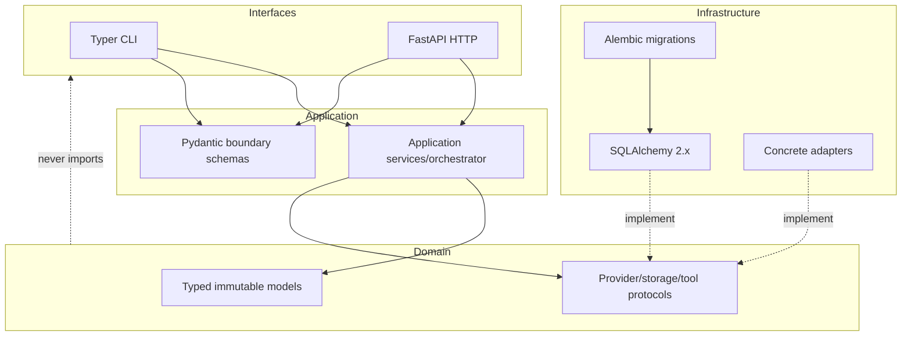
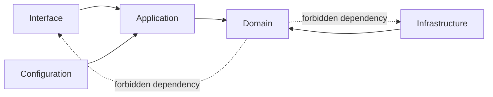

# ADR 0001: Language and framework

**Status:** Accepted

## Context

The platform needs typed async orchestration, validation, SQL persistence, a CLI, and an
HTTP API while remaining approachable to repository-tool authors.

## Decision

Use production CPython 3.12, Pydantic v2, SQLAlchemy 2.x, Alembic, Typer, and FastAPI.
Keep source syntax compatible with 3.10 for the supplied host. Domain modules cannot
import interface or infrastructure modules.

## Alternatives

Go would simplify single-binary deployment but has a weaker ecosystem for Python code
analysis. A workflow framework adds durable primitives but creates operational and vendor
coupling. Dataclasses alone require duplicated validation/schema work.

## Consequences

The stack is mature and strongly typed, but Python packaging and async database lifecycle
need explicit testing. Compatibility syntax forgoes a few Python 3.12-only conveniences.

## Decision drivers

The platform needs four properties simultaneously: rich repository/code-analysis support,
strict boundary validation, asynchronous provider/tool orchestration, and a low-friction
offline developer experience. It also needs mature relational migrations, CLI/API schema
generation, and deterministic testing without coupling the domain to web/ORM objects.

Python is already the natural language for the demonstration repository and offers
standard AST/path/subprocess/async primitives. The cost is packaging/runtime management
and the fact that type annotations are statically checked rather than runtime-enforced
unless boundary validation is explicit.

## Detailed decision

CPython 3.12 is the production/container baseline. Source remains syntax-compatible with
3.10 on the supplied managed host, but compatibility does not lower pinned dependency
metadata or the production support target. CI/release should execute 3.12; a host-only
3.10 result is disclosed as a compatibility observation.

Framework responsibilities are deliberately narrow:

| Technology | Accepted responsibility | Prohibited leakage |
|---|---|---|
| Pydantic v2 | External/config/checkpoint/provider schema validation | Domain policy cannot be replaced by shape validation |
| SQLAlchemy 2.x | Portable mappings, queries, transactions | ORM sessions/models do not enter core domain APIs |
| Alembic | Ordered reviewable schema evolution | Runtime `create_all` is not production migration |
| Typer | CLI parsing/help/exit adapter | CLI commands do not mutate ORM rows directly |
| FastAPI | HTTP schemas/routing/lifespan/OpenAPI | Request handlers do not own orchestration rules |
| `asyncio` | Concurrent I/O orchestration and cancellation boundaries | Async tasks are not durable state |

Full type annotations plus strict mypy provide design-time feedback. Pydantic validates
untrusted runtime inputs. Protocols and dependency injection keep clocks, IDs, stores,
models, embeddings, search, events, and tools replaceable.

## Dependency rule

The core domain may import the Python standard library and its own domain definitions.
The application layer depends on domain ports. Infrastructure implements ports. CLI/API
call application services. This is enforced by code organization, reviews, static checks,
and contract tests—not by a dependency-injection framework.

## Alternatives considered in depth

| Alternative | Advantages | Why not selected |
|---|---|---|
| Go | Static binary, strong concurrency/tooling | Less direct Python AST/ecosystem reuse; more schema/agent experimentation friction |
| Rust | Strong memory/resource safety and performance | Higher implementation cost for rapidly evolving provider/retrieval integrations |
| TypeScript/Node | Strong web ecosystem and shared API types | Python repository analysis/testing integration is less direct for this primary use case |
| Durable workflow service | Mature timers/retries/history | Adds required service/determinism constraints; does not solve evidence/tool policy |
| Standard dataclasses only | Minimal runtime dependency | Duplicates external validation, JSON schema, settings, and error-path work |
| Vendor agent SDK as core | Fast vendor feature adoption | Leaks model/tool semantics and prevents provider-neutral offline baseline |

These alternatives remain viable for adapters or a future worker implementation if they
preserve domain protocols and durable formats.

## Consequences and risks

Positive consequences are an approachable extension language, excellent test ecosystem,
shared schemas across CLI/API/checkpoints/providers, and mature SQL migration tooling.
Negative consequences are dependency/version coordination, GIL constraints for CPU-heavy
parsing, async resource-lifecycle complexity, and the need to sandbox arbitrary Python
tests outside the process.

CPU-bound indexing can move to isolated processes/services without changing protocols.
Multi-worker scaling uses database ownership rather than threads. Python exceptions are
classified into domain errors before retry decisions; framework exceptions cannot become
the public recovery model.

## Security and failure implications

Pydantic is validation, not sanitization or authorization. SQLAlchemy parameterization
does not make unsafe raw SQL acceptable. `asyncio` cancellation can occur between awaits,
so durable intents/checkpoints must bracket effects. Typer/FastAPI must not reflect
secrets or untrusted content in errors. Python cannot safely sandbox hostile Python code
in-process.

## Compliance, tests, and revisit triggers

Mypy strict mode, Ruff, package builds, clean-wheel imports, CLI/API integration,
migration validation, and offline test execution enforce the choice. Contract tests check
that domain/provider ports use project types rather than SDK types. Dependency lock
validation pins direct requirements and the research log records version-sensitive facts.

Revisit if Python 3.12 loses upstream/security support; core throughput is dominated by
CPU despite process isolation; an external workflow runtime becomes an explicit
operational requirement; framework support materially changes; or domain code cannot
remain independent without pervasive adapter leakage. A switch requires serialization,
migration, interoperability, and phased-worker planning—not a wholesale rewrite
assumption.
