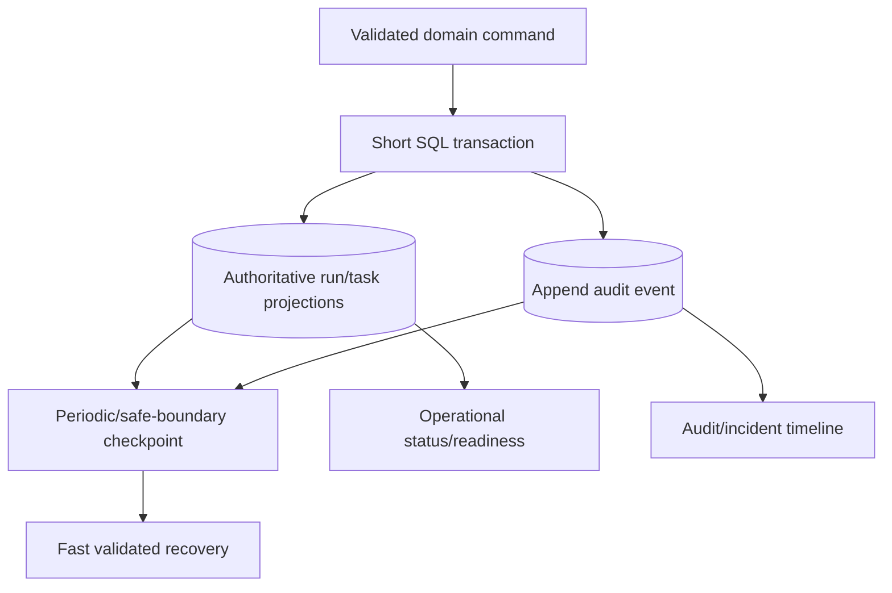
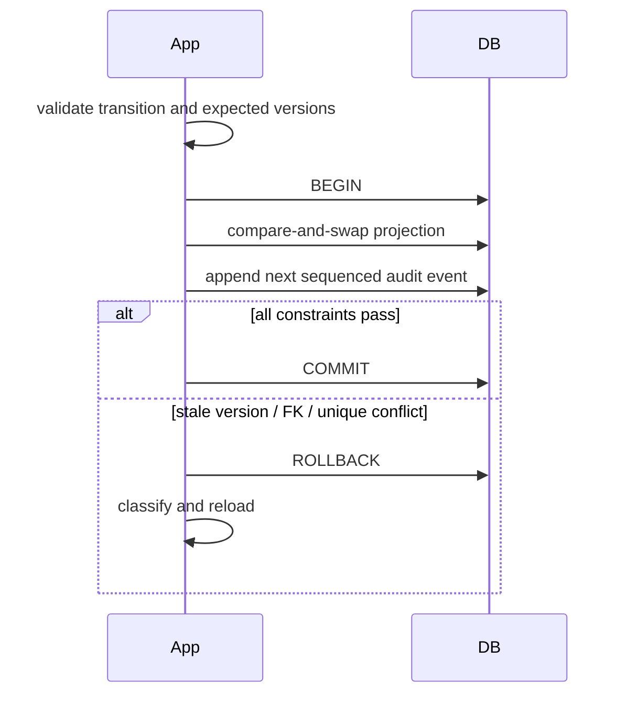
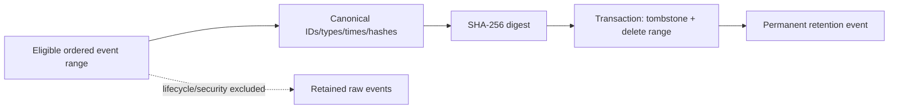

# ADR 0002: Persistence and event audit

**Status:** Accepted

## Context

Resume needs fast authoritative state and audit needs causal history. Full event sourcing
would require replay/upcasters for every read.

## Decision

Use normalized materialized state plus append-only event writes and explicit checkpoint
documents. All related writes share SQL transactions. State is authoritative; events are
audit/rebuild inputs, so the system is not fully event-sourced. Retention may compact old
high-volume events only for terminal runs, in one transaction that adds a permanent
SHA-256 manifest tombstone and preserves lifecycle, failure, recovery, retention, and
security events.

## Alternatives

Opaque pickles are unsafe and not evolvable. Full event sourcing improves temporal
queries but raises replay/migration complexity. Logs lack transactions and integrity.

## Consequences

Reads and recovery are direct and portable; code must enforce that state and audit writes
remain atomic. Audit verification detects projection inconsistencies. A tombstone digest
does not replace an external archive when regulations require the full raw event history.

## Decision drivers

Operators need current run/task state without replay latency, while incident reviewers
need to understand how that state was reached. Recovery needs a compact self-contained
resume envelope. The model must be queryable, migratable, concurrency-safe, and usable on
SQLite locally and PostgreSQL in production.

No one representation optimizes all three needs. Materialized relational rows answer
current-state queries; events explain causal history; checkpoints bound recovery. The
decision is therefore an event-audit hybrid.

## Detailed model

Projection and material audit event commit atomically when the event describes that
state transition. Provider/tool calls never occur inside the transaction. Events are not
commands to replay automatically, and checkpoints are not opaque object snapshots.

The authoritative hierarchy is:

1. Normalized state plus version/fencing constraints controls legal current mutation.
2. Tool intent/result rows control external-effect recovery.
3. Checkpoints validate a consistent resume view and durable references.
4. Events explain history and support audit/diagnosis.
5. Logs/traces are operational telemetry and never authoritative state.

## Transaction and consistency rules

Every mutable projection uses expected-version update where concurrency exists. Per-run
event sequence is unique and monotonic. A transaction that advances a task/run and emits
its event either commits all of those rows or none. Event payloads use bounded,
versioned/typed JSON and stable correlation IDs.

A consistency checker can compare event/checkpoint sequences and projection state, but
the service does not require complete event replay for every read.

## Event retention and compaction

Events are categorized by audit value. Lifecycle, security, failure, recovery, retention,
and side-effect reconciliation records remain. High-volume operational events become
eligible only when a run is terminal, its required reports/evidence exist, and retention
age is met. Compaction is atomic: canonicalize the ordered event manifest, calculate its
SHA-256 digest, insert a tombstone with range/count/hash, and delete eligible rows.

The digest detects inconsistency relative to retained metadata but cannot reconstruct
deleted bodies. Regulated deployments requiring raw history must archive it outside this
compaction or disable deletion.

## Alternatives considered

| Alternative | Benefit | Rejection reason |
|---|---|---|
| Full event sourcing | Complete temporal replay and projections | Upcasters/replay compatibility dominate complexity; side effects still need intent ledger |
| One serialized run blob | Simple initial writes | Poor queries/concurrency/migrations; large rewrite conflicts; opaque corruption scope |
| Logs as history | Existing telemetry pipeline | No transactional coupling, schema/integrity/retention guarantees |
| Relational state only | Simple reads | Insufficient causal audit and recovery explanation |
| Checkpoints only | Bounded resume | Loses intermediate attempts, errors, lifecycle decisions |

## Consequences and operational obligations

Reads remain fast and SQL-inspectable, local recovery does not replay an unbounded log,
and schema migration follows normal relational practice. The cost is dual-write discipline:
all code paths must preserve projection/event atomicity and audit category/sequence rules.

Backups cover database and artifact bytes. Cleanup must understand evidence reachability
and never compact an active/recoverable range incorrectly. Direct operator SQL mutation
bypasses invariants and therefore requires backup, incident authorization, and an audit
record.

## Security and integrity

Events can contain attacker-controlled metadata, so payloads are bounded, JSON-encoded,
redacted, owner-scoped, and rendered safely. Hash tombstones do not authenticate against a
privileged database attacker; signed/WORM external audit is the stronger production
option. SQLAlchemy parameters and explicit schemas avoid injection/unsafe deserialization.

## Tests and revisit triggers

Integration tests prove atomic rollback, unique ordering, optimistic conflicts, event/
projection agreement, checkpoint linkage, retention eligibility, permanent-category
preservation, tombstone hashes, and idempotent partial cleanup. Fault tests crash around
state/effect/checkpoint commits. Migration tests prove fresh and upgrade schemas.

Revisit if regulatory policy demands complete immutable event history, temporal queries
become dominant, event volume makes the relational log untenable, or multiple independent
projections require formal replay. A move to full event sourcing would require versioned
event contracts, upcasters, deterministic replay tests, side-effect exclusion, and a
projection migration plan.
