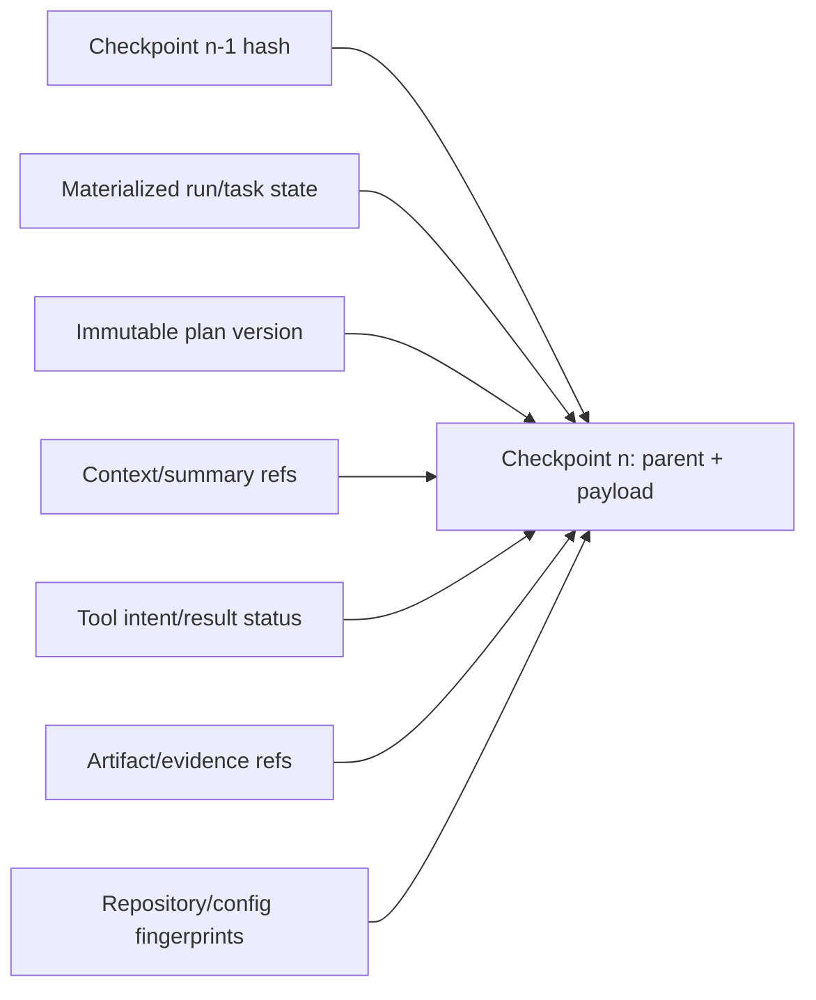
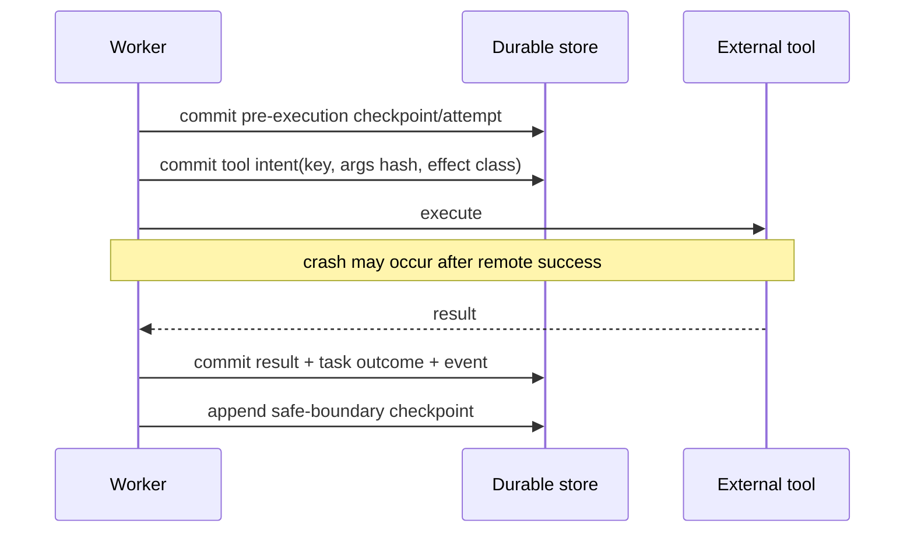
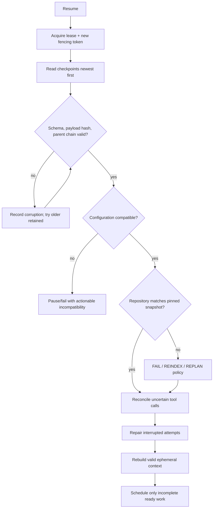

# ADR 0003: Checkpoint and recovery strategy

**Status:** Accepted

## Context

A restart can occur at any instruction, including around an external side effect.

## Decision

Store canonical, versioned, hash-chained checkpoint JSON at safe boundaries with a
monotonic sequence and configuration/repository fingerprints. Persist tool intent before
execution and result after it. Resume validates checkpoints newest-first and reconciles
uncertain calls. Unverifiable non-idempotent calls require review.

## Alternatives

Periodic memory snapshots are opaque. Replaying every event increases recovery latency.
Blind retries can duplicate irreversible effects.

## Consequences

Recovery is inspectable and corruption-tolerant at the cost of extra writes. Side-effect
tools must implement honest idempotency/reconciliation metadata.

## Decision drivers

The system must survive process termination without repeating completed work, losing
constraints/evidence, trusting corrupted bytes, or blindly retrying an external effect.
Recovery latency must be bounded even after a long run, and operators must be able to
inspect state without importing arbitrary Python classes.

## Checkpoint contract

A checkpoint is an explicit versioned envelope recording run/task states, active task,
completed/pending sets, plan version, context/summary/artifact/evidence references, tool
statuses, retry counters, error state, repository snapshot, configuration fingerprint,
sequence, parent hash, and creation time. Canonical JSON provides a deterministic payload
hash.

The checkpoint stores explicit data and references, not database sessions, coroutines,
open file handles, SDK clients, pickles, or provider conversations. Missing ephemeral
objects are rebuilt after validation.

## Failure-window protocol

Intent-before-effect makes ambiguity enumerable. A result proves what was observed; no
result does not prove non-execution. On restart, reconciliation observes provider/target
state using the same key and desired hash. Only read-only/retry-safe or proven-absent
effects retry automatically. Irreconcilable operations pause for review.

## Recovery algorithm

Checkpoint selection falls back only through retained valid history and emits a recovery
event. Unsupported newer schema versions fail closed. Materialized state/checkpoint
consistency is checked before new work. Completed task/tool identities and idempotency
keys prevent repetition.

## Frequency and retention

Checkpoints occur at run creation/planning, before and after effectful work as policy
requires, every configured task interval, before pause/cancel/terminal reporting, and
during recovery transitions. Higher frequency reduces replay/reconstruction and lost
ephemeral effort but increases database writes.

Retention keeps at least two chain-adjacent checkpoints so corruption of the newest has a
fallback. A checkpoint referenced for audit/legal recovery may be pinned. Cleanup never
deletes the only valid resume point of an active/paused run.

## Alternatives considered

| Alternative | Benefit | Rejection reason |
|---|---|---|
| In-memory/process snapshot | Fast | Lost on crash; opaque handles/classes; unsafe evolution |
| Pickled agent object | Easy serialization | Code execution/deserialization risk and version fragility |
| Event replay only | One history source | Unbounded recovery cost and upcaster complexity |
| Periodic checkpoints without intents | Simple | Cannot resolve external-effect uncertainty |
| Blind retry | Progress under transient failure | Duplicates irreversible/non-idempotent effects |
| Distributed transaction with providers | Strong atomicity in theory | Providers/filesystems generally do not participate |

## Consequences and limitations

Recovery is bounded, inspectable, schema-versioned, and tolerant of a corrupt newest
checkpoint. Costs are write amplification, canonicalization/migration discipline, and a
mandatory reconciliation implementation for side-effect tools. A valid local checkpoint
cannot prove an external provider's state; that assurance depends on provider idempotency
or observation APIs.

The parent chain detects mutation only relative to trusted stored hashes. A privileged
attacker can rewrite the whole chain; signed external manifests are an optional stronger
control. Retention and backups must preserve database plus referenced artifacts.

## Tests and revisit triggers

Tests cover explicit schema round-trip, canonical determinism, monotonic/unique sequence,
parent/payload tampering, unsupported versions, concurrent append conflict, newest
corruption fallback, no-valid-checkpoint failure, configuration mismatch, repository
drift, context rebuild, interrupted attempt repair, intent crash/reconciliation, and no
duplicate completed work across a new process.

Revisit if checkpoint write cost dominates workloads, recovery needs cross-region
replication guarantees, a workflow engine supplies equivalent explicit/effect semantics,
or signed transparency becomes mandatory. Any change must retain readable migration from
every supported checkpoint version or define an explicit terminal/manual recovery path.
