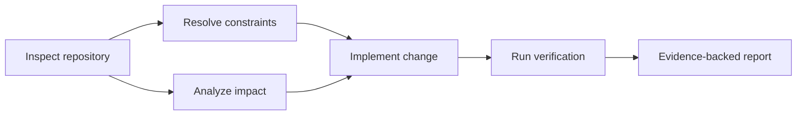
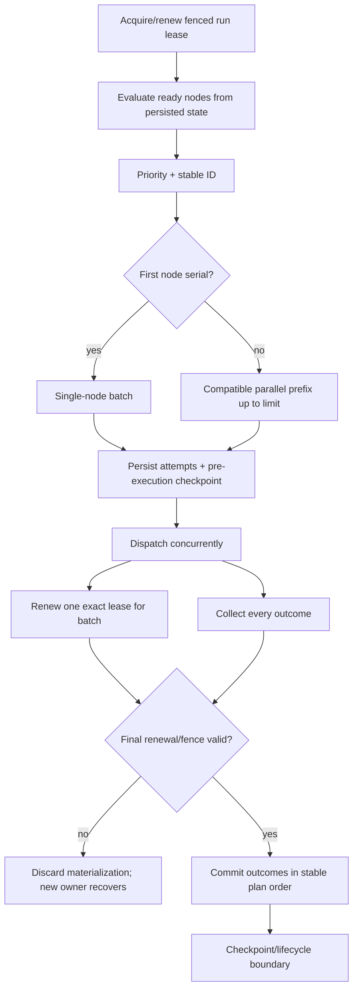
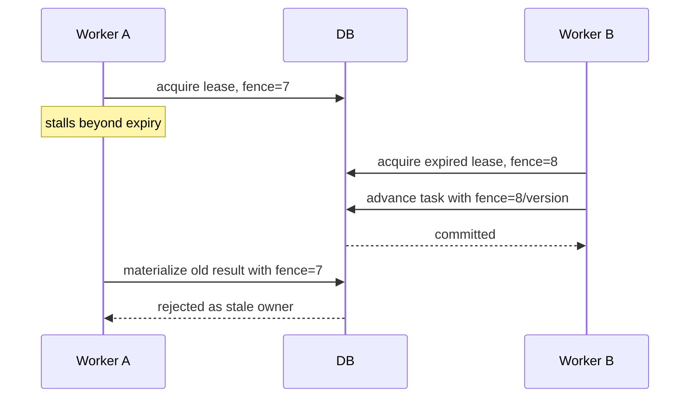

# ADR 0004: Task graph and concurrency

**Status:** Accepted

## Context

Plans need dependencies and parallel work, while multiple workers may race after expiry.

## Decision

Represent each immutable plan revision as a bounded DAG. Use explicit run/task transition
tables, process-operation-unique renewable database leases, fencing tokens, and optimistic
row versions. A task heartbeat renews the exact lease version, and the worker must renew
successfully again before materializing task/run outcome. Claim only tasks whose
dependencies succeeded. Within a leased run, dispatch a stable prefix of explicitly
`parallelizable` ready tasks, bounded by `maximum_concurrency`. Persist every task attempt
and a pre-execution checkpoint before dispatch, use one lease heartbeat for the batch, and
commit all successes and failures in deterministic plan order. Repository write/patch
permissions are serial-only and make a parallel plan invalid. The run's `active_task_id`
is a single-task UI hint; checkpoint task-state entries are authoritative when a batch has
multiple active tasks. One run lease still prevents two worker processes from claiming the
same graph concurrently.

## Alternatives

A linear list cannot express parallelism. Process locks do not span hosts. Database locks
alone do not fence a slow worker after lease expiry.

## Consequences

Run ownership and duplicate-task protection work across processes and databases;
PostgreSQL performs better than SQLite. External side-effect adapters still need their
own idempotency/fencing contract because a database lease cannot make a remote provider
transactional. Pause and cancellation requests do not interrupt an ambiguous operation;
they take effect after every member of the current batch has reached a durable outcome.
Parallel tasks must use collision-safe artifact IDs and provider idempotency keys.

## Decision drivers

Complex objectives contain true prerequisites and independent read-only work. A linear
plan either hides dependency semantics or forgoes safe parallelism. At the same time,
processes can crash, leases can expire, and a slow worker can outlive ownership. The
design must therefore separate graph readiness, process ownership, row concurrency, and
external-effect idempotency.

## Graph invariants

An accepted plan graph `G=(V,E)` is finite and acyclic. An edge `(u,v)` means `v` is not
ready until `u` succeeds. Each node contains bounded attempts, evidence/verification,
permissions, effect policy, and context estimate.

Stable topological ordering uses priority then task ID for ties. Graph validation rejects
missing/self/duplicate dependencies, cycles, excessive nodes/depth, untestable completion,
and parallel write/patch permissions.

## Scheduling protocol

Wall-clock completion order does not determine event ordering. Deterministic commit order
makes tests, checkpoints, and audit reproducible. A successful sibling remains succeeded
when another sibling fails retryably.

## Lease and fencing semantics

A lease answers “who may advance this run now?” Its expiry enables takeover. The fencing
token answers “is this writer still the latest owner?” and prevents a former owner from
committing after a pause or network partition.

An OS/database/process lock alone cannot provide this because it may disappear or remain
unobservable across hosts and does not attach a generation to a late write. Lease renewal
uses compare-and-swap on the exact version; failure instructs the worker to stop.

## Parallel-safety rules

Parallelism is opt-in. Tasks in a batch must have compatible read-only or collision-safe
effects, independent artifact identities, and no repository write/patch permission. The
run owns one lease because graph scheduling and checkpoint ordering are one consistency
domain; a task-level distributed lease design would require additional graph and report
coordination.

Pause/cancel signals are observed while a batch runs but apply only after every launched
member has a durable result or explicit uncertainty. Killing one member mid-effect to
make pause faster would violate recovery clarity.

## Plan revisions

Plans are immutable. Replanning creates a successor and carries terminal state only when
the full execution-relevant task specification is unchanged. A new edge, input, output,
permission, criterion, or evidence requirement prevents unsafe success inheritance.

## Alternatives considered

| Alternative | Advantage | Why not selected |
|---|---|---|
| Linear task list | Simple scheduler | Hides prerequisites and parallel work |
| Arbitrary recursive agents | Expressive | Unbounded decomposition/authority and poor audit |
| Process-local mutex | Low overhead | Does not span processes/hosts or survive crash |
| Long SQL row lock during task | Strong single owner | Holds transaction across provider/tool latency and failure |
| Lease without fencing | Easy takeover | Slow old owner can commit after expiry |
| Task-level leases for all nodes | More theoretical parallelism | Greatly complicates shared graph/checkpoint/revision consistency |
| Commit completion order | Natural timing | Nondeterministic audit/checkpoint sequence |

## Consequences, tests, and revisit triggers

The design supports bounded intra-run parallelism and multi-process takeover while
preserving deterministic materialization. It costs lease heartbeats, optimistic retries,
pre-batch writes, and intentionally serial mutations. Database fencing cannot make an
external API transactional; tools retain their own idempotency/reconciliation obligation.

Tests validate cycles/topological order, readiness, serial barriers, real execution
overlap, stable commit order, selective retry, pause/cancel races, duplicate workers,
lease renewal/expiry/takeover, stale-fence rejection, checkpoint conflicts, plan-revision
carry-forward, and idempotency. Property tests assert every accepted topological order
respects every edge.

Revisit if independent task workloads require task-level distributed ownership, database
contention proves one run lease too coarse, or a workflow runtime is adopted. Any change
must preserve state/evidence ordering, pause safety, fencing, and non-duplicate effects.
