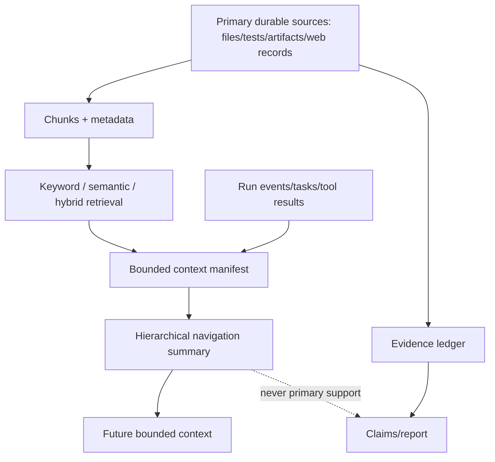
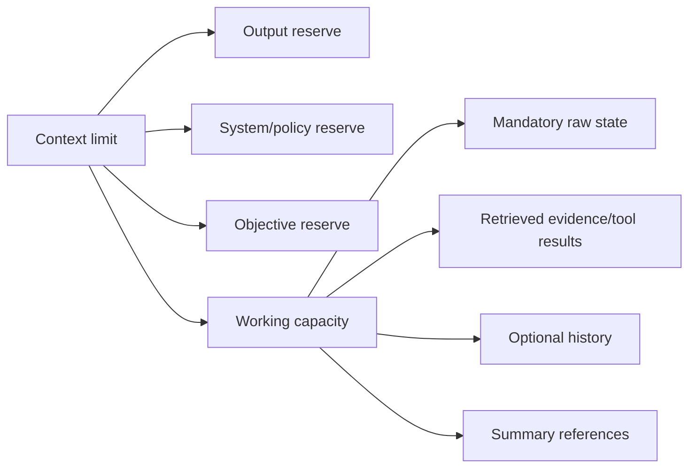
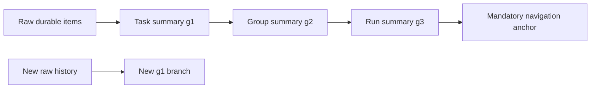

# ADR 0005: Context compression and retrieval

**Status:** Accepted

## Context

Long runs exceed model windows, and summaries can drift or lose constraints.

## Decision

Budget context by category, preserve constraints/decisions/questions/evidence first, and
compress hierarchically. Store source manifests and invalidation hashes. Use keyword
retrieval plus optional embeddings and reciprocal-rank hybrid fusion. Summaries are never
primary evidence.

## Alternatives

Dropping oldest content loses negative requirements. Repeated free-form summarization
creates drift. Requiring a vector database breaks offline use.

## Consequences

Deterministic local behavior is testable; language quality can improve through an optional
LLM adapter after strict validation.

## Decision drivers

Long runs generate more material than a fixed model window, while repository/research
corpora are much larger still. Selection must preserve authority, constraints, open
questions, active state, and evidence references; compression must remain invalidatable;
and the complete local baseline cannot require an embedding service or vector database.

## Information hierarchy

Retrieval finds candidates; context chooses a working set; summaries navigate omitted
history; evidence supports claims. These roles are deliberately not interchangeable.

## Context-budget decision

The model limit is partitioned into reserved output, system instructions, original user
objective, and working input. Mandatory categories—constraints including negative
requirements, accepted decisions, unresolved questions, active task state, and essential
evidence IDs—are selected raw before priority-ranked optional material. If mandatory
content cannot fit, execution stops with a budget error rather than silently dropping it.

The deterministic estimator and stable selection order make offline tests and resume
reconstruction reproducible. Provider-reported token usage is recorded separately.

## Compression decision

Compression forms bounded generations: raw event/result to task summary, task summaries
to group summary, group to run navigation. Generation depth is capped; new history starts
a new branch instead of recursively rewriting the same summary forever. Every summary
stores source IDs/hashes, retained protected fields/evidence IDs, removed IDs, algorithm
fingerprint, generation, and validity.

Validation rejects invented source/evidence IDs, omitted protected fields, changed
epistemic kind, excess generation, or stale source hashes. LLM compression may improve
language only after passing the same strict schema/provenance validator; deterministic
compression is the fallback.

## Retrieval decision

Keyword retrieval is always available. Optional embeddings rank semantic similarity and
are fingerprinted by provider/model/dimension. Reciprocal-rank fusion combines rankings:

\[
RRF(d)=\sum_r \frac{1}{k+rank_r(d)}.
\]

Rank fusion avoids pretending lexical and cosine raw scores share calibration. Results
retain snapshot/source location and hash; retrieval scores never become evidence quality.

## Invalidation

Repository changes, deleted chunks, normalization/parser/embedding/compressor changes,
or source hash mismatch invalidate affected derived records. Existing rows remain for
old checkpoint audit; new contexts exclude them and rebuild from primary sources.

## Alternatives considered

| Alternative | Advantage | Rejection reason |
|---|---|---|
| Last-N messages | Very simple | Loses old negative constraints and decisions |
| One rewritten run summary | Compact | Repeated lossy drift lacks provenance/generation bound |
| Vector memory only | Flexible similarity | Relevance is not authority; offline dependency and missed negatives |
| Full raw history always | No summarization loss | Eventually exceeds every fixed context |
| Provider-managed thread as memory | Convenient | Vendor-specific, not process-independent durable state |
| Raw-score lexical/vector averaging | Simple | Scores have incompatible scales |

## Consequences and limitations

The system remains deterministic and offline-capable while allowing higher-quality
optional adapters. Costs are metadata/storage for manifests, conservative mandatory
overflow, and explicit invalidation. Deterministic four-byte token estimation is not exact
for every language/model; configured headroom and provider usage metrics mitigate but do
not erase that limitation.

Summaries can still be imperfect navigation, so reports return to primary evidence.
Embeddings may encode provider bias and sensitive content; production adapters require
owner isolation, data-governance review, and model fingerprint invalidation.

## Tests and revisit triggers

Tests cover budget arithmetic, stable selection, mandatory preservation/overflow,
hierarchy generation, summary source/evidence non-invention, staleness, repository drift,
keyword/semantic ranking, RRF, provenance, provider fingerprint changes, and final report
verification against primary sources. Property tests assert selected context never
exceeds capacity after a successful build.

Revisit if exact tokenizer support is required for every provider, corpora demand a
distributed vector engine, retrieval evaluation shows inadequate recall, or a stronger
lossless episodic-memory design becomes operationally feasible. Replacements must retain
offline determinism, provenance, invalidation, and evidence separation.
