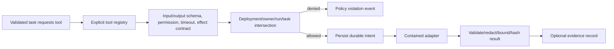
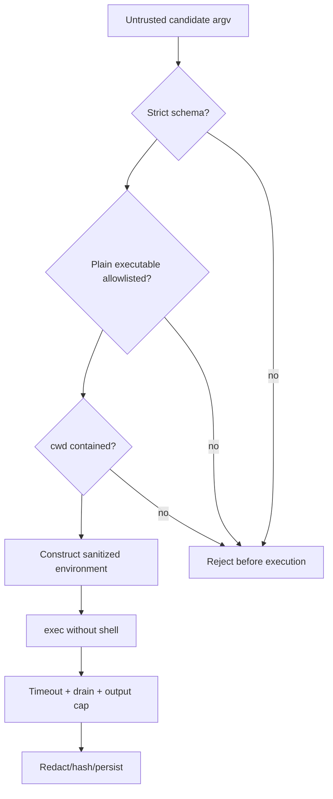
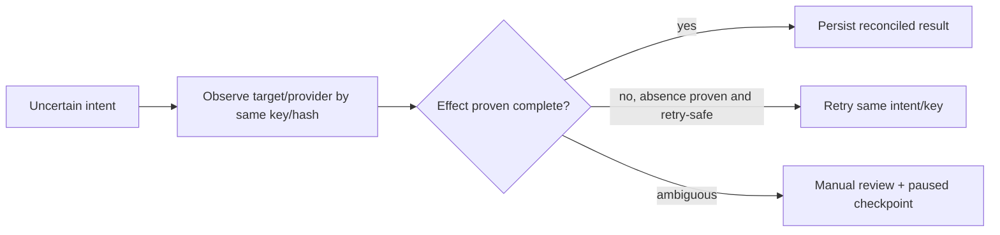

# ADR 0006: Tool security

**Status:** Accepted

## Context

Repositories and retrieved documents are hostile inputs, and coding tools can modify or
execute data.

## Decision

Tools declare schemas, permissions, timeouts, idempotency, retry safety, side-effect
class, and evidence behavior. Resolve paths beneath approved roots, reject symlink escape,
execute argv with `shell=False`, sanitize environment, redact secrets, cap output, and
disable write/shell/network by default. High-impact tools require policy approval.

## Alternatives

String shell commands are injection-prone. Prompt-based permission checks are not a
security boundary. In-process Python sandboxing is not reliable.

## Consequences

Useful commands require explicit allowlisting. Truly hostile code still needs a container
or VM sandbox supplied by deployment.

## Decision drivers

Tools cross the system's strongest trust boundaries: filesystem, process, network, and
external side effects. Repository/model/research content is attacker-controlled data and
may request dangerous actions. The design must make authority explicit, bound resources,
record effects durably, and recover honestly across crashes.

## Capability contract

Every tool declares stable name/description, strict schemas, timeout/output bounds,
required permissions, idempotency scope, retry safety, side-effect class, evidence
behavior, and reconciliation support. Registration is explicit; importing code cannot
grant a capability.

Effective authority is an intersection:

\[
P_{effective}=P_{deployment}\cap P_{owner}\cap P_{run}\cap P_{task}\cap P_{tool}.
\]

Retrieved or model-produced text is absent from this equation. High-impact actions can
require a durable approval bound to owner/run/task/tool/argument hash and expiry.

## Filesystem and process controls

Paths are normalized as relative, resolved beneath an approved root, checked for symlink
escape/non-regular type, and bounded before read/write. Writes use expected hashes,
temporary sibling files, atomic replace, and final-hash reconciliation. Patches use exact
preconditions rather than fuzzy matches.

Subprocesses receive argv arrays with `shell=False`, a plain executable allowlist,
root-contained cwd, closed stdin, minimal environment allowlist, timeout, concurrent
stdout/stderr draining, output caps, safe decoding, and recursive redaction.

These controls prevent shell/path/secret leakage classes but do not sandbox an allowed
interpreter or test suite. Hostile code requires a disposable low-privilege VM/container,
no secrets/network, restricted mounts/syscalls, and CPU/memory/PID/disk quotas.

## Side-effect recovery

Intent is committed before execution with idempotency key, normalized argument hash, and
effect class. Result commits after validation. Intent without result is uncertain and is
reconciled before retry.

Non-idempotent tools require native idempotency, transactional outbox, reliable
reconciliation, or human confirmation. Missing result is never treated as proof that the
effect did not occur.

## Network policy

Network is disabled by default. Research adapters allow only HTTP(S), reject credentials/
unsafe ports and non-global resolved addresses, revalidate redirects, bound bodies/types,
and mark content untrusted. Application validation cannot fully eliminate DNS rebinding;
production needs connection-time egress proxy/firewall enforcement.

## Alternatives considered

| Alternative | Advantage | Why not selected |
|---|---|---|
| Shell command strings | Familiar/flexible | Injection and quoting/environment ambiguity |
| Prompt-only permission rules | Easy to describe | Model/content is not a security boundary |
| In-process Python sandbox | Low deployment cost | Python introspection/native/system interfaces defeat reliable isolation |
| Allow everything in container | Simple | Containers are not automatically hostile-code secure and may contain secrets/network |
| Retry every failure | Maximum apparent progress | Duplicates uncertain effects and ignores classifications |
| Implicit plugin registration | Extensible | Import-time code/authority becomes difficult to audit |

## Consequences and residual risks

The framework makes authority, retries, effects, and evidence inspectable and secure by
default. The cost is explicit registration/approval, reduced command flexibility, adapter
reconciliation work, and external sandbox infrastructure for hostile code. OS/filesystem
and DNS time-of-check races remain platform risks. A compromised worker can use whatever
its OS/database credentials already permit, so least-privilege deployment is essential.

## Tests and revisit triggers

Contract tests require metadata and fake behavior for every registered tool. Security and
fault tests cover traversal, absolute/symlink escape, stale expected hashes, shell
metacharacters, executable/cwd/environment denial, timeout/output caps, redaction, SSRF,
permission escalation, intent crash, idempotency conflict, reconciliation, ambiguous
manual review, and forged evidence behavior.

Revisit for any new side-effect class, remote execution backend, plugin discovery model,
multi-tenant hostile-code execution, non-HTTP network tool, or stronger approval/RBAC
requirement. New authority receives a new threat analysis and executable recovery
contract before registration.
