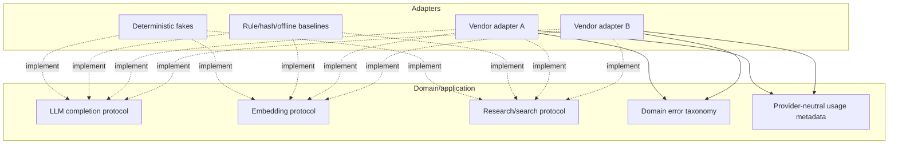
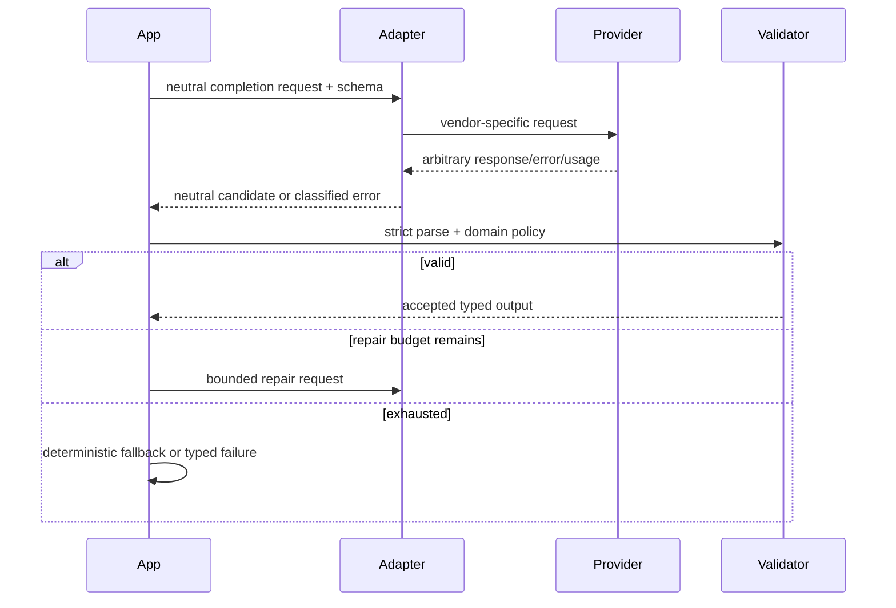
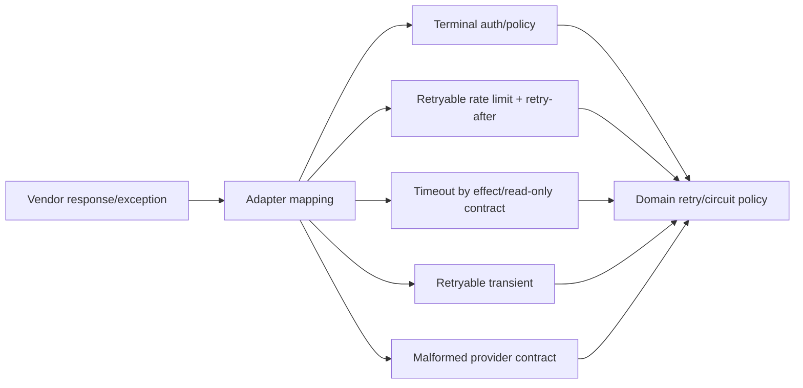

# ADR 0007: Provider abstraction

**Status:** Accepted

## Context

Models, embeddings, and web search change rapidly and paid services cannot be required.

## Decision

Define async protocols in the domain and ship deterministic fakes plus baseline rule-based
implementations. LLM responses are validated Pydantic schemas with bounded repair.

## Alternatives

Binding to one SDK is quicker initially but leaks vendor types/retry behavior throughout
the core. Mocking SDK internals gives brittle tests.

## Consequences

Core tests are offline and stable. Production adapters must map provider errors into the
domain taxonomy and supply usage metadata.

## Decision drivers

Model, embedding, and research APIs change independently, have different authentication,
quotas, response formats, retry semantics, and cost/usage units. None may be required for
offline tests or baseline local operation. Provider output is untrusted and must not leak
SDK classes or exception taxonomies into planning, recovery, evidence, or reports.

## Port boundary

Protocols use project-owned request/result value types. Authentication clients, stream
objects, vendor tool-call classes, response IDs, and raw exceptions remain inside the
adapter. Application assembly chooses an adapter from validated configuration.

## LLM completion semantics

The completion port accepts a bounded request with model identity, purpose, typed message
content, desired output schema, timeout, and correlation metadata. It returns text or a
project-owned structured candidate plus usage/finish metadata. Planning and compression
never accept free-form meaning directly: Pydantic parses the complete output, domain
validators enforce graph/provenance/authority rules, and repair is bounded.

A model cannot grant permissions, increase decomposition/retry budgets, or turn retrieved
content into authority. Repair receives safe validation summaries, not secrets or broad
exception dumps.

## Embedding and search semantics

Embedding results include provider/model/version fingerprint and fixed dimension. Vectors
from incompatible fingerprints are never compared. Hash/deterministic embeddings support
offline ranking tests without claiming production semantic quality.

Research search returns normalized provider-neutral result metadata; content remains
untrusted. Fetching, hashing, deduplication, conflict detection, and evidence creation are
project services rather than assumed SDK behavior.

## Error and retry mapping

Adapters translate native errors into bounded domain categories: validation/contract,
authentication/permission, rate limit, timeout, retryable provider failure, circuit-open,
and terminal provider failure. Retry-after metadata is preserved when safe. Unknown
exceptions fail conservatively; string matching on raw messages is not the principal
classification mechanism.

Persisted attempt count and injected jitter drive retries; recreating a process or SDK
client does not reset them. Provider circuits group failures without storing raw secrets.

## Deterministic fakes

Fakes are first-class contract implementations, not mocks of SDK internals. They accept
scripted responses/errors, record normalized requests, expose stable usage, and support
named failure injection. The rule planner, deterministic compressor, keyword retrieval,
and optional hash embeddings make a useful complete system without pretending a fake is
a real external service.

## Alternatives considered

| Alternative | Advantage | Why not selected |
|---|---|---|
| One vendor SDK throughout | Fast initial development | Vendor types/errors/tool semantics leak into durable core |
| Generic dictionary adapter | Flexible | Loses type/schema/error guarantees |
| Mock SDK clients in tests | Low initial effort | Brittle against SDK internals; weak contract coverage |
| Require live sandbox APIs | Realistic integration | Network/credentials/cost/flakiness violate offline suite |
| Lowest-common-denominator wrapper | Simple | Hides needed usage/schema/capability metadata |

## Consequences and limitations

Provider replacement, offline determinism, and vendor-neutral durable schemas improve.
Adapter authors carry meaningful work: capability checks, timeouts, usage normalization,
error mapping, redaction, and contract tests. Some vendor-specific features may require an
optional capability extension rather than contamination of the core protocol.

Fakes prove orchestration behavior, not external service compatibility or model quality.
Production adapters require separately gated live contract/smoke tests using controlled
credentials, budgets, and recorded non-secret results.

## Security, tests, and revisit triggers

Prompts exclude unnecessary secrets; provider output is bounded and untrusted; tenant
data-sharing/retention settings require deployment review. Logs record provider/model,
latency, usage, and error category without full prompts/tokens. Network policy and egress
controls remain outside the SDK.

Contract tests run every adapter against normalized requests/results/errors, malformed
outputs, timeouts, usage, and cancellation. Core tests use fakes for bounded repair,
fallback, retry/circuit, embeddings, conflicting research, and prompt injection.

Revisit if providers converge on a stable open protocol, streaming/tool-calling needs a
new durable incremental contract, local models become the production baseline, or vendor
capability differences cannot be represented cleanly. Extensions must remain versioned,
optional, and excluded from domain authority.
