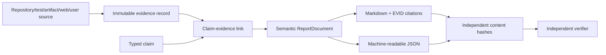
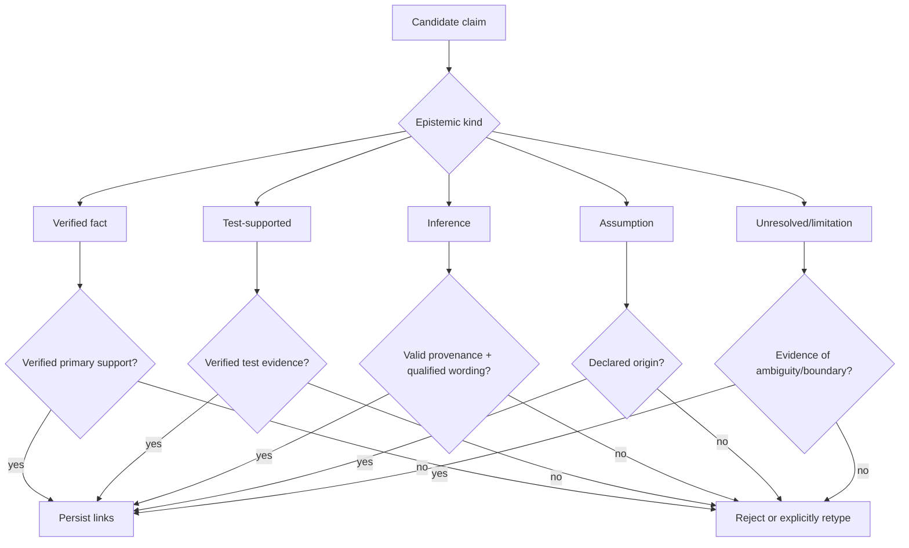

# ADR 0008: Evidence model

**Status:** Accepted

## Context

Reports must distinguish verified facts from inference and survive file/source changes.

## Decision

Store immutable evidence records with stable IDs, type, location, content hash, snapshot,
reliability, verification state, and task. Store claims separately with an epistemic kind
and many-to-many evidence links. Render durable `[EVID-…]` citations and verify links.

## Alternatives

Inline URLs lack snapshot integrity. Using summaries as evidence compounds drift. A single
JSON report cannot support independent audit.

## Consequences

Reports are machine-verifiable and auditable; evidence retention is coupled to referenced
reports and may increase storage.

## Decision drivers

Agent reports combine direct source observations, test outcomes, assumptions, and
reasoning. A fluent paragraph can hide which statements were observed and which inferred.
Repository paths and web URLs also change, so citations require snapshot/hash/time
provenance. Verification must be possible without trusting the report generator itself.

## Separate evidence, claims, and rendering

Evidence records identify what was observed. Claims identify what the system says and
its epistemic kind. Links express support. Renderers provide human and machine views.
Separating these permits multiple reports to cite one ledger and makes forged prose-only
IDs detectable.

## Evidence semantics

Each record has stable ID, owner/run/task scope, type, source/location, optional repository
snapshot, exact normalized-content hash, creation/retrieval time, bounded excerpt or
structured result, reliability metadata, and verification status. Evidence is immutable;
changed source content creates a new record or invalidation history rather than rewriting
what an earlier run saw.

Verification proves integrity/provenance within scope, not universal truth. A verified
test result supports “this invocation passed in this environment.” A verified source
retrieval supports “these bytes were retrieved from this identified source at this time.”

## Claim admissibility

Every claim kind requires evidence, though its role differs. Inference evidence provides
premises/provenance, not proof of the inference. A summary cannot be the primary source.
Same-run ownership is checked before linking.

## Conflict policy

Conflicting sources remain independent evidence with conflict metadata. Reliability may
guide further research but cannot average incompatible claims into a fact. Scope,
software version, and time are normalized first so historically different facts are not
misclassified as contradiction. Reports surface unresolved conflict explicitly.

## Rendering and verification

One strict `ReportDocument` generates both Markdown and JSON so the formats cannot drift
semantically. Markdown cites stable `[EVID-*]` IDs near material claims; JSON lists exact
claim/link/evidence structures. Required sections remain even when empty or partial.

The verifier recomputes report hashes, parses JSON identity/schema, revalidates every
link/admissibility rule, checks Markdown citations, and resolves catalogued local source/
artifact/tool-result hashes. Verification failure preserves the questioned report and
does not overwrite hashes to match altered bytes.

## Alternatives considered

| Alternative | Advantage | Why not selected |
|---|---|---|
| Inline URL/path citations only | Familiar and compact | No same-run link integrity, snapshot identity, or machine graph |
| Put citations inside one JSON report | Self-contained | Generator remains sole authority; poor reuse/query/retention |
| Summary as evidence | Cheap context reuse | Launders compression drift and invented attribution |
| One confidence score | Easy ranking | Collapses source quality, directness, integrity, conflict, claim type |
| Copy every full source into DB | Self-contained | Storage/copyright/privacy burden and still lacks claim relationships |

## Consequences and limitations

Reports become reviewable, queryable, conflict-aware, and independently integrity-checked.
Costs include relational links, evidence retention, source normalization, verification
work, and explicit epistemic wording. Bounded excerpts may require access to a primary
artifact for full context.

Hashes detect modification relative to trusted metadata but do not authenticate against
a privileged administrator. Signed/WORM manifests and separation of duties are optional
higher-assurance controls. External source truth and current freshness cannot be proven
solely by preserved retrieval bytes.

## Security, tests, and revisit triggers

Evidence/report access is owner-scoped; rendered untrusted content is escaped; local
artifacts resolve under an approved root; verification never blindly fetches a URL.
Secrets and copyrighted content are minimized/redacted with explicit metadata.

Tests cover every claim kind, missing/cross-run/invalid/forged links, conflicts, summary
rejection, deterministic dual rendering, citations, partial reports, byte/artifact/source
tampering, and complete end-to-end report verification.

Revisit if external signed attestations, formal proof objects, regulatory chain-of-custody,
or massive evidence graph analytics become requirements. Any successor must preserve
typed epistemic distinctions, durable provenance, conflict visibility, and independent
verification.
