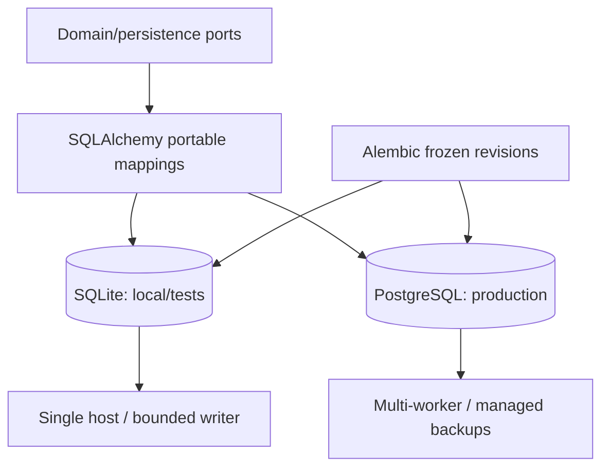
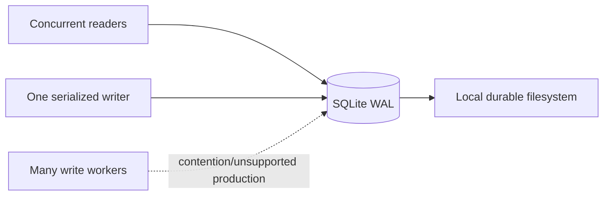
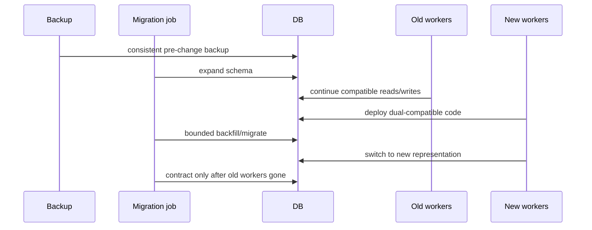

# ADR 0009: Local and production databases

**Status:** Accepted

## Context

Local setup should require no service, while multiple workers need robust concurrency.

## Decision

Use SQLite with WAL and foreign keys for development/tests and PostgreSQL for production.
Use SQLAlchemy portable types, explicit constraints, and Alembic migrations. Correctness
relies on optimistic versions/fencing, with database-specific claiming as an optimization.

## Alternatives

PostgreSQL-only increases local friction. SQLite-only cannot meet multi-worker throughput
or operational expectations. Runtime `create_all` provides no upgrade history.

## Consequences

Most behavior is tested on SQLite and CI can add PostgreSQL contract tests. Production
operators must run migrations and use shared artifact storage.

## Decision drivers

Local installation and offline tests should not require a database service. Production
multi-user workers need robust concurrent writes, row-level locking options, connection
management, backup/replication tooling, and operational observability. The domain should
retain one consistency model rather than silently weakening behavior on the local backend.

## Two deployment profiles, one logical schema

Portable tables use explicit string IDs, UTC timestamps at domain boundaries, JSON with
validated schemas, foreign keys, uniqueness, and indexes. Correctness relies on
optimistic versions, unique sequences/idempotency keys, short transactions, and lease
fencing supported by both databases. PostgreSQL-specific task claiming or JSON/index
optimization may improve throughput behind the repository contract but cannot change
observable semantics.

## SQLite profile

SQLite runs with foreign keys enabled, WAL journal mode, full synchronous durability, and
busy timeout. WAL permits readers alongside a writer but still has one writer and same-host
storage assumptions. It is appropriate for CLI development, deterministic test files,
and a local single-worker deployment. It is not approved for network filesystems or
multi-replica production.

Transactions remain short; external tool/provider work is never held under a SQLite
write lock. Persistent `database is locked` errors indicate topology or transaction
defects rather than a cue to disable durability.

## PostgreSQL profile

Production configuration requires PostgreSQL-compatible async and sync URLs addressing
the same logical schema. PostgreSQL supplies concurrent writer behavior, stronger
operational backup/replication, connection controls, row-lock/skip-locked optimization,
and optional row-level security. Workers still use application leases/fences and expected
versions: database row locks alone do not fence an external slow worker after transaction
completion.

Bound connection pools per API/worker deployment. Migration uses a separate
least-privilege release role; application roles cannot alter schema. TLS and managed
credential rotation are deployment requirements.

## Migration discipline

Alembic is the only production schema-creation/evolution path. Revision `0001` imports a
frozen metadata snapshot, not today's ORM. Future changes use forward revisions and
expand/migrate/contract when versions overlap.

Runtime `create_all` is isolated to tests/demo fallback because it provides neither
upgrade ordering nor frozen historical meaning. Migration CI checks empty upgrade, prior
upgrade fixtures, exactly one head, required schema, and application metadata agreement.

## Portability boundaries

SQL portability does not mean every dialect behaves identically. Timestamp/JSON/index/
locking details are normalized through repository interfaces and dialect tests. SQLite
coarse serialization can hide races that PostgreSQL exposes, so production concurrency
contracts should also run against PostgreSQL in CI/release environments.

The schema avoids relying on SQLite's permissive typing and PostgreSQL-only constraints
for fundamental correctness. Cross-row DAG/state/evidence invariants remain domain checks
inside transactions.

## Alternatives considered

| Alternative | Advantage | Why not selected |
|---|---|---|
| PostgreSQL everywhere | One production-like backend | Service/container requirement raises local/offline friction |
| SQLite everywhere | Zero-service simplicity | Inadequate multi-writer scaling/operations/HA expectations |
| Embedded alternative database | Potential richer concurrency | Smaller ecosystem or portability/migration cost |
| NoSQL/document database | Natural JSON/checkpoints | Relational graph/link/uniqueness/transaction needs dominate |
| Separate database per subsystem | Independent scaling | Harder atomic lifecycle/evidence operations and local setup |
| Runtime schema creation | Minimal migration code | No upgrade history, review, rollback, or rolling compatibility |

## Consequences and operations

Developers receive fast zero-service tests and production receives an established
multi-worker store. The cost is a portability test matrix and the possibility that local
SQLite does not reproduce production query plans/lock contention. Shared production
artifact storage must be backed up consistently with SQL.

Backups use SQLite online backup while workers are paused or PostgreSQL-native physical/
logical/PITR mechanisms. Restore verification checks schema, FKs, checkpoint chains,
artifact/report hashes, and canary recovery. Database-only backup is incomplete.

## Security, tests, and revisit triggers

SQLAlchemy bound statements prevent ordinary parameter injection but do not authorize raw
SQL. Owner scoping is required on every query; PostgreSQL RLS may add defense in depth.
Separate migration/application/read roles, TLS, encryption at rest, restricted backup,
and secret-manager credentials are production obligations.

Integration tests cover constraints, cascades, optimistic conflicts, leases/fences,
sequences, idempotency, and concurrent writers. Migration contracts validate frozen/live
schema. PostgreSQL-specific tests are required before declaring production concurrency
for a release.

Revisit if an embedded database gains proven multi-worker operational suitability, a
managed durable workflow store replaces SQL responsibilities, global/multi-region writes
become mandatory, or workload requires database sharding. A change needs data migration,
transaction/locking equivalence, backup/restore, and checkpoint/evidence integrity plans.
