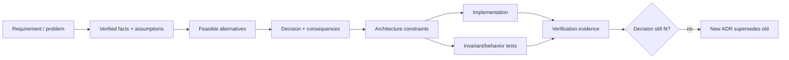
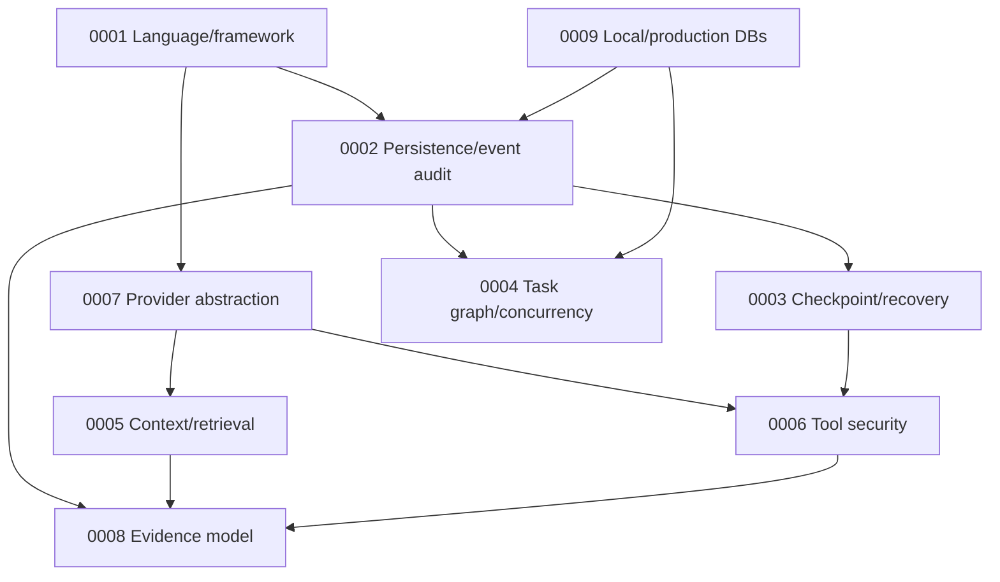

# Architecture decision records

Accepted decisions:

1. [Language and framework](0001-language-framework.md)
2. [Persistence and event audit](0002-persistence-event-audit.md)
3. [Checkpoint and recovery strategy](0003-checkpoint-recovery.md)
4. [Task graph and concurrency](0004-task-graph-concurrency.md)
5. [Context and retrieval](0005-context-retrieval.md)
6. [Tool security](0006-tool-security.md)
7. [Provider abstraction](0007-provider-abstraction.md)
8. [Evidence model](0008-evidence-model.md)
9. [Local and production databases](0009-databases.md)

## Purpose and authority

An architecture decision record captures a durable choice: the forces at the time, the
selected design, serious alternatives, consequences, and conditions that would justify
reconsideration. ADRs explain *why* the implementation has its shape; subsystem guides
explain *how* it works; tests and verification results establish what was actually
observed.

An accepted ADR is normative for new implementation until superseded. It is not edited
to pretend that a later decision existed earlier. Clarifications that do not change the
decision may be added; material reversals receive a new ADR linking predecessor and
migration consequences.

## Decision dependency map

The arrows mean the downstream decision relies on constraints established upstream. For
example, checkpoint recovery assumes the event-audit persistence model, and task
concurrency assumes portable database fencing semantics.

## Record lifecycle

| Status | Meaning | Allowed next step |
|---|---|---|
| Proposed | Under review; implementation must not depend on it yet | Accept, reject, withdraw |
| Accepted | Normative current choice | Clarify or supersede with new ADR |
| Rejected | Considered but not selected | Re-propose only with materially new context |
| Deprecated | Still present but discouraged during migration | Supersede/remove after compatibility period |
| Superseded | Replaced by linked decision | Historical record remains immutable |

Every ADR includes operational and security consequences because a locally elegant
choice can externalize unacceptable recovery or threat-model cost. “Alternative rejected”
does not mean universally bad; it means less suitable under this project's requirements
and assumptions.

## Review checklist

Reviewers check that context describes a real decision tension, verified facts are
separated from assumptions, the choice precisely constrains code, alternatives receive
fair treatment, negative consequences are explicit, failure/recovery and migration are
covered, tests can detect violation, and revisit triggers are observable.

When implementation contradicts an accepted ADR, either repair the implementation or
propose a superseding ADR. Silently redefining terminology in a guide is not decision
governance.
