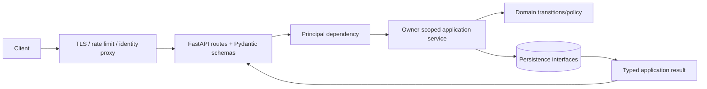
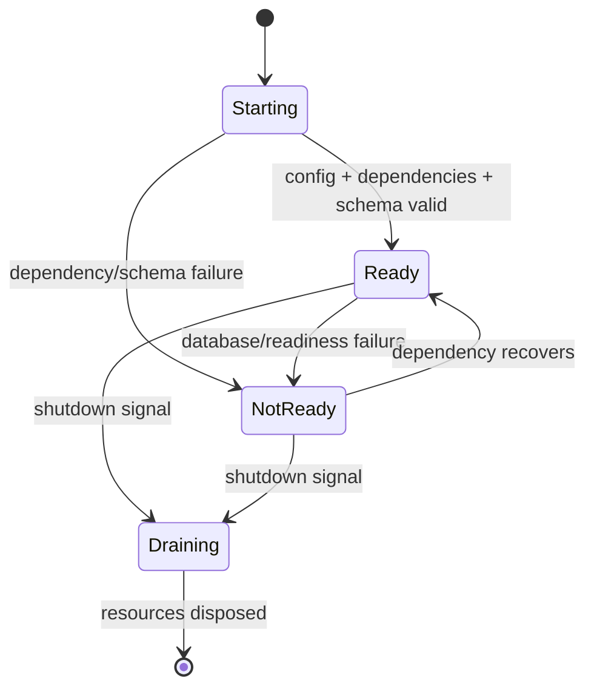
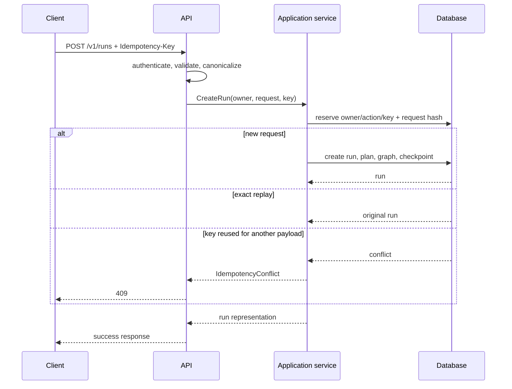
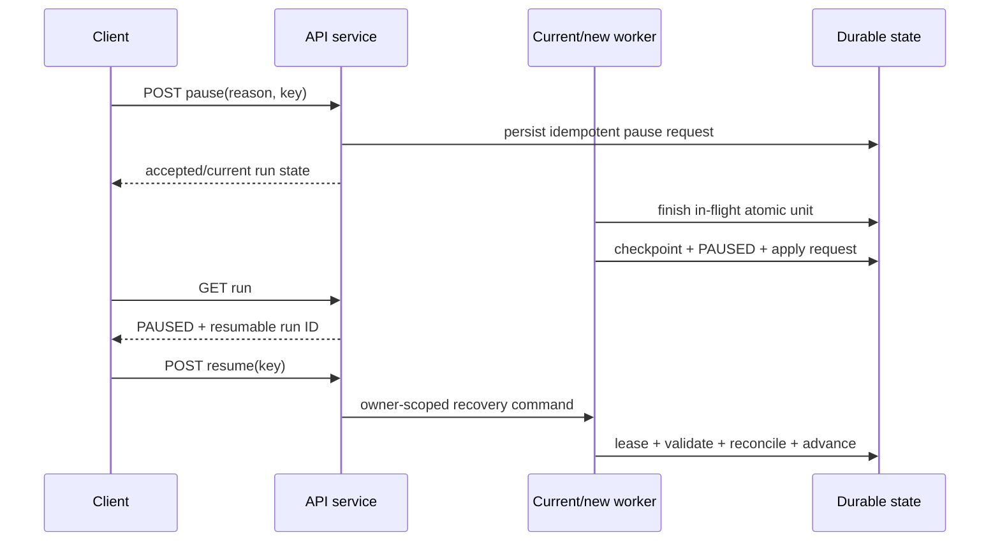
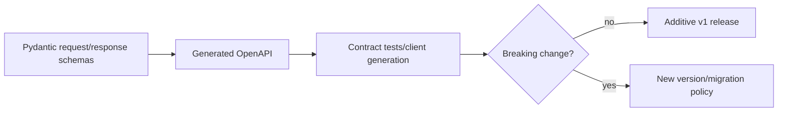

# HTTP API

FastAPI generates OpenAPI at `/docs` and `/openapi.json`. `create_app` uses lifespan for
database/application ownership and mounts Prometheus at `/metrics` when enabled.

| Method/path | Behavior |
|---|---|
| `GET /health`, `/ready` | Process and migrated-database probes |
| `POST /v1/runs` | Create/index/plan; requires `Idempotency-Key`; optional `auto_advance` |
| `GET /v1/runs`, `/v1/runs/{id}` | Owner-scoped list/status |
| `GET /v1/runs/{id}/plan`, `/tasks` | Active immutable plan and task states |
| `POST /v1/runs/{id}/pause`, `/cancel` | Durable lifecycle request; requires key and reason |
| `POST /v1/runs/{id}/resume` | Recover and advance; requires `Idempotency-Key`; optional maximum task bound |
| `GET /v1/runs/{id}/checkpoints`, `/evidence`, `/report` | Durable state/provenance/report; report format query is `markdown` or `json` |

Example:

```bash
curl -sS -X POST http://127.0.0.1:8000/v1/runs \
  -H 'Authorization: Bearer TOKEN' -H 'X-Owner-ID: team-a' \
  -H 'Idempotency-Key: objective-42' -H 'Content-Type: application/json' \
  -d '{"objective":"Inspect retry behavior","auto_advance":false}'
```

The development default may disable bearer authentication; production must enable it
behind TLS and an identity-aware proxy/middleware. `X-Owner-ID` is an integration hook,
not a self-asserted production identity. Allowed owners and service-level `_owned_run`
checks prevent cross-run reads/mutations.

Request bodies reject extra fields and bound text lengths. Reusing a key with another
payload returns `409`; validation is `422`, missing is `404`, policy/ownership is `403`,
and invalid/missing authentication is `401`. Successful create/pause replay returns the
original resource. Resume persists an intent before recovery; an identical replay returns
durable current state, while a crash before completion can safely continue from
`PAUSED`/`RECOVERING`. The local API can advance inline; production should persist the
command and let workers advance asynchronously.

API integration tests cover health/readiness, OpenAPI-compatible routes, authentication,
owner isolation, create/pause/resume idempotency (including concurrent duplicate resume),
conflict mapping, and plan/task/checkpoint retrieval. Network edge controls, rate
limiting, TLS, and identity provider integration belong at the production ingress.

## API role and dependency direction

The HTTP layer is a transport adapter. It validates HTTP syntax, derives a principal,
maps request schemas to application commands, and maps typed outcomes to responses. It
does not implement planning, state transitions, checkpoint integrity, authorization by
guessing IDs, or direct ORM mutation.



This direction lets the same service semantics power CLI and tests. Route code cannot
“fix” a state by writing a row around the domain state machine.

## Resource model

A run is the aggregate resource. Plans, tasks, checkpoints, evidence, and reports are
read-only subordinate resources; lifecycle actions are commands because they have
transition and idempotency semantics.

```mermaid
flowchart TB
  Runs[/v1/runs] --> Run[/v1/runs/{run_id}]
  Run --> Plan[/plan]
  Run --> Tasks[/tasks]
  Run --> CP[/checkpoints]
  Run --> EV[/evidence]
  Run --> RP[/report]
  Run --> Pause[/pause command]
  Run --> Resume[/resume command]
  Run --> Cancel[/cancel command]
```

Run and subordinate IDs are opaque. All lookups use `(principal.owner_id, run_id)` so a
valid ID owned by someone else does not grant access.

## Application lifecycle and readiness

FastAPI lifespan creates configuration, logging/telemetry, database engines, stores, and
application services once, then disposes them on shutdown. Importing the module does not
open a database connection. This makes test construction explicit and avoids per-request
engine creation.

`/health` answers whether the process and event loop are alive. `/ready` additionally
checks that startup configuration is valid, database connectivity works, and the schema
is at a compatible migration head. Health may remain `200` while readiness is failing so
an orchestrator can stop routing new traffic without repeatedly killing a diagnosable
process.



Health/readiness endpoints should expose minimal status, not credentials, SQL errors, or
tenant data. Detailed reasons belong in restricted structured logs.

## Create-run protocol

Run creation requires an idempotency key because clients retry after lost responses.
The server canonicalizes the request and hashes all behavior-relevant fields. The key is
scoped to authenticated owner and action.



`auto_advance=true` is suitable for bounded local use. It may keep the request open while
work progresses and is therefore constrained by application task limits. Production
topologies normally commit creation and enqueue/publish an execution command, returning
the durable run promptly; workers then own progression through leases.

## Lifecycle command semantics

Pause and cancel requests are durable signals. A successful response means the request
was accepted/persisted; clients must inspect run state to distinguish `PAUSE_REQUESTED`
from a completed safe-boundary `PAUSED`. Resume acquires ownership, verifies compatible
state, reconciles uncertainty, and advances under a bound.



Cancellation is not resumeable and stops new scheduling. Repeating an identical command
returns the durable outcome. Concurrent pause/completion and duplicate resume are
resolved through state transitions, idempotency, leases, and optimistic versions—not by
arrival timing assumptions.

## Request and response discipline

Request schemas reject unknown fields so misspelled safety controls do not disappear.
Strings, lists, task bounds, and page sizes are constrained. Response schemas are
separate from ORM models and expose only documented fields. Datetimes are serialized in
UTC and enums use stable values.

The JSON report endpoint returns the machine-readable report document; Markdown returns
rendered report content with an appropriate content type. Large lists should use stable
pagination in production extensions; ordering must be documented and deterministic.

## Error taxonomy and status mapping

| HTTP status | Meaning | Example |
|---|---|---|
| `400` | Syntactically valid but unsupported request semantics | Unsupported report format if not schema-enumerated |
| `401` | Authentication absent/invalid | Missing or wrong bearer token |
| `403` | Authenticated but policy/owner action denied | Owner not allowed to create or mutate |
| `404` | Owner-scoped resource absent | Unknown run or another owner's non-disclosed run |
| `409` | Current durable state conflicts with command | Idempotency payload mismatch or concurrency conflict |
| `422` | Request schema validation failed | Missing reason, extra field, invalid bound |
| `503` | Service not ready or retryable dependency unavailable | Database/schema/provider readiness failure |
| `500` | Unexpected server defect | Correlated error ID; no stack trace in response |

Domain errors are recorded with correlation fields before mapping. Responses contain a
stable category and safe message; untrusted source text, SQL details, tokens, and local
absolute paths are not reflected.

## Authentication and owner isolation

The static bearer/allowed-owner hook demonstrates integration and constant-time secret
comparison; it is not a complete production identity system. At ingress, a trusted
identity component should authenticate a credential and pass an immutable principal.
Clients must not be able to self-assert `X-Owner-ID` unless the trusted proxy removes and
recreates it.

Authorization is performed on every route, including evidence/report inspection and
health-adjacent administrative data. Cross-run claim/evidence links are separately
rejected, so an application bug cannot use another owner's evidence by ID.

## OpenAPI and compatibility policy

FastAPI generates the OpenAPI description from the exact route and Pydantic schemas.
Contract tests load this document and exercise endpoints. Additive optional fields and
new endpoints can remain within `/v1`; removing/renaming fields, changing enum meaning,
or altering idempotency/state semantics requires a versioned compatibility decision.



Database/checkpoint schema versions are independent of HTTP API version. A response may
include stable opaque version metadata, but clients should not infer persistence layout.

## Concurrency, timeouts, and deployment topology

Multiple API replicas are safe because durable idempotency and optimistic concurrency
live in the database. In-memory locks are not correctness controls. PostgreSQL is required
for production multi-writer deployment; SQLite is a local single-host baseline.

Ingress, application, and tool/provider timeouts should be layered. An ingress timeout
must not cause a worker to assume the underlying command failed. Clients retry mutation
requests with the same idempotency key, then query run state. Background-worker execution
prevents long tools from consuming API request capacity.

## Observability and security

Requests bind trace/request ID, principal/owner, route/action, run ID when known, status,
and latency. Run/task IDs belong in logs/spans, not high-cardinality Prometheus labels.
Metrics cover request count/latency/error class and readiness; domain metrics cover run,
task, checkpoint, tool, and recovery behavior.

TLS, rate limiting, body limits, connection limits, WAF/edge policy, and identity-provider
integration are production ingress responsibilities. CORS should be deny-by-default and
enabled only for known browser clients. OpenAPI/docs endpoints may be restricted in
production. Error rendering escapes untrusted strings and never includes credentials.

## Examples

Create a run without inline advancement:

```bash
curl --fail-with-body -sS -X POST http://127.0.0.1:8000/v1/runs \
  -H 'Authorization: Bearer TOKEN' \
  -H 'X-Owner-ID: team-a' \
  -H 'Idempotency-Key: retry-limit-2026-08-04' \
  -H 'Content-Type: application/json' \
  -d '{"objective":"Add a configurable retry limit","auto_advance":false}'
```

Pause and resume with distinct stable command keys:

```bash
curl --fail-with-body -sS -X POST http://127.0.0.1:8000/v1/runs/RUN_ID/pause \
  -H 'Authorization: Bearer TOKEN' -H 'X-Owner-ID: team-a' \
  -H 'Idempotency-Key: maintenance-pause-1' -H 'Content-Type: application/json' \
  -d '{"reason":"database maintenance"}'

curl --fail-with-body -sS -X POST http://127.0.0.1:8000/v1/runs/RUN_ID/resume \
  -H 'Authorization: Bearer TOKEN' -H 'X-Owner-ID: team-a' \
  -H 'Idempotency-Key: maintenance-resume-1' -H 'Content-Type: application/json' \
  -d '{"maximum_tasks":5}'
```

## Tests and operator inspection

Unit tests exercise schemas and error mapping. Integration tests run the lifespan against
a migrated temporary database and verify OpenAPI, health/readiness, create/replay/conflict,
owner isolation, lifecycle idempotency, concurrent duplicate resume, retrieval endpoints,
and report formats. Security tests verify missing/wrong tokens, unapproved owners,
cross-owner IDs, unknown fields, bounded input, and non-disclosing errors.

Operators inspect `/ready`, request/error logs, database/worker health, and the owner-scoped
run endpoints. A request timeout with a mutation must be resolved by replaying its key or
querying state, never by sending the same mutation with a new key.
