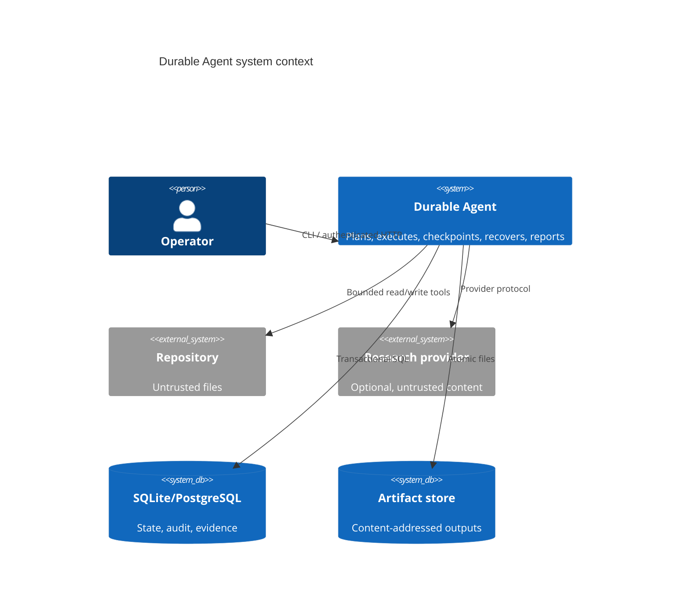
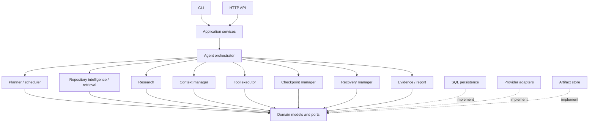
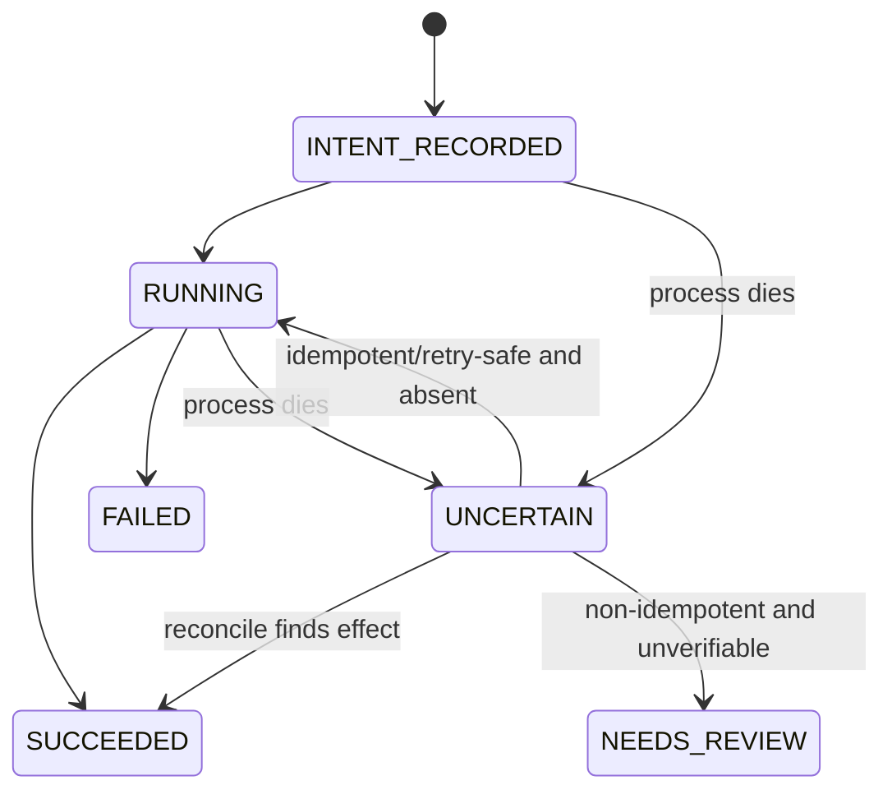
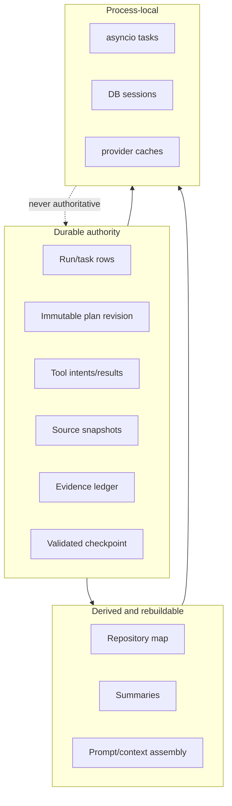
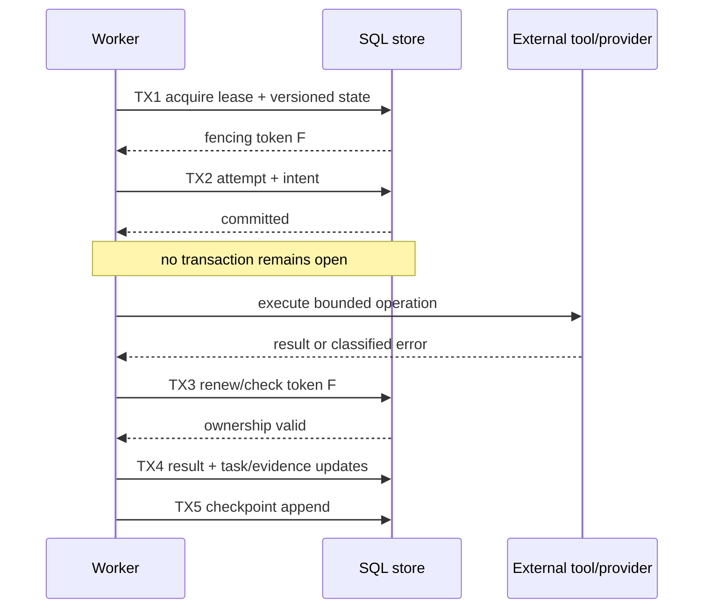
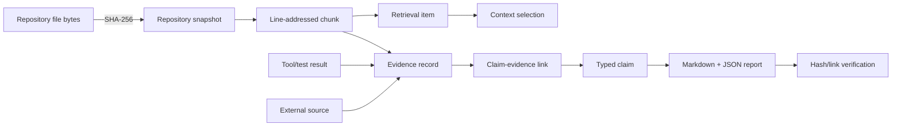
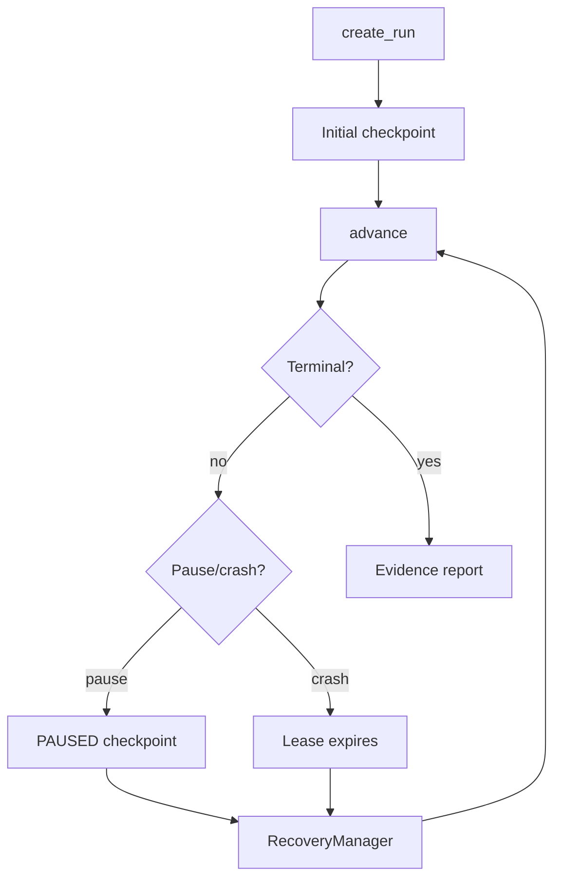
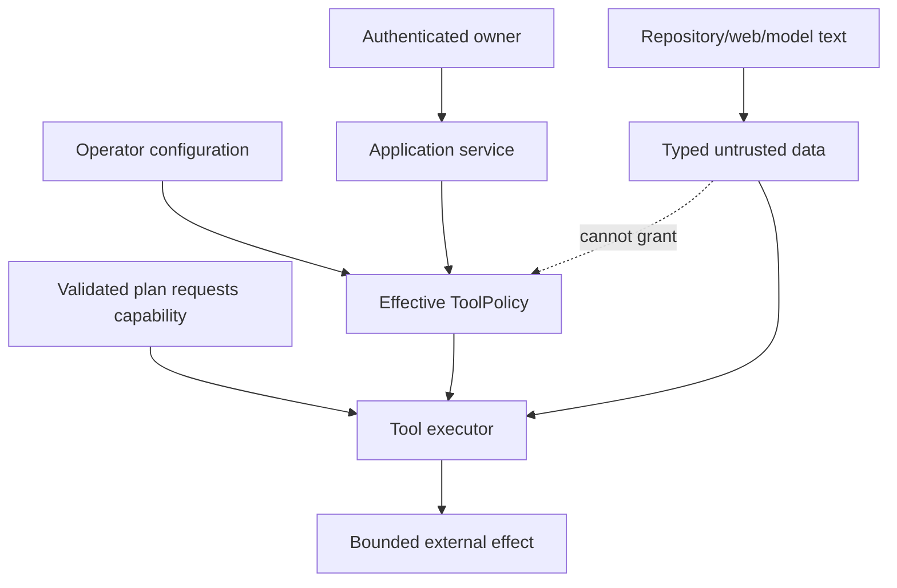

# Architecture

## System context and boundaries

Durable Agent accepts objectives through a CLI or HTTP control plane. Application
services authorize and validate operations, the orchestrator advances domain state, and
ports isolate infrastructure. Repository and research inputs are untrusted data. Tool
policy is the sole authority for side effects.



Trust boundaries are the user/control plane, repository filesystem, provider/network,
tool subprocess, SQL database, and artifact store. See `security.md` for threats.

## Components and dependency direction



Dependencies point inward. `domain` imports only the standard library and Pydantic.
Infrastructure implements protocols for completion, embeddings, search, repository
indexing, tools, state/checkpoint/evidence/artifact storage, clocks, IDs, and events.

## Runtime control flow

```mermaid
sequenceDiagram
  actor U as Operator
  participant A as Application service
  participant O as Orchestrator
  participant D as Durable store
  participant T as Tool executor
  U->>A: create objective (idempotency key)
  A->>D: create run + event
  A->>O: advance
  O->>D: persist plan revision and checkpoint
  loop ready tasks
    O->>D: lease run; task RUNNING; intent
    O->>T: execute policy-checked tool
    T-->>O: bounded result + evidence
    O->>D: atomically result, task state, event, checkpoint
    O->>D: observe pause/cancel request
  end
  O->>D: report + claims + evidence links
  O-->>A: terminal or resumable run
```

Safe boundaries occur before a tool intent and after its result has been reconciled. A
pause/cancel request stops new scheduling and becomes effective only at such a boundary.

## Domain and persistence model

The task graph is a DAG of stable task IDs. `RunState` and `TaskState` transition tables
are explicit and total for supported transitions. A plan is immutable once stored; a
revision creates a new version with its reason and predecessor.

Persistence is an **event-audit hybrid**, not full event sourcing:

- normalized tables are the authoritative query model;
- explicit Pydantic checkpoint envelopes are authoritative resume points;
- append-only event writes explain changes and recovery until explicit terminal retention;
- materialized state need not be replayed for normal startup, but event replay is useful
  for audit validation and projection rebuilds.

Each checkpoint contains canonical JSON, schema version, monotonically increasing
sequence, parent hash, payload hash, and configuration/repository fingerprints. One SQL
transaction commits the checkpoint after checking its expected sequence and parent. Its
audit event is appended immediately afterward; a crash in that narrow gap leaves a valid
resume point without an explanatory event. Readers validate hashes and choose the highest
valid supported checkpoint; corruption produces a recovery event.

## Recovery and side effects

Leases use owner, expiry, fencing token, and optimistic version. An expired lease may be
stolen; the incremented fencing token makes stale owners unable to commit. Database rows
also have integer versions for compare-and-swap updates.

Tool calls follow intent/result semantics:



Idempotent tools reuse a key and cached result. Non-idempotent tools must supply a key
and reconciliation function or transition to manual review. Retry policy uses bounded
exponential backoff with injected deterministic jitter. Partial artifacts and evidence
remain durable on failure/cancellation.

## Indexing, retrieval, and context

The indexer enumerates without following directory symlinks, applies `.gitignore` plus
policy exclusions, validates resolved paths, enforces per-file/aggregate limits, rejects
binaries, hashes bytes, and records incremental new/changed/unchanged/deleted states.
Python AST supplies symbols/imports; a line-aware fallback handles other text. Chunks
carry snapshot, file, hash, line range, language, and symbols.

Keyword retrieval scores normalized term frequency. An optional embeddings protocol
adds cosine similarity; hybrid uses reciprocal-rank fusion. Every result carries primary
provenance. Summaries are navigation aids linked to sources and invalidated by source
hash changes; they are never accepted as evidence.

Context budgeting reserves fixed system/user/output budgets, selects constraints and
active evidence before low-priority history, and stores a manifest of retained/removed
references. Hierarchical deterministic compression creates task, group, and run summaries.
LLM compression is optional and must pass source/evidence/constraint validation.

## Deployment topology and scaling

Local topology is one process, SQLite WAL, and filesystem artifacts. Production topology
uses stateless API/workers, PostgreSQL, shared object storage, an external scheduler, TLS,
and authentication middleware. Workers compete via leases, not process-local locks.
Within one leased run, explicitly parallelizable read/research nodes execute in bounded
batches; mutation nodes remain serial. PostgreSQL row locks can optimize cross-run claiming
while fencing remains the correctness mechanism. Partition events/evidence by tenant/run
at scale, export metrics/traces, and run retention cleanup as a singleton maintenance job.

SQLite serializes writes and is unsuitable for high worker counts. API handlers do not
run long work in request scope; they persist commands and workers advance them. The local
implementation may invoke a bounded advance inline for convenience.

## Failure modes and inspection

Provider throttling/timeouts are retryable; validation, security policy, unsupported
schema, and irreconcilable side effects are terminal or manual-review failures. Database
conflicts are retried after reloading state. Repository drift invalidates affected index
and summaries then follows `fail`, `reindex`, or `replan` policy. Operators use `status`,
`inspect-plan`, `inspect-checkpoint`, `verify`, events, metrics, and structured logs.

## Design alternatives and tradeoffs

- Full event sourcing was rejected: replay and event evolution cost exceed its benefit
  here; ordered audit writes preserve causality, and controlled terminal retention leaves
  a digest tombstone for every compacted range.
- A workflow engine was rejected for the local baseline: it would obscure the durability
  semantics being demonstrated and add operational coupling. Ports permit later adoption.
- A vector database is optional: SQLite keyword/hashing retrieval keeps tests offline and
  deterministic, while a protocol supports production engines.
- In-process code sandboxing is not claimed: subprocess allowlists reduce risk, but
  hostile code requires container/VM isolation supplied by deployment.

Implementation details and tests are linked from the concept-specific guides and ADRs.

## Correctness model: authoritative, derived, and ephemeral state

The architecture classifies every datum by recovery authority. This is more useful than
classifying data merely by storage location because two rows in the same database can
have very different roles.

| Class | Examples | Can drive recovery? | Can prove a report claim? |
|---|---|---:|---:|
| Authoritative domain state | runs, active plan, tasks, attempts, lifecycle requests | Yes | Sometimes, through evidence records |
| Authoritative effect journal | tool intent/result, idempotency record | Yes | Tool results can become primary evidence |
| Authoritative source identity | repository snapshots/files/chunks, external source hashes | Yes | Yes |
| Authoritative recovery document | validated checkpoint envelope | Yes | No; it points to evidence but is not evidence itself |
| Derived navigation state | summaries, repository map, context selection | Rebuild only | No |
| Diagnostic audit | events, logs, metrics, spans | Explains but does not normally drive | No |
| Ephemeral process state | Python objects, task futures, open DB sessions | Never | No |

The fundamental recovery rule is: **rebuild ephemeral and derived data from validated
authoritative records; never infer authoritative state from logs or model prose.** This
prevents a restart from treating an incomplete log line, a stale summary, or an
in-memory future as committed work.



## Transaction boundaries and the no-long-lock rule

External providers and subprocesses can take seconds or minutes. Holding a database
transaction or row lock during that time would reduce throughput, amplify deadlocks, and
make process loss harder to reason about. The orchestrator therefore uses short
transactions around durable boundaries:

1. Acquire/renew lease and load a versioned snapshot of run/task state.
2. In a short transaction, mark attempts/tasks running and persist tool intent.
3. Release database resources before invoking external work.
4. Execute the provider/tool with time and output limits.
5. Renew/fence ownership before accepting the outcome.
6. In short transactions, persist result/evidence/task outcome and checkpoint.



There is necessarily an uncertainty window between the external effect and result
commit. The architecture does not pretend transactions can span an arbitrary filesystem,
HTTP provider, and SQL database atomically. It closes that window with intent records,
idempotency keys, observable final-state hashes, and reconciliation.

## Scheduler semantics and deterministic parallelism

Ready tasks are derived from the active plan revision and materialized task states. The
scheduler sorts candidates deterministically by priority and stable plan order. A serial
node acts as a barrier. A consecutive prefix of explicitly parallelizable, non-mutating
nodes may be dispatched up to `maximum_concurrency`.

All attempts are persisted before dispatch. Worker futures may finish in any order, but
outcomes are committed in plan order. This provides real overlap without making the
durable history depend on CPU scheduling. If one member fails, already successful
members are committed first; failure policy is then applied to the failed node. A pause
or cancellation arriving during the batch becomes effective when all dispatched members
reach the common safe boundary.

```mermaid
gantt
  title One bounded parallel batch
  dateFormat X
  axisFormat %L
  section Durable preparation
  Persist attempts A and B :0, 1
  section Execution
  Read task A             :1, 5
  Research task B         :1, 4
  section Deterministic commit
  Commit A outcome        :5, 1
  Commit B outcome        :6, 1
  Checkpoint batch        :7, 1
```



Parallel repository writes are rejected at plan validation because deterministic commit
order alone cannot prevent two external mutations from racing. A future transactional
workspace adapter could relax that constraint, but only with an explicit isolation and
merge model.

## End-to-end data lineage

The system is designed so an operator can traverse from a report sentence back to source
bytes and forward from source bytes to every derived artifact.



Context and summaries are deliberately absent from the proof path. They may help choose
the chunk, but the claim links to the immutable evidence record. Repository snapshots
make the proof time-specific: a later file with the same path is not silently treated as
the file used by the run.

## Component collaboration in create, advance, and resume

### Create

`AgentService.create_run` validates owner, objective, idempotency key, and repository
root. It indexes the repository, creates the run, invokes the planner, stores immutable
plan/task rows, transitions the run through `CREATED → PLANNING → RUNNING`, and writes
the initial checkpoint. Reusing the same owner/key/request hash returns the same run;
changing the request under that key fails.

### Advance

`AgentOrchestrator.advance` acquires a lease, observes lifecycle commands, derives ready
work, executes a bounded batch, applies failure policy, builds context and summaries,
writes policy-driven checkpoints, and creates a report at terminal state. The service
can bound the number of tasks for CLI demonstrations and cooperative worker loops.

### Resume

`RecoveryManager` transitions a paused/interrupted run into `RECOVERING`, selects a
valid checkpoint, validates configuration and source identity, reconciles uncertain
tools, repairs abandoned attempts, handles repository drift, and returns the run to
`RUNNING`. The orchestrator then uses the same normal advance path; there is no separate
“best effort” execution engine for resumed work.



## Storage consistency and schema evolution

The relational schema enforces identity and ownership relationships while Pydantic
schemas enforce domain constraints at adapter boundaries. Important writes use unique
constraints in addition to application checks: task identity within a plan, checkpoint
sequence within a run, one tool result per call, lifecycle idempotency, and claim/evidence
links.

Migration revisions import a frozen schema representation rather than the live ORM.
This avoids the historical-revision anti-pattern where modifying current models silently
changes what an old migration creates. Checkpoint schema versioning is separate from SQL
migration versioning: a database can be current while containing older supported
checkpoint envelopes. Unsupported checkpoint versions fail explicitly.

## Security architecture and authority flow

Authority moves only downward from configuration and authenticated application context.
It never flows upward from retrieved content.



The planner's `required_tools` and `tool_permissions` fields describe needs; they do not
grant them. The executor resolves a registry definition and intersects its declared
permissions with operator policy. Network, writes, patches, and subprocess execution are
off by default. API ownership is checked at the service boundary, where CLI and HTTP
share identical use cases.

## Observability architecture

Logs, metrics, and traces answer different questions:

- Structured logs explain a specific occurrence with correlation IDs.
- Metrics describe aggregate rate, latency, failure, retry, and resource trends without
  high-cardinality run labels.
- Traces show causal latency across planning, retrieval, execution, checkpointing,
  recovery, compression, and reporting.
- Durable events provide ordered audit facts even when log retention differs.

Observability must not become a second state store. A missing exporter cannot alter
domain correctness, and no recovery branch depends on a log line or trace span.

## Extension protocol

Adding a provider or tool follows an inward-contract-first process:

1. Identify the existing domain protocol or add a vendor-neutral one.
2. Define strict input/output schemas and error classification.
3. Implement the adapter without importing it from the domain.
4. Add a deterministic fake and contract tests.
5. Register it explicitly in application assembly under secure defaults.
6. Document authority, failure, reconciliation, and operator configuration.

This keeps vendor concerns at the edge. An adapter may use a hosted LLM, vector store,
search API, or object store, but checkpoints and reports continue to contain explicit
domain records rather than opaque vendor objects.

## Architecture validation strategy

Architecture is tested through invariants at its seams rather than by screenshotting a
diagram. Contract tests ensure planner tool names exist in the production registry.
Database tests exercise unique constraints and optimistic conflicts. Concurrency tests
prove overlap and deterministic outcomes. Fault injection places crashes inside the
intent/result window. End-to-end tests reconstruct a second application container to
prove that process-local objects are unnecessary. Security tests attempt to cross every
declared filesystem, command, network, and ownership boundary.

Operators can inspect the same seams with `status`, `inspect-plan`,
`inspect-checkpoint`, `verify`, the SQL tables described in [data-model.md](data-model.md),
and the procedures in [operations.md](operations.md).
