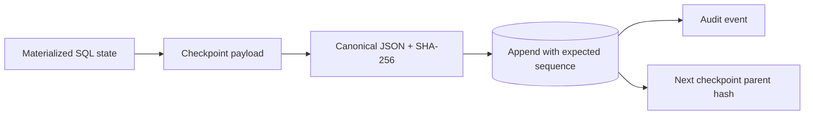
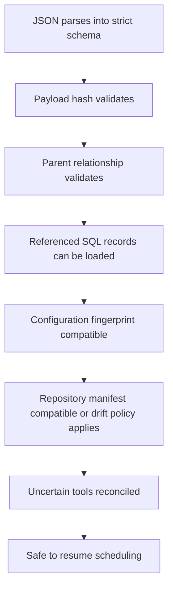
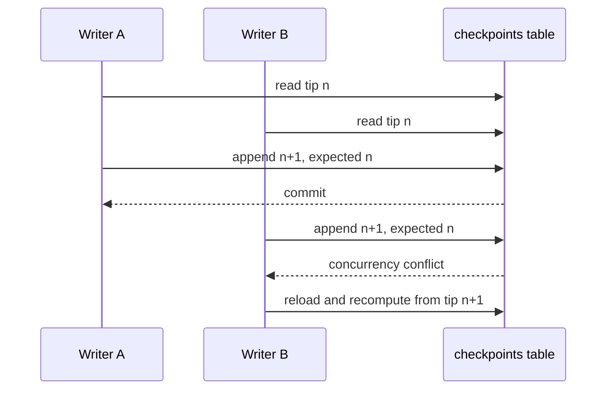
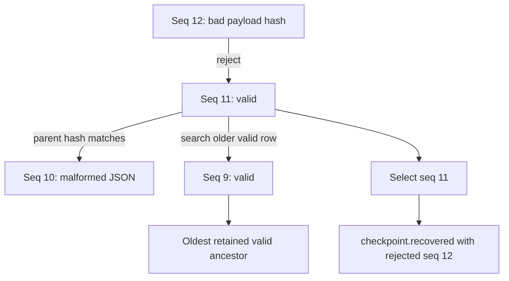

# Checkpointing

`CheckpointPayload` and `CheckpointEnvelope` are strict Pydantic schemas. The current
schema version is `1`; unknown versions fail rather than being guessed. Payload fields
include run/task state, active-task hint, completed/pending IDs, plan version, contexts,
summaries, tool calls, artifacts, evidence, retry counters, error, repository snapshot
and manifest, configuration fingerprint, and timestamp.



`CheckpointManager.write` reconstructs context, summary, tool-call, artifact, evidence,
and latest-error references from authoritative SQL rows before building the payload. It
reads the persisted numeric tip, selects the newest valid retained chain, creates the
next monotonic sequence, and calls `SqlStore.append_checkpoint`. The store transaction
checks the expected tip, a parent hash matching a valid retained checkpoint, and unique
`(run_id, sequence)` before inserting. This permits safe continuation after a corrupt
row without deleting forensic data. Retention keeps at least two entries and deletes only
older checkpoints. A crash after the checkpoint commit but before its audit event leaves
valid resume state; events are explanatory, not the commit record.

`BEFORE_AND_AFTER` and `AFTER` task policies force their declared task-boundary writes.
`RUN_BOUNDARY` tasks use `checkpoint_every_tasks` as the periodic interval; lifecycle,
failure, recovery, and terminal boundaries always checkpoint regardless of that interval.
Materialized task/attempt state remains transactional between periodic checkpoints.

For a parallel batch, the complete `task_states` mapping records every `RUNNING` member;
`active_task_id` is `null` because it is only a single-task display hint. Recovery scans
all task rows, closes every abandoned attempt explicitly, and retries only nodes still
within their attempt bounds.

Recovery parses stored JSON without pickle or dynamic imports, verifies payload hashes,
and verifies each selected parent hash through the retained window. Corrupt rows may be
skipped only when the candidate hash links exactly to an older valid row. If the newest
item is malformed or corrupt, recovery records rejected positions and selects the latest
valid predecessor. No valid item is a terminal corruption error. `inspect-checkpoint`
presents a human-readable view.

Schema changes add a new explicit model and migration/adapter; old versions remain
readable or fail with `UnsupportedSchemaVersionError`. Configuration fingerprints omit
secrets and observability toggles but include repository root, provider/model limits, and
tool authority. This prevents resuming under materially different permissions.

Tests cover round trips, tampering, parent mismatch, concurrent sequence conflict,
retention, and corrupt-tip fallback. Operators back up the SQL database and artifact
store together and verify both hashes after restore.

## What a checkpoint guarantees—and what it does not

A valid checkpoint guarantees that the platform can interpret a self-consistent resume
projection created at a known run boundary. It does not guarantee that every referenced
artifact still exists, that the repository still matches, that configuration remains
compatible, or that an external effect with no result definitely did or did not occur.
Those are resume-time validations performed by the recovery manager.

The guarantee is intentionally layered:



`recover_latest` establishes the first three layers needed to select a candidate.
`RecoveryManager` establishes the remaining operational layers. Keeping these concerns
separate makes corruption diagnosis precise: malformed bytes differ from a valid but
environment-incompatible checkpoint.

## Payload field semantics

| Field | Recovery meaning | Invariant |
|---|---|---|
| `run_id`, `run_state` | Identifies the run and lifecycle projection | Envelope and payload run IDs agree |
| `active_task_id` | Human/display hint for a single active task | Null for parallel batches; never sole task authority |
| `task_states` | Complete active-plan task-state map | Every completed/pending reference exists |
| `completed_task_ids` | Exactly the tasks in `SUCCEEDED` | Equal to the succeeded subset of `task_states` |
| `pending_task_ids` | All non-succeeded tasks at the boundary | Disjoint from completed IDs |
| `plan_id`, `plan_version` | Immutable plan revision used by the run | Version is positive and row must exist |
| `context_ids`, `summary_ids` | Durable context/navigation references | Summary is not evidence |
| `tool_calls` | Intent identity, key, status, effect class | Full result remains in tool tables |
| `artifact_ids`, `evidence_ids` | Durable output/proof references | Revalidated through their stores |
| `retry_counters` | Attempts consumed per task | Values are non-negative |
| `error` | Latest classified error at the boundary | Diagnostic/recovery input, not exception object |
| `repository_snapshot_id`, `repository_manifest_hash` | Source identity used by the run | Compared with a fresh scan on resume |
| `configuration_fingerprint` | Resume-sensitive runtime contract | Excludes secrets, includes authority-changing settings |

The manager merges caller-supplied references with authoritative persisted references.
This guards against a caller forgetting evidence or tool calls already committed before
the checkpoint is assembled.

## Canonicalization and integrity construction

Pydantic serializes the payload in JSON mode. `canonical_json` uses stable key ordering
and representation, then SHA-256 creates `payload_hash`. The envelope's `chain_hash`
hashes the complete serialized envelope, including the payload hash, sequence, parent,
and timestamp. The next checkpoint stores this value as `parent_hash`.

```text
payload_hash(Cn) = SHA256(canonical_json(Cn.payload))
chain_hash(Cn)   = SHA256(canonical_json(Cn.envelope))
Cn+1.parent     = chain_hash(Cn)
```

Changing a task state changes the payload hash and therefore the chain hash. Replacing a
checkpoint with another self-valid document still breaks the child's expected parent.
The design is tamper-evident, not tamper-proof: an attacker able to rewrite the entire
database chain could recompute hashes. External signing or hash anchoring is required
against that stronger adversary.

## Atomic append protocol

Two workers may try to append sequence (n+1). Both read tip (n), but the store accepts
only one expected-sequence comparison inside its transaction.



The unique `(run_id, sequence)` constraint is a second defense. A caller must not catch
the conflict and reuse its old parent; it reloads materialized state and constructs a new
checkpoint. This matters because the winning checkpoint may include task outcomes the
loser had not seen.

Checkpoint and `checkpoint.written` event use separate transactions. The checkpoint is
the commit record; a crash before the event may leave an audit gap but never an invalid
resume point. Reversing the order would be unsafe because an event could claim a
checkpoint that never committed.

## Retained-chain validation and corrupt fallback

Rows are loaded newest first. Each is parsed without executing code. A candidate is
self-verified, then its parent is sought among older self-valid rows. Corrupt older rows
may be skipped only if the candidate's stored parent hash matches an actual older valid
envelope. The oldest retained valid row becomes the local trust anchor because retention
may have removed its ancestors.



Fallback is observable. The recovery event records selected checkpoint ID/sequence and
each rejected position/reason. Forensic rows are not silently repaired or deleted.

## Checkpoint policy and write amplification

Writing after every durable micro-operation maximizes recovery precision but increases
database load and storage. Writing only at run termination minimizes load but loses too
much restart information. The system combines:

- forced lifecycle/failure/recovery/terminal checkpoints;
- task-level `BEFORE_AND_AFTER` and `AFTER` policies;
- configurable periodic boundaries for ordinary `RUN_BOUNDARY` tasks;
- materialized task/tool/evidence state between checkpoint writes.

This hybrid means a process crash may cause recovery from an older checkpoint while more
recent materialized rows exist. Recovery reconciles those rows instead of blindly
replaying from the checkpoint as though the later commits did not exist.

## Parallel batches

A multi-task batch creates one shared safe boundary. Every selected task is first marked
`RUNNING` with an open attempt. During execution, an inspection checkpoint—when produced
by a test or operational hook—shows all active task states and no single active-task
hint. Outcomes commit in plan order, then the batch checkpoint reflects the complete
frontier.

If the worker dies mid-batch, recovery scans task and attempt tables, not just
`active_task_id`. This is why a checkpoint carries the complete `task_states` mapping.

## Schema evolution

Checkpoint schema evolution follows an explicit reader/writer strategy:

1. Define a new payload/envelope schema version.
2. Keep a reader or migration path for supported historical versions.
3. Write only the current version after deployment.
4. Test old fixture checkpoints against the new reader.
5. Fail with `UnsupportedSchemaVersionError` when safe interpretation is impossible.

Adding a Pydantic default without incrementing the version may be acceptable only when
the old semantics are unambiguous. Renaming a state, changing evidence authority, or
changing tool recovery meaning requires an explicit versioned conversion.

## Failure modes and security implications

| Failure | Detection | Response |
|---|---|---|
| Truncated/malformed JSON | Pydantic parse failure | Reject row and try older candidate |
| Payload mutation | SHA mismatch | Record corruption and fall back |
| Broken/reordered ancestry | Parent hash/sequence validation | Reject candidate chain |
| Concurrent writer | Expected-tip/unique conflict | Reload and recompute |
| Unknown version | Version discriminator | Fail explicitly; never guess |
| Repository drift | Fresh manifest comparison | FAIL, REINDEX, or REPLAN policy |
| Authority/configuration change | Fingerprint comparison | Refuse automatic resume |
| Missing artifact/evidence | Store/hash verification | Fail verification or require review |

Checkpoint JSON is untrusted input even though it normally comes from the project's own
database. No pickle, `eval`, import hook, or opaque provider object is accepted. Error
messages and tool metadata are bounded domain fields, not re-thrown serialized
exceptions.

## Alternatives and tradeoffs

- **Opaque Python serialization** was rejected because it couples recovery to code
  layout and enables unsafe deserialization.
- **Database snapshot/backup per task** was rejected because it is expensive and does
  not capture external-source/tool reconciliation semantics.
- **Event replay only** was rejected as the normal path because every historical event
  version would become recovery-critical.
- **Unchained independent checkpoints** were rejected because corruption/reordering
  across rows would be harder to detect.
- **Never prune** was rejected because long-running installations need bounded storage;
  the retained oldest valid row is an explicit local trust anchor.

## Testing and operator procedure

Unit/property tests cover serialization, invariant rejection, version errors, hashes,
and arbitrary round trips. Integration tests cover append conflicts, retention, parent
selection, and SQL storage. Fault and end-to-end tests corrupt the newest row, reconstruct
the process, and verify fallback/recovery events.

Operators should run:

```bash
durable-agent inspect-checkpoint RUN_ID --json
durable-agent status RUN_ID --json
durable-agent verify RUN_ID
```

During an incident, preserve the database before modifying anything. Compare checkpoint
sequences, payload/parent hashes, referenced snapshot manifest, tool calls, and errors.
Do not “fix” a row by editing its hash; restore from a verified backup or allow the
documented fallback logic to choose an older valid boundary.
