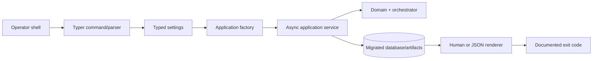
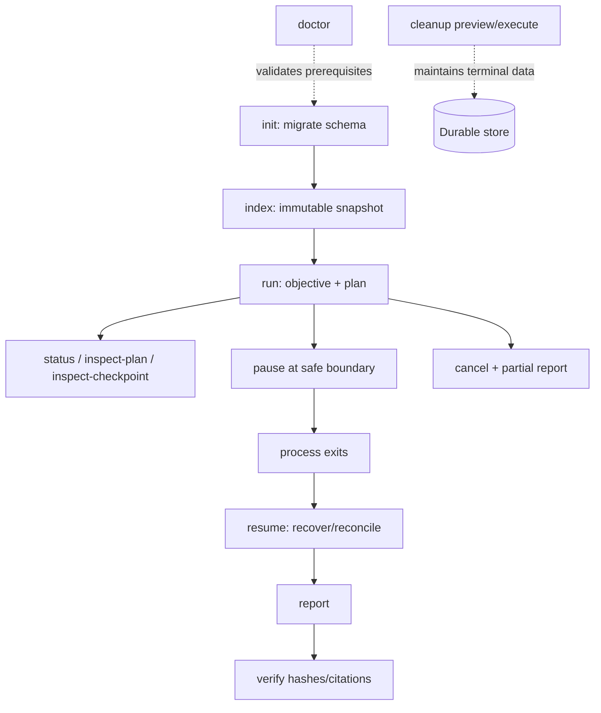
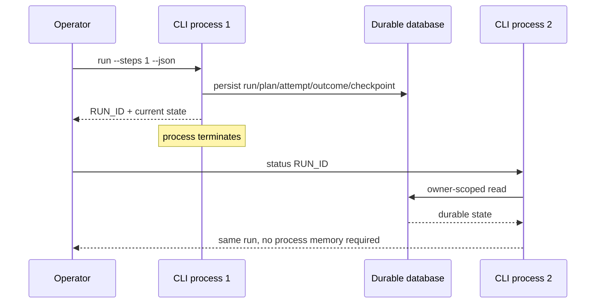
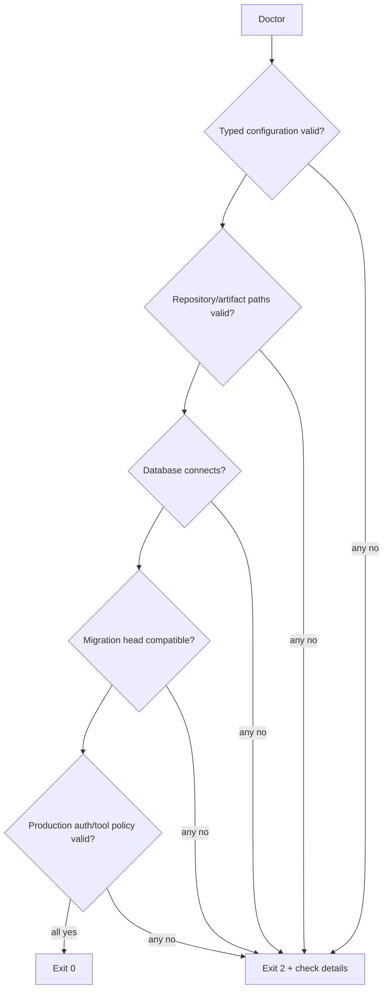

# Command-line interface

All commands use the same application service as HTTP and support meaningful exit codes:
`0` success, `2` invalid input/configuration/not-ready/domain failure, and `1` for an
unexpected Typer/process failure.

```text
durable-agent init
durable-agent index REPOSITORY_PATH
durable-agent run --objective TEXT [--repository PATH] [--steps N] [--no-execute]
durable-agent run --objective-file PATH
durable-agent status RUN_ID
durable-agent inspect-plan RUN_ID
durable-agent inspect-checkpoint RUN_ID
durable-agent pause RUN_ID --reason TEXT
durable-agent resume RUN_ID [--steps N]
durable-agent cancel RUN_ID --reason TEXT
durable-agent report RUN_ID [--format markdown|json] [--output PATH]
durable-agent verify RUN_ID
durable-agent cleanup [--execute]
durable-agent doctor
```

`init` applies Alembic migrations. `index` persists a snapshot. `run` requires exactly
one objective source, plans immediately, and normally advances to completion; `--steps`
creates a deterministic stopping boundary and `--no-execute` leaves the plan ready.
Generated default request keys hash objective content; supply your own stable key for
automation. A run repository must equal the configured sandbox root.

Pause/cancel request keys make transport retries safe. Pause invokes one scheduling pass
to persist the safe-boundary checkpoint. Resume validates ownership/configuration/
repository and may run to completion. `verify` validates evidence links and stored report
hashes. `cleanup` is a dry run unless `--execute` is explicit; it compacts eligible old
terminal-run events into a digest tombstone and deletes only old uncatalogued artifact
files. Most inspection/mutation commands accept `--json`; report emits its native format.

Example restart:

```bash
export DURABLE_AGENT_REPOSITORY_ROOT=tests/fixtures/sample_service
durable-agent run --objective-file examples/retry-limit-objective.md --steps 1 --json
durable-agent pause RUN_ID --reason maintenance
# terminate this shell/process; state is in SQL
durable-agent resume RUN_ID
durable-agent verify RUN_ID
```

CLI integration tests run through a migrated temporary SQLite schema and assert JSON,
status, plan, checkpoint integrity, retention preview/execution, doctor, and
ambiguous-input rejection.

## CLI design and execution model

The CLI is a synchronous presentation adapter over asynchronous application services.
Typer handles command syntax and help; a small runner creates settings/application
resources, awaits one service operation, renders a stable result, disposes resources,
and exits. It shares domain and persistence semantics with HTTP rather than maintaining a
separate local state machine.



Each invocation is intentionally disposable. Pause/resume proves that correctness comes
from durable SQL/checkpoints, not a resident CLI process.

## Command lifecycle map



## Initialization and migration

`durable-agent init` locates packaged or source-checkout Alembic configuration and upgrades
to the current head. It is idempotent at the migration level: running it twice does not
recreate tables. It does not silently downgrade, delete, or recreate an incompatible
database. Production operators should back up first and run migration as a singleton
release job, not independently in every worker.

## Repository indexing

`durable-agent index REPOSITORY_PATH` canonicalizes the path, checks it against the
configured root policy, scans within file/repository limits, persists a snapshot, and
prints its ID, manifest hash, counts, changes, and warnings. JSON mode is designed for
automation; skipped binary/oversized/unsafe files remain explicit warnings rather than
being interpreted as absent.

```bash
export DURABLE_AGENT_REPOSITORY_ROOT=/workspace/project
durable-agent index /workspace/project --json
```

An index command is read-only with respect to repository bytes but writes index state to
the database. Repeating an unchanged scan creates or resolves content-addressed snapshot
semantics according to the repository store; citations remain pinned to exact snapshot
IDs.

## Creating and advancing a run

Exactly one of `--objective` and `--objective-file` is accepted. An objective file is
read as bounded user input and cannot supply CLI flags, environment variables, or tool
permissions. `--repository` must equal the configured approved root after resolution.

`run` persists run, plan graph, events, and checkpoint before execution. With
`--no-execute`, it stops after a reviewable plan. With `--steps N`, it advances at most
the configured logical task boundary, useful for deterministic demonstrations and
controlled operations. Omitting both normally advances until terminal, waiting, paused,
or failed state.



Automation should provide or retain a stable idempotency key when supported by the
command workflow. Generated default keys are convenient for local deterministic
objectives, but explicit keys make orchestration intent auditable.

## Inspection commands

`status` shows lifecycle state, active plan/task, progress, snapshot, and latest
checkpoint. `inspect-plan` shows immutable plan metadata, dependencies, task states,
permissions, evidence obligations, and revision history. `inspect-checkpoint` decodes and
integrity-checks the latest valid checkpoint into a human-readable representation; it
does not print secrets or deserialize arbitrary objects.

JSON mode uses stable machine-readable fields. Human mode is optimized for review and may
evolve cosmetically, so scripts should consume JSON rather than parse columns/prose.

## Pause, resume, and cancel

Pause persists a request with reason and stable key, allows an in-flight atomic unit to
settle, records a pre-pause checkpoint, and returns a resumable run ID. A request accepted
during a long external operation may initially show `PAUSE_REQUESTED`; status eventually
shows `PAUSED` at a safe boundary.

Resume is a recovery operation, not merely a state flip. It acquires a fenced lease,
finds the latest valid checkpoint, validates configuration and repository state,
reconciles intent-without-result tool calls, repairs interrupted attempts, reconstructs
context, and only then schedules missing work.

Cancel persists a distinct terminal intent, stops new scheduling at a safe boundary,
retains evidence/artifacts, and generates a partial report when possible. A cancelled run
cannot be resumed.

## Reporting and verification

`report` reads the stored semantic report and emits Markdown or JSON. `--output` writes
only to a policy-approved destination using safe file handling; absent `--output`, native
content goes to stdout. `verify` independently recomputes stored report/artifact hashes,
validates claims/evidence links, and confirms Markdown citations.

```bash
durable-agent report RUN_ID --format markdown --output run-report.md
durable-agent report RUN_ID --format json --output run-report.json
durable-agent verify RUN_ID --json
```

A generated report and a passing verifier are separate results. Verification failure is
reported nonzero and must not overwrite the questioned report.

## Doctor diagnostics

`doctor` validates configuration construction, repository root existence/containment,
artifact directory access, database connectivity, migration-head compatibility, and
effective high-level permission posture. It avoids changing lifecycle state and produces
actionable checks in human or JSON form.



Doctor does not prove that arbitrary repository tests are safe or that optional external
providers will remain available. Those are explicit limitations/readiness domains.

## Cleanup safety

Cleanup defaults to a preview and reports candidates. `--execute` is required for
mutation. It compacts only eligible event ranges into a hashed tombstone and deletes only
old uncatalogued regular artifact files under the configured artifact root. It does not
delete repository evidence, reports, catalogued artifacts, snapshots, or resumable
checkpoints.

Operators should back up and run cleanup as a singleton maintenance task. Symlinks and
path escapes fail closed. Repeating after partial failure is idempotent.

## Output and exit-code contract

| Exit | Class | Automation response |
|---|---|---|
| `0` | Command completed with the documented result | Parse stdout/JSON |
| `2` | User/config/domain/readiness failure | Correct input/state/config; retry only if classified retryable |
| `1` | Unexpected adapter/process defect | Preserve stderr/correlation ID and investigate |

Expected domain failures do not emit Python tracebacks in normal mode. JSON errors have a
stable category, safe message, and correlation fields. Secrets and full untrusted content
are redacted from console/log output.

## Configuration precedence and reproducibility

Settings use documented `DURABLE_AGENT_` environment variables and optional `.env`.
Command options override only the fields explicitly modeled for that command; they do not
provide an unrestricted configuration escape hatch. A run stores a fingerprint of
resume-relevant effective configuration, excluding secret values.

For reproducible operations, record the package version, configuration fingerprint,
database migration head, repository snapshot ID, objective hash, command arguments, and
report verification output.

## Security model

Local CLI ownership defaults are convenient on a single-user workstation. On shared
hosts, OS users, file modes, database credentials, and artifact paths form the access
boundary; a local CLI without an identity service must not be exposed as a setuid/shared
control surface. Objective files and repository content are untrusted data. Shell tools,
network, writes, and patches remain disabled unless configuration and task policy both
allow them.

Do not place API tokens or database passwords directly on the command line because shell
history and process listings can reveal them. Use a secret manager or protected
environment injection.

## End-to-end operational example

```bash
python -m pip install --constraint requirements.lock -e .
export DURABLE_AGENT_REPOSITORY_ROOT="$PWD/tests/fixtures/sample_service"
durable-agent init
durable-agent doctor --json
durable-agent index "$DURABLE_AGENT_REPOSITORY_ROOT" --json
durable-agent run --objective-file examples/retry-limit-objective.md --steps 1 --json
# Save the returned run_id as RUN_ID.
durable-agent inspect-plan RUN_ID --json
durable-agent pause RUN_ID --reason 'restart demonstration' --json
# Start a new shell/process with the same durable configuration.
durable-agent resume RUN_ID --json
durable-agent report RUN_ID --format markdown
durable-agent verify RUN_ID --json
```

## Failure diagnosis and tests

If a command reports not-ready, run `doctor`; for an invalid transition, inspect status
and plan; for resume failure, inspect checkpoint, repository drift, lease owner, and
uncertain tool intents. A database “locked” condition usually indicates excessive SQLite
concurrency or a long transaction, not a reason to delete the database.

CLI integration tests construct a migrated temporary database and isolated artifact/root
directories. They cover every required command, objective-source exclusivity, JSON
schemas, exit codes, restart across invocations, idempotent lifecycle requests,
checkpoint inspection, report verification, doctor failures, and cleanup preview/execute.
