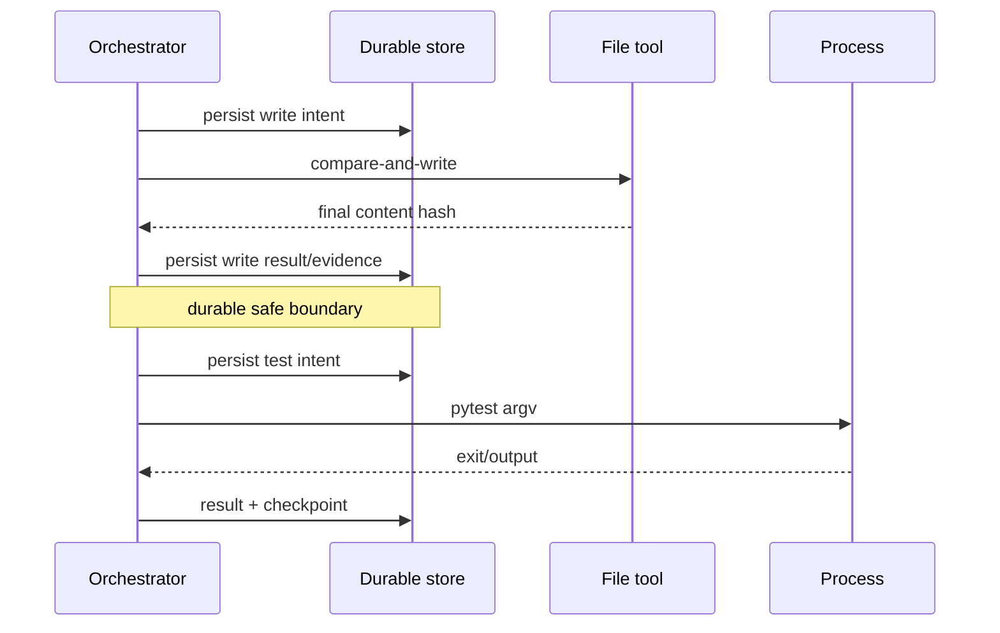
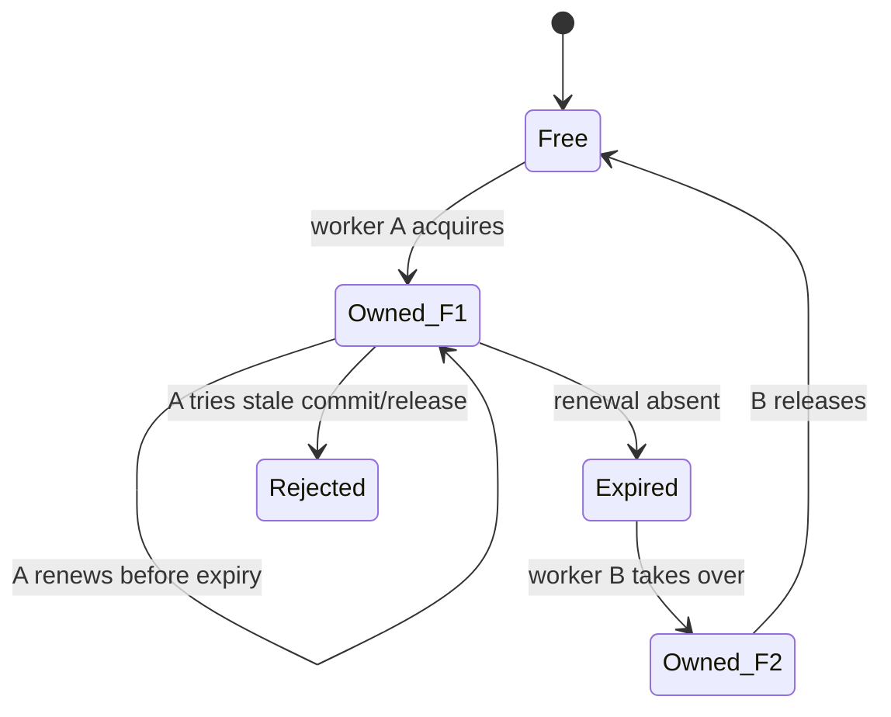
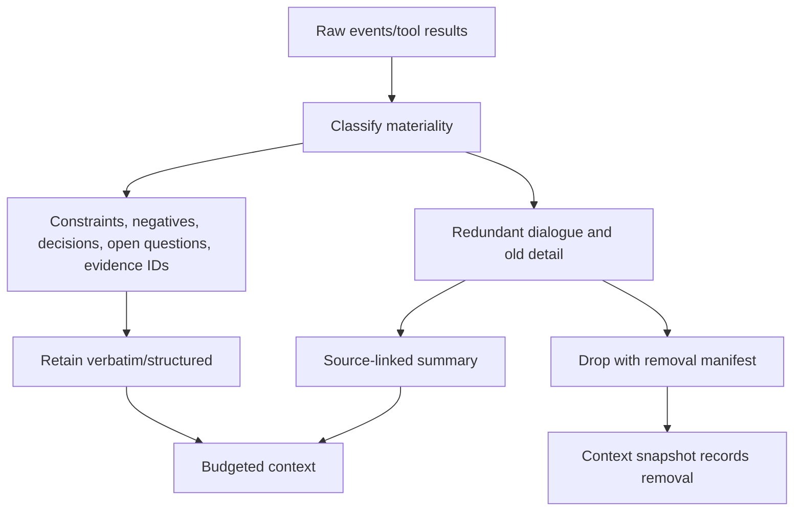
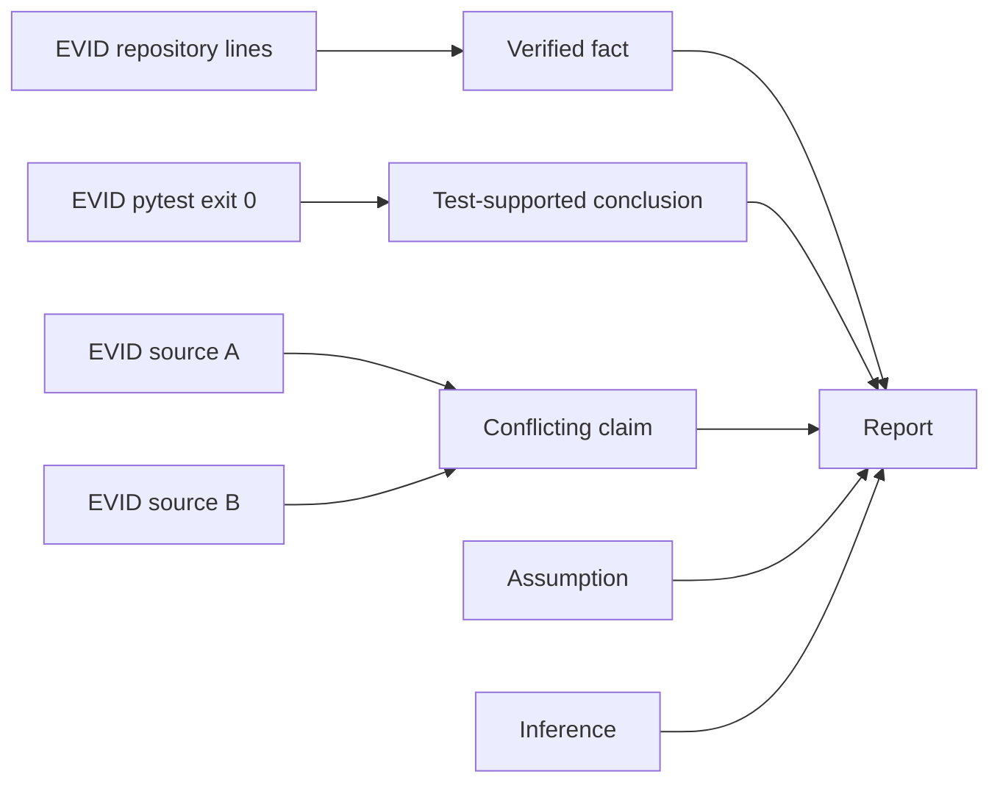

# Concepts

## Durable execution

Durable execution makes committed progress survive process loss. The orchestrator stores
the run, task, attempt, tool intent/result, context manifest, and checkpoint before it
assumes a boundary is complete. A restart reconstructs ephemeral objects from these
explicit records. Logs are diagnostic output and are never used as state.

## State machines and task graphs

A state machine enumerates legal lifecycle changes. It prevents convenient but unsafe
jumps such as `PAUSED -> COMPLETED`. A task graph is a directed acyclic graph (DAG): an
edge means the dependent task cannot become ready until its prerequisite succeeds.
Stable IDs make state independent of list order. See `domain/state_machine.py` and
`domain/plan.py`; exhaustive and property tests reject every unlisted transition and
cycle.

## Checkpoints, events, and optimistic concurrency

A checkpoint is a versioned resume document, not a Python object dump. It records the
materialized state and durable references needed after restart. Its canonical payload
hash detects tampering; its parent hash and sequence detect gaps and reordering. A SQL
transaction appends each checkpoint under an expected sequence. The audit event is
written immediately afterward in a separate transaction, so a crash can omit that
diagnostic event without invalidating the authoritative checkpoint.

Optimistic concurrency is compare-and-swap: update only when the stored version equals
the version read. A zero-row update means another actor won and the caller must reload.
This avoids holding database locks across provider or tool calls.

## Idempotency, intent records, and reconciliation

An idempotency key identifies one logical mutation. The store binds it to a request hash
and result resource; reuse with different input is rejected. Before a tool runs, an
intent row commits its exact arguments, hash, effect class, and key. If the process dies
before a result commits, recovery asks the tool to reconcile observable state. It never
blindly repeats an unverifiable, non-idempotent effect.

Retry safety and idempotency are different. A read is retry-safe. An atomic compare-and-
swap write is idempotent for the same expected/result hashes. Sending an email is neither
unless the provider honors a key or exposes reconciliation.

## Leases and fencing

A lease grants temporary run ownership. Renewal by the same owner preserves its fencing
token; takeover after expiry increments it. A stale worker's lease release is rejected.
Database versions add a second fence. SQLite supports the local single-worker topology;
PostgreSQL is required for multiple production workers.

## Context windows and compression

Models have finite input/output budgets. The context manager reserves system, user, and
output space, estimates the remainder, and selects constraints, negative requirements,
decisions, questions, active task state, and evidence first. Lower-value history is
compressed into a source-linked summary. The hierarchy is raw events → task summary →
task-group summary → run summary. Repeated summaries retain a constraint sentinel, and
source hash changes invalidate them. A summary helps navigation but cannot prove a claim.

## Retrieval and evidence provenance

Keyword retrieval scores terms; semantic retrieval uses an embedding protocol; hybrid
retrieval fuses ranks. Every item includes source, snapshot, content hash, and line range.
Evidence is an immutable ledger record with reliability and verification state. A claim
stores evidence IDs and an epistemic kind: verified fact, test-supported conclusion,
inference, assumption, limitation, or unresolved conflict. Report verification traverses
that graph and rejects missing, cross-run, invalid, or incompatible links.

## Failure taxonomy and circuit breaking

Validation, security, unsupported schema, corruption, repository drift, concurrency,
database, provider, rate-limit, timeout, tool, and terminal domain failures are distinct.
Only explicitly retryable classes receive bounded exponential backoff with deterministic
jitter. A circuit breaker stops calls after repeated provider failure and allows a
half-open probe after its recovery interval. Attempts and errors are durable rows, so an
operator can distinguish retries from duplicate work.

## Inspection

Use `status`, `inspect-plan`, `inspect-checkpoint`, `verify`, SQL event/attempt/error rows,
structured logs, Prometheus metrics, and traces. Tests for each concept are cataloged in
[testing.md](testing.md); operational response is in [operations.md](operations.md).

## A formal mental model of a run

At time (t), a run can be understood as a tuple of durable values:

```text
R(t) = (run state, active plan version, task states, attempts,
        tool intents/results, source snapshot, evidence ledger,
        context references, lifecycle requests, lease generation)
```

A checkpoint is a validated, versioned projection of this tuple plus references to
durable records. It is not the tuple's only storage location and is not a byte-for-byte
memory image. An event is a statement that a transition occurred; it is not itself the
current state. A report is a terminal projection of claims and evidence; it cannot be
used to reconstruct unfinished task execution.

```mermaid
flowchart TD
  STATE[Materialized run state R(t)] --> CP[Checkpoint projection Cn]
  STATE --> EVENT[Audit event En]
  STATE --> VIEW[CLI/API status view]
  STATE --> REPORT[Terminal report projection]
  CP --> RECOVERY[Resume reconstruction]
  EVENT --> AUDIT[Human/event audit]
  EVENT -. not authoritative .-> RECOVERY
  REPORT -. not execution state .-> RECOVERY
```

This separation solves a common agent-system failure: assuming that a transcript is the
agent. A transcript cannot tell whether a subprocess effect happened but its response was
lost, whether a task attempt is still owned by a live worker, or whether the repository
changed while the process was stopped.

## Durable execution versus long-running processes

A long-running process merely stays alive. Durable execution assumes the process will
die and defines which completed work survives. The unit of progress is therefore a
**commit boundary**, not a Python stack frame.

Consider a task that writes a file and then runs tests:



If the process dies before the write result commits, recovery compares the expected
final hash with the file. If it dies after the result but before the checkpoint, the
materialized tool/task rows still identify committed progress and the next checkpoint
reconstructs them. If it dies during tests, the command is treated according to its
declared retry safety; the system does not infer success from partial stdout.

## Safety, liveness, and monotonic progress

Durability is best reasoned about with three categories:

- **Safety:** illegal transitions, duplicate non-idempotent effects, forged evidence, and
  root escapes never occur.
- **Liveness:** retryable work eventually succeeds or becomes a bounded explicit failure;
  pause and cancellation eventually reach a boundary.
- **Monotonicity:** stable facts such as completed tasks, checkpoint sequence numbers,
  attempt counts, and evidence records do not silently move backward.

Not all fields are monotonic. A lease expires; active-task hints change; summaries become
invalid after source drift. The design makes those changes explicit rather than treating
all persistence as append-only.

## Idempotency algebra

An operation (f) is mathematically idempotent when applying it twice has the same
observable outcome as applying it once: (f(f(x)) = f(x)). Distributed systems need a
stronger practical question: *same according to which observer and side effects?*

| Operation | Naturally idempotent? | Retry-safe after ambiguous termination? | Required control |
|---|---:|---:|---|
| Read immutable snapshot | Yes | Yes | Snapshot ID and content hash |
| Search snapshot | Yes | Yes | Same snapshot/query/limit |
| Put artifact by ID/content | Yes | Yes | Reject different bytes for the same logical key |
| Compare-and-write file | Conditionally | Yes when final hash is observable | Expected old and final hashes |
| Run tests | No general guarantee | Usually no | Record output; rerun only by explicit policy |
| Send notification | Usually no | No | Provider idempotency key or reconciliation |
| Create run | Logically yes | Yes | Owner-scoped key plus request hash |

An idempotency key does not magically make the underlying world idempotent. It creates a
stable identity that a cooperating journal/provider can use to suppress or reconcile
duplicates. Reusing a key with different input is a security and correctness error.

## Optimistic concurrency and compare-and-swap

Suppose workers A and B both read run version 7. Each calculates a new state. Their SQL
updates include `WHERE version = 7`. A commits first and writes version 8. B updates zero
rows, receives `ConcurrencyConflictError`, discards its stale calculation, and reloads.

```mermaid
sequenceDiagram
  participant A as Worker A
  participant B as Worker B
  participant DB as Run row
  A->>DB: read version 7
  B->>DB: read version 7
  A->>DB: UPDATE ... WHERE version=7
  DB-->>A: 1 row; version 8
  B->>DB: UPDATE ... WHERE version=7
  DB-->>B: 0 rows
  B->>DB: reload version 8
```

This is preferable to holding locks while model/tool calls run. It does mean callers must
be prepared to abandon calculations made from stale state. Lease fencing adds an
ownership dimension: even if a stale worker retained old objects, it cannot legitimately
commit after another worker acquires the next fencing generation.

## Leases are not mutexes

A process mutex disappears when the process dies and cannot coordinate hosts. A lease is
a durable, expiring claim. Its safety relies on time bounds and fencing, not on believing
the old owner stopped exactly at expiry.



Clock skew and long stop-the-world pauses are why the fencing token matters. The token is
monotonic ownership evidence; expiry alone is insufficient to stop a delayed old worker
from sending a late write.

## Checkpoint chains and content-addressed integrity

Canonical serialization maps semantically identical payloads to identical bytes. The
payload hash detects a mutated document. The parent hash creates a retained hash chain,
and the sequence creates a human/query ordering. These controls answer different
questions:

- Payload hash: “Were these checkpoint contents altered?”
- Parent hash: “Does this checkpoint claim the expected predecessor?”
- Sequence/unique constraint: “Is its position unambiguous for this run?”
- Schema version: “Do we know how to interpret it?”
- Configuration/source fingerprints: “Is it compatible with this resume environment?”

A hash proves integrity relative to trusted storage of the expected hash; it does not
prove authorship. Administrators needing protection from a database superuser must add
signatures or externally anchored/WORM storage.

## Retrieval as a provenance-preserving function

Retrieval is not “paste text into the prompt.” It is a function from a query and an
identified corpus to ranked, addressable source records:

```text
retrieve(query, snapshot_id, policy) -> [(item, score, provenance), ...]
```

Keyword and semantic scores are incomparable quantities, so hybrid retrieval combines
ranks using reciprocal-rank fusion rather than adding raw values. A result retains the
snapshot ID, relative path/source, line range, content hash, and structured metadata.
The model may interpret the content, but it cannot change those provenance fields.

## Context compression as controlled information loss

Compression is an information-loss operation. The question is not whether information
is lost—it must be—but whether loss respects a declared priority and remains auditable.



Negative requirements deserve special attention. A summary that preserves “add retry”
but loses “do not change the default” can invert the task. Constraint sentinels and
source-linked summaries make such drift detectable. Repeated summarization is bounded by
hierarchy so a summary is not recursively paraphrased without its source references.

## Evidence, claims, and epistemic kinds

Evidence and claims are different nodes. Evidence records an observed source/result.
A claim is an assertion made by the report. Links state which observations support which
assertion.



Two reputable sources may conflict. The correct output is not an arbitrary winner but a
conflict record, unless an explicit resolution method supplies new evidence. Inferences
and assumptions may appear in a useful report, but their labels prevent readers from
mistaking them for verified facts.

## Retry, circuit breaker, and failure policy are distinct

- **Retry policy** decides when and how often to repeat a retry-safe attempt.
- **Circuit breaker** decides whether calls to a repeatedly failing dependency should be
  attempted at all during a cooling period.
- **Task failure policy** decides what the graph does after attempts are exhausted:
  fail the run, skip descendants, wait for review, or use a declared recovery path.

Combining these into one “try again” flag produces retry storms and hidden partial
failure. The error taxonomy supplies stable categories; the task specification supplies
policy; the durable attempt/error rows supply history.

## Common misconceptions

1. **“SQL persistence makes execution durable.”** Only if commit boundaries, retries,
   external effects, and recovery selection are defined.
2. **“Exactly once is guaranteed.”** The platform provides durable intent and duplicate
   suppression where adapters can prove it; arbitrary external effects remain at-least-
   once/unknown without provider cooperation.
3. **“A lease means the prior worker is dead.”** It means its authority expired; fencing
   rejects late actions.
4. **“A summary is compressed truth.”** It is a fallible navigation artifact linked to
   primary records.
5. **“Parallel tasks commit whenever they finish.”** Execution overlaps, but durable
   outcome order is deterministic.
6. **“Prompt injection is solved by a warning string.”** The real control is separation
   of data from authority plus tool policy and sandbox boundaries.

## Where to go deeper

Use [architecture.md](architecture.md) for component collaboration,
[checkpointing.md](checkpointing.md) for chain validation,
[pause-resume-recovery.md](pause-resume-recovery.md) for lifecycle recovery,
[context-compression.md](context-compression.md) for budgeting,
[tools.md](tools.md) for side-effect semantics, and
[evidence-and-reporting.md](evidence-and-reporting.md) for the claim graph.
