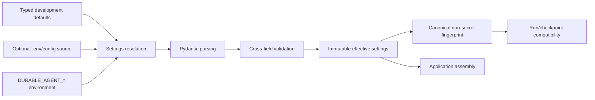
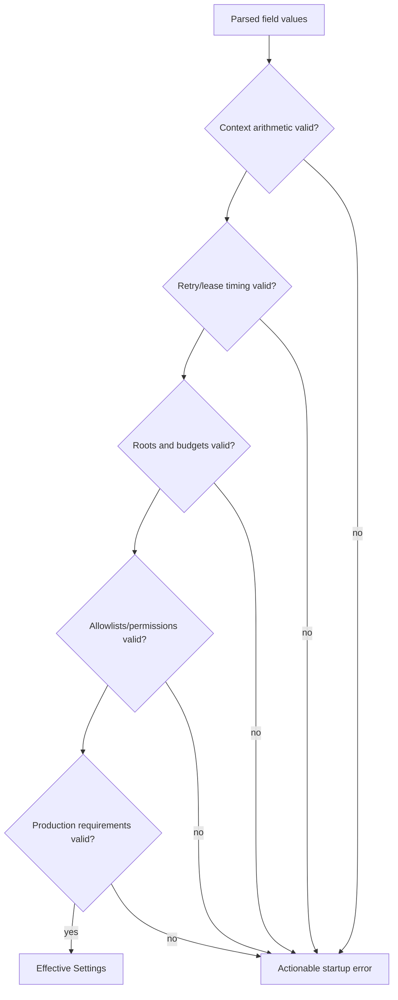
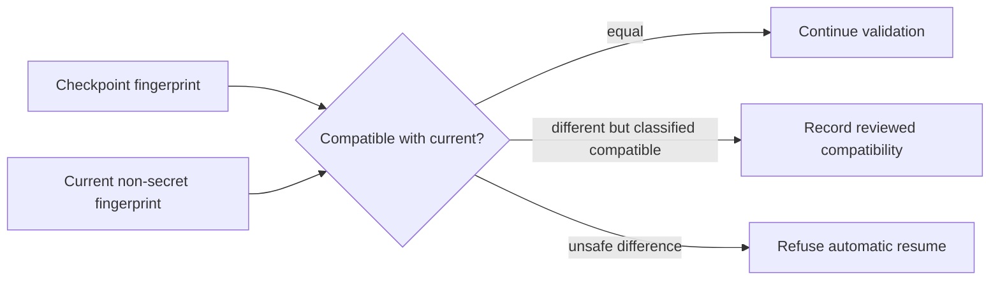
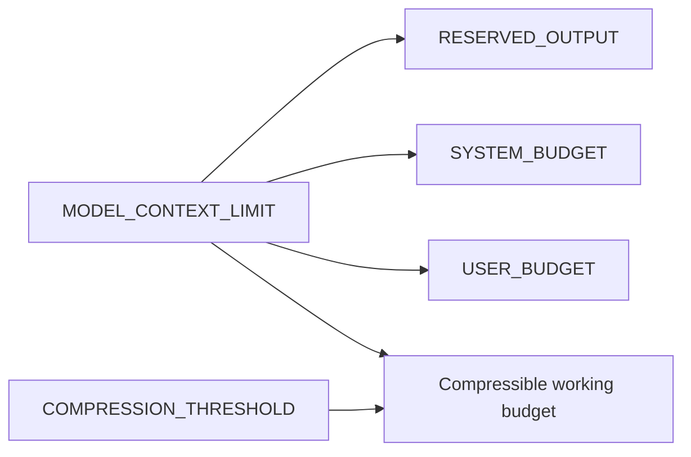
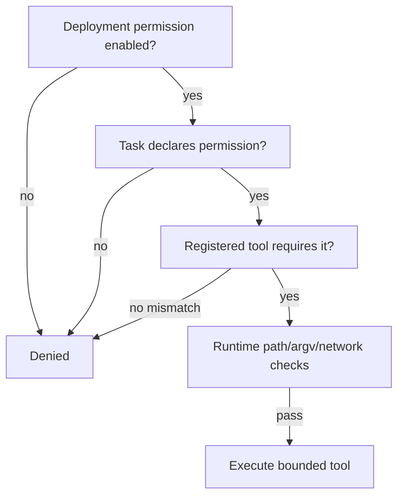

# Configuration reference

`Settings` in `configuration/settings.py` loads environment variables with the
`DURABLE_AGENT_` prefix and optional `.env`, validates defaults, and rejects invalid
cross-field combinations at startup. Nested settings use `__`; tuple/list environment
values use JSON syntax.

| Area | Variables / defaults | Notes |
|---|---|---|
| Persistence | `DATABASE_URL=sqlite+aiosqlite:///./durable-agent.db`, `SYNC_DATABASE_URL=sqlite:///...`, `ARTIFACT_DIRECTORY=artifacts` | Production rejects SQLite and uses PostgreSQL URLs |
| Repository | `REPOSITORY_ROOT=.`, `MAXIMUM_FILE_BYTES=2000000`, `MAXIMUM_REPOSITORY_BYTES=100000000`, `INDEXING_EXCLUSIONS` | Root is the tool sandbox; exclusions are JSON list/tuple |
| Models/context | `LLM_PROVIDER=deterministic`, `MODEL_NAME=offline-baseline`, `MODEL_CONTEXT_LIMIT=32768`, output/system/user budgets, `CONTEXT_COMPRESSION_THRESHOLD=.8` | Fixed reservations must be below limit |
| Retry/lifecycle | `RETRY__MAXIMUM_ATTEMPTS`, base/max delay, jitter; `CHECKPOINT_EVERY_TASKS=1`, checkpoint retention; `MAXIMUM_CONCURRENCY=1`; lease TTL/renewal | Task checkpoint policy can force a write before the interval; renewal must be less than half TTL |
| Tools | `ALLOW_FILE_WRITES=false`, `ALLOW_PATCH=false`, `ALLOW_SHELL=false`, `NETWORK_ACCESS=false`, command/env allowlists, timeout/output cap | Deny by default; repository root must match run root |
| Drift/retention | `REPOSITORY_DRIFT_POLICY=REINDEX`, event/artifact retention days | Policies: `FAIL`, `REINDEX`, `REPLAN` |
| Observability | `LOG_LEVEL=INFO`, `LOG_JSON=true`, `METRICS_ENABLED=true`, `TRACING_ENABLED=true` | Exporter SDK is deployment-provided |
| API security | `REQUIRE_API_AUTHENTICATION=false`, `API_AUTH_TOKEN`, `API_ALLOWED_OWNERS` | The HTTP application refuses to start in production unless authentication is enabled; enabled production auth requires a token |

Copy `.env.example` only for development and never commit `.env` or credentials. Secret
values use `SecretStr` and are omitted from configuration fingerprints. Fingerprints
include settings that change resume semantics: repository, database dialect, model,
context, concurrency, permissions, limits, and drift policy.

Example production values:

```dotenv
DURABLE_AGENT_ENVIRONMENT=production
DURABLE_AGENT_DATABASE_URL=postgresql+asyncpg://agent:REDACTED@db/agent
DURABLE_AGENT_SYNC_DATABASE_URL=postgresql+psycopg://agent:REDACTED@db/agent
DURABLE_AGENT_REQUIRE_API_AUTHENTICATION=true
DURABLE_AGENT_API_AUTH_TOKEN=load-from-secret-manager
DURABLE_AGENT_API_ALLOWED_OWNERS=["team-a"]
DURABLE_AGENT_NETWORK_ACCESS=false
DURABLE_AGENT_ALLOW_FILE_WRITES=false
```

`durable-agent doctor` validates configuration, database connectivity, schema, root,
and effective high-level permissions. It exits `2` when migration/connectivity is not
ready. Configuration tests cover drivers, budgets, leases, production requirements,
plain command names, fingerprints, and secret exclusion.

Migration configuration and revision files are included in wheels under
`share/durable-agent`, so `durable-agent init` works outside a source checkout. A local
`alembic.ini` takes precedence for repository development and container operations.

## Configuration is part of execution semantics

Configuration is not only deployment plumbing. Repository roots, tool permissions,
context limits, retry attempts, concurrency, drift behavior, and provider identity can
change what a resumed run would do. The system therefore validates configuration before
creating services and stores a non-secret fingerprint in each run/checkpoint.



Precedence follows the settings implementation: explicit initialization values used by
tests/application assembly, environment values, optional dotenv values, then class
defaults. Operators should use one controlled configuration source per deployment to
avoid surprising overrides.

## Typed structure and environment encoding

Settings are grouped by responsibility rather than kept as an untyped string dictionary.
The `DURABLE_AGENT_` prefix prevents collisions. Nested retry fields use a double
underscore, for example `DURABLE_AGENT_RETRY__MAXIMUM_ATTEMPTS`. Lists/tuples use JSON so
values containing commas are not parsed ambiguously:

```dotenv
DURABLE_AGENT_INDEXING_EXCLUSIONS=[".git",".venv","dist","node_modules"]
DURABLE_AGENT_COMMAND_ALLOWLIST=["pytest","python"]
DURABLE_AGENT_ENVIRONMENT_ALLOWLIST=["PATH","LANG","LC_ALL"]
```

Booleans and numbers are schema-parsed; an unknown or malformed value fails startup with
the field path and constraint. Secrets use `SecretStr` and safe representations.

## Cross-field invariants

Individual types cannot express all safe combinations. Startup validation enforces at
least these relationships:

1. Fixed context reservations are non-negative and sum to less than the model context
   limit.
2. Compression threshold is within its accepted range.
3. Retry attempts/delays are positive, maximum delay is not below base delay, and jitter
   is bounded.
4. Lease renewal occurs sufficiently before lease expiry; TTL and checkpoint intervals
   are positive.
5. File and repository budgets are positive and aggregate limit is not nonsensically
   below required operation sizes.
6. Command allowlist entries are plain executable names rather than paths or shell
   fragments.
7. Production rejects SQLite and unauthenticated API startup.
8. Enabled authentication requires a token and valid owner policy.
9. Tool permissions default off and cannot be enabled by repository/model content.
10. Repository and artifact roots resolve to usable explicit locations.



Failing at startup is safer than discovering during recovery that a lease never renews
or mandatory context can never fit.

## Resume-compatibility fingerprint

The fingerprint is SHA-256 over canonical JSON containing only behavior-relevant,
non-secret settings. Keys are sorted and enum/path values are normalized. Secrets are
excluded entirely—not replaced with a fixed marker that might accidentally make secret
rotation appear meaningful.

Settings typically included are:

- database dialect and persistence semantics, not credentials;
- approved repository root and indexing limits/exclusions;
- planner/model/compressor identity and context budgets;
- concurrency, checkpoint, lease, retry, and drift policy;
- effective tool/network permission posture and command policy;
- schema/normalization versions where applicable.



Equality is the conservative default. Some future migrations may classify changes as
compatible—for example, raising a metrics-export flag—but permission expansion, root,
provider, context, retry, or drift changes require explicit policy/review. Rotating a
credential without changing provider semantics should not invalidate a run.

## Persistence settings

The asynchronous URL serves application I/O; the synchronous URL serves Alembic and
tools requiring a sync engine. They must address the same logical database/schema.
SQLite uses `aiosqlite`/standard SQLite locally; production uses PostgreSQL drivers.
Embedding credentials directly in committed configuration is prohibited.

Artifact directory is a root for content-addressed generated bytes, not an arbitrary
output path. It should reside on persistent storage, have owner-restricted permissions,
be backed up consistently with the database, and have sufficient quota. Object storage
can replace it behind the artifact protocol.

## Repository and indexing settings

`REPOSITORY_ROOT` is both an indexing boundary and a tool sandbox boundary. Runs cannot
select another root dynamically. File, aggregate byte, file-count/chunk, exclusion, and
optional parser settings contain resource use and define snapshot semantics; changing
them can require re-indexing or invalidate derived summaries.

Use absolute, dedicated roots in services. A broad host root or shared home directory
violates least privilege. Mount repositories read-only for inspection and provide a
separate isolated worktree for authorized mutations.

## Model and context settings

`LLM_PROVIDER=deterministic` and `MODEL_NAME=offline-baseline` provide complete offline
behavior. A production provider is loaded through an adapter; its name/model/context
limit must agree with actual capability. Reservations explicitly allocate output, system,
user objective, and working context.



Changing a model or compressor can alter planning/summarization behavior even at the same
token limit, so identity belongs in compatibility data.

## Retry, lease, checkpoint, and concurrency settings

Retries use bounded attempts and exponential delay capped by maximum delay with jitter.
Lease TTL must exceed renewal cadence and expected scheduling/database jitter. It does
not need to exceed tool timeout because renewal runs while a tool is active, but a lost
heartbeat eventually fences the worker. Checkpoint interval balances write cost against
recovery work; task policies may force additional boundaries. Maximum concurrency is a
ceiling, not permission for every task to run in parallel.

## Tool and network policy

The effective tool set is deny-by-default. Enabling `ALLOW_SHELL` does not allow every
command: executable allowlist, sanitized environment, root-bound cwd, task permission,
argument schema, timeout, and effect policy still apply. Enabling network does not make
every URL valid: research provider availability and SSRF/egress policy still apply.



## Drift, retention, and observability

`FAIL` preserves the old run and refuses to continue against changed repository state.
`REINDEX` refreshes affected index material and invalidates stale summaries but preserves
the plan when its assumptions remain valid. `REPLAN` creates an auditable plan revision
and carries forward only unchanged task specifications.

Retention settings define eligibility, not permission to delete referenced primary
evidence. Cleanup retains minimum checkpoint chains and protects catalogued artifacts,
evidence, snapshots, and reports as documented in the runbook.

JSON logs are recommended for services; human logs can aid local development. Log level
does not authorize logging secrets/full prompts. Metrics can be disabled for minimal
local runs, while tracing hooks remain no-op-compatible until a deployment supplies an
OpenTelemetry SDK/exporter. Run/task IDs are trace/log correlation fields, not
Prometheus labels.

## Environment profiles

| Concern | Test | Development | Production |
|---|---|---|---|
| Database | Temporary SQLite | Local SQLite | PostgreSQL-compatible service |
| Providers | Deterministic fakes | Deterministic by default | Explicit vendor adapters |
| Network/write/shell | Off except isolated test fixture | Off by default | Explicit least privilege |
| Authentication | Test principal/hook | May be disabled on loopback | Required with TLS/IdP integration |
| Artifacts | Temporary directory | Local persistent directory | Durable encrypted object/volume store |
| Logging | Captured deterministic | Human or JSON | Structured JSON with secured pipeline |
| Resource controls | Small deterministic bounds | Workstation limits | Tenant quotas + cgroups/ingress limits |

## Secret management

`.env.example` documents names using fake values. `.env` is ignored and appropriate only
for local development. Production injects database/provider/API credentials from a
secret manager or orchestrator secret volume with restrictive permissions. Do not print
effective secret values in `doctor`, exceptions, traces, or configuration dumps.

Rotate by updating the secret source and rolling processes. If provider identity or
permissions change, treat it as a configuration compatibility event; if only credentials
rotate, existing paused runs can generally resume after normal authorization checks.

## Troubleshooting configuration

| Startup error | Likely correction |
|---|---|
| Reservations exceed context | Lower reservations or choose a larger supported context |
| Production rejects SQLite | Configure matching async/sync PostgreSQL URLs and migrate |
| Lease renewal invalid | Shorten renewal interval or increase TTL within operational bounds |
| Command entry rejected | Use a plain allowlisted executable name, never shell syntax/path |
| Root mismatch on run | Set the one approved root or deploy a separately scoped worker |
| Auth required/token missing | Inject token/identity integration and allowed owners securely |
| Migration not ready | Run packaged `durable-agent init`/Alembic release job |

`durable-agent doctor --json` is the first diagnostic. Configuration errors should be
fixed at the source; editing checkpoint fingerprints or database state to bypass them
destroys recovery guarantees.

## Alternatives and tests

Untyped dictionaries were rejected because parsing and cross-field mistakes surface late.
Allowing arbitrary command-line overrides was rejected because they can silently change
resume semantics. Storing complete configuration including secrets in checkpoints was
rejected for exposure risk. A strict non-secret semantic fingerprint plus external
secret management makes incompatibility visible without persisting credentials.

Tests cover defaults, environment/nested JSON parsing, unknown/malformed values, every
cross-field invariant, production database/auth requirements, command names, path roots,
secret-safe representation, stable fingerprints, fingerprint sensitivity to behavioral
settings, and insensitivity to secret rotation. CLI/API startup tests assert actionable
failure before work is scheduled.
