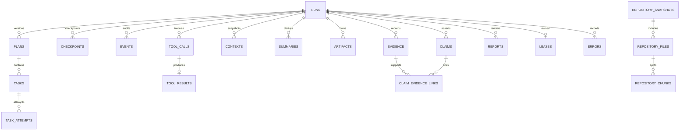
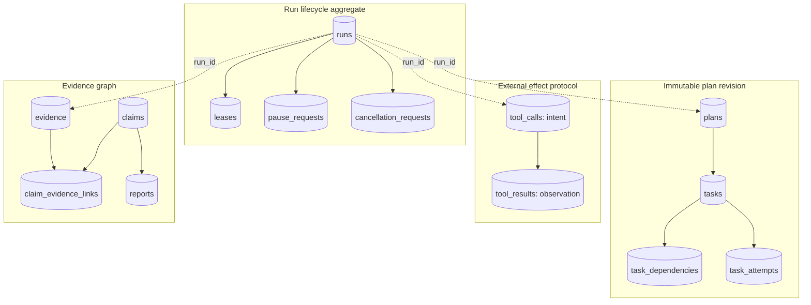
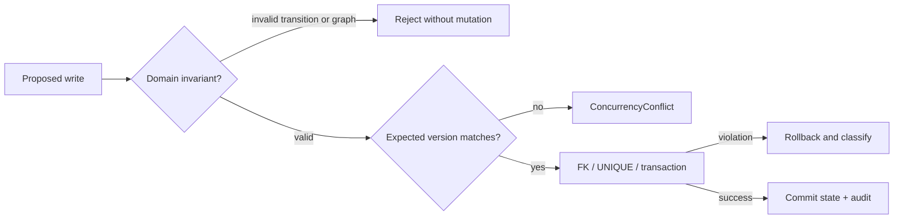
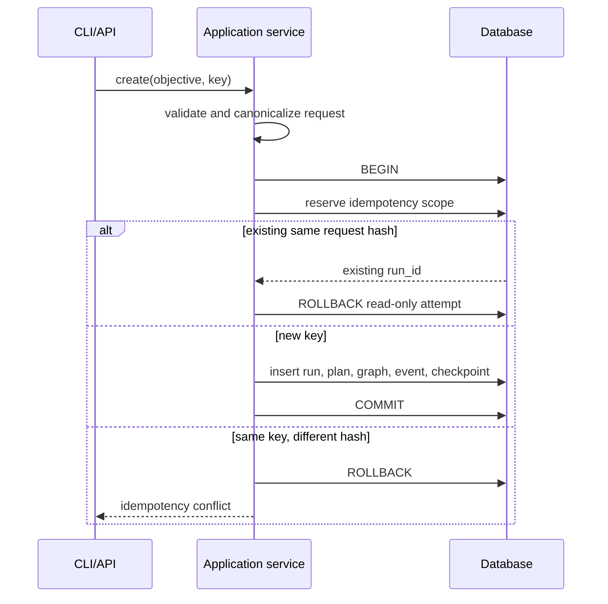
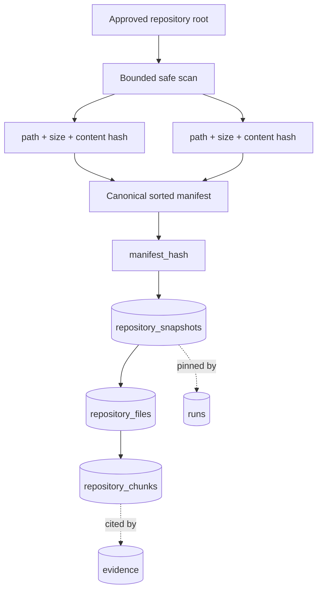
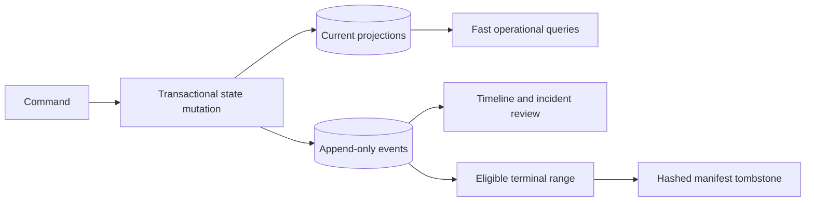
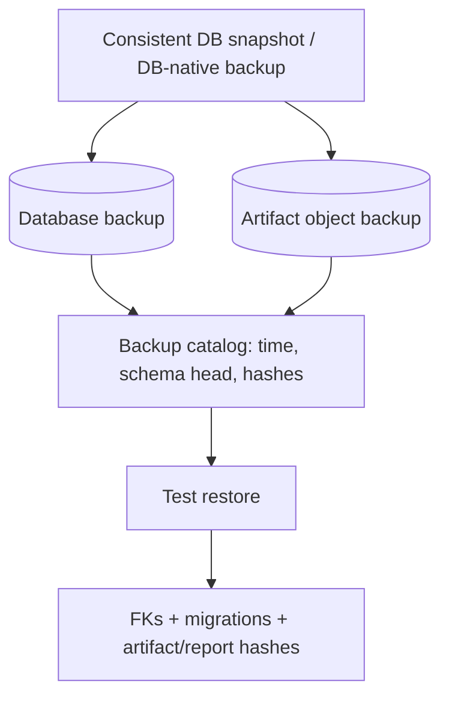

# Data model

SQLAlchemy models live in `persistence/orm.py`; Alembic revision `0001` creates the
schema. IDs are strings so callers can use UUID or deterministic test generators.
Timestamps are UTC-aware at domain boundaries. JSON columns store explicit schemas,
never pickle.

| Entity | Purpose and key constraints | Lifecycle / concurrency / retention |
|---|---|---|
| `runs` | Objective, owner, state, active plan/task, fingerprints; PK `run_id`; owner/state indexes | Optimistic `version`; retain with reports/evidence |
| `plans`, `plan_revisions` | Immutable payload/version/reason/predecessor; unique run/version | Append revisions; retain for audit |
| `tasks`, `task_dependencies` | Materialized node state/spec and DAG edges; composite uniqueness | Optimistic version; terminal immutable |
| `task_attempts` | One row per run/task/attempt, state/error/times; unique attempt number | Start before worker, finish atomically with task outcome |
| `checkpoints` | Explicit envelope/hash/sequence; unique run/sequence | Append with expected tip; configurable rolling retention ≥2 |
| `events` | Ordered event type/payload/correlation | Append-only while active; old high-volume terminal events compact to a SHA-256 manifest tombstone; lifecycle/security/failure events remain |
| `tool_calls`, `tool_results` | Intent, effect class, key, status, bounded result; unique key/result | Intent precedes effect; reconcile absent result |
| `contexts`, `summaries` | Budget manifest and derived navigation; source manifest hash | Append; invalidate on drift; not evidence |
| `artifacts` | URI/media/hash/size/run/task | Immutable metadata; bytes retained per artifact policy |
| `evidence` | Typed source provenance and verification | Immutable; retained with claims/reports |
| `claims`, `claim_evidence_links` | Epistemic claim and many-to-many support | FK-enforced; link verification before insert |
| `reports` | Markdown/JSON bytes, hash, partial flag | Immutable format rows; multiple generations permitted |
| `repository_snapshots/files/chunks` | Manifest, changes, line/symbol provenance | Content addressed; old run snapshots retained |
| `pause_requests`, `cancellation_requests` | Owner/reason/status/time | Pending → applied/rejected; idempotency key stored separately |
| `leases` | Owner, expiry, fencing token, version | Renew/take over with optimistic fencing; short-lived |
| `errors` | Category/message/details/retryability/stack hash | Append; linked to attempts/tasks |
| `idempotency_keys` | Owner/action/key → request hash/resource | Unique scope; retained as long as mutation replay is supported |

## Physical schema catalogue

`PK` marks primary-key columns; `FK→table.column` marks foreign keys. Columns not marked required are nullable. Named indexes and uniqueness constraints are shown explicitly; SQLAlchemy may also create dialect-specific indexes for unnamed `unique=True` columns.

| Table | Columns and key relationships | Named indexes | Named uniqueness |
|---|---|---|---|
| `artifacts` | `artifact_id` (PK; required), `run_id` (FK→runs.run_id; required), `task_id`, `uri` (required), `media_type` (required), `content_hash` (required), `size_bytes` (required), `created_at` (required) | `ix_artifacts_run_id`, `ix_artifacts_task_id` | — |
| `cancellation_requests` | `request_id` (PK; required), `run_id` (FK→runs.run_id; required), `reason` (required), `requested_by` (required), `status` (required), `created_at` (required), `applied_at` | `ix_cancellation_requests_run_id` | — |
| `checkpoints` | `checkpoint_id` (PK; required), `run_id` (FK→runs.run_id; required), `schema_version` (required), `sequence` (required), `parent_hash`, `payload_hash` (required), `envelope_json` (required), `created_at` (required) | `ix_checkpoints_run_id`, `ix_checkpoints_run_sequence_desc` | `uq_checkpoint_run_sequence` |
| `claim_evidence_links` | `claim_id` (PK; FK→claims.claim_id; required), `evidence_id` (PK; FK→evidence.evidence_id; required) | — | — |
| `claims` | `claim_id` (PK; required), `run_id` (FK→runs.run_id; required), `text` (required), `kind` (required), `related_task_id` | `ix_claims_kind`, `ix_claims_related_task_id`, `ix_claims_run_id` | — |
| `contexts` | `context_id` (PK; required), `run_id` (FK→runs.run_id; required), `task_id`, `payload` (required), `created_at` (required) | `ix_contexts_run_id`, `ix_contexts_task_id` | — |
| `errors` | `error_id` (PK; required), `run_id` (FK→runs.run_id; required), `task_id`, `category` (required), `message` (required), `details` (required), `retryable` (required), `stack_hash`, `created_at` (required) | `ix_errors_category`, `ix_errors_run_id`, `ix_errors_task_id` | — |
| `events` | `event_id` (PK; required), `run_id` (FK→runs.run_id; required), `sequence` (required), `event_type` (required), `task_id`, `payload` (required), `created_at` (required) | `ix_events_event_type`, `ix_events_run_id`, `ix_events_task_id` | `uq_event_run_sequence` |
| `evidence` | `evidence_id` (PK; required), `run_id` (FK→runs.run_id; required), `evidence_type` (required), `source` (required), `source_location`, `content_hash`, `snapshot_id`, `related_task_id`, `reliability` (required), `excerpt` (required), `verification_status` (required), `metadata` (required), `created_at` (required) | `ix_evidence_evidence_type`, `ix_evidence_related_task_id`, `ix_evidence_run_id`, `ix_evidence_snapshot_id`, `ix_evidence_verification_status` | — |
| `idempotency_keys` | `idempotency_pk` (PK; required), `owner_id` (required), `action` (required), `idempotency_key` (required), `request_hash` (required), `resource_id` (required), `created_at` (required) | `ix_idempotency_keys_owner_id` | `uq_idempotency_scope` |
| `leases` | `run_id` (PK; FK→runs.run_id; required), `owner_id` (required), `expires_at` (required), `fencing_token` (required), `version` (required), `acquired_at` (required), `renewed_at` (required) | `ix_leases_expires_at`, `ix_leases_owner_id` | — |
| `pause_requests` | `request_id` (PK; required), `run_id` (FK→runs.run_id; required), `reason` (required), `requested_by` (required), `status` (required), `created_at` (required), `applied_at` | `ix_pause_requests_run_id` | — |
| `plan_revisions` | `revision_id` (PK; required), `plan_id` (FK→plans.plan_id; required; unique), `run_id` (FK→runs.run_id; required), `version` (required), `previous_plan_id`, `reason` (required), `created_at` (required) | `ix_plan_revisions_run_id` | — |
| `plans` | `plan_id` (PK; required), `run_id` (FK→runs.run_id; required), `version` (required), `payload` (required), `created_at` (required) | `ix_plans_run_id` | `uq_plans_run_version` |
| `reports` | `report_id` (PK; required), `run_id` (FK→runs.run_id; required), `format` (required), `content` (required), `content_hash` (required), `partial` (required), `created_at` (required) | `ix_reports_run_id` | — |
| `repository_chunks` | `chunk_id` (PK; required), `file_id` (required), `snapshot_id` (FK→repository_snapshots.snapshot_id; required), `relative_path` (required), `content` (required), `content_hash` (required), `start_line` (required), `end_line` (required), `symbol_name`, `language`, `imports` (required) | `ix_repository_chunks_file_id`, `ix_repository_chunks_path_lines`, `ix_repository_chunks_snapshot_id`, `ix_repository_chunks_symbol_name` | — |
| `repository_files` | `repository_file_pk` (PK; required), `file_id` (required), `snapshot_id` (FK→repository_snapshots.snapshot_id; required), `relative_path` (required), `content_hash` (required), `size_bytes` (required), `media_type` (required), `language`, `change_kind` (required), `is_deleted` (required), `indexed_at` (required) | `ix_repository_files_content_hash`, `ix_repository_files_file_id`, `ix_repository_files_snapshot_id` | `uq_repository_file_path` |
| `repository_snapshots` | `snapshot_id` (PK; required), `root` (required), `manifest_hash` (required), `file_count` (required), `total_bytes` (required), `index_payload` (required), `created_at` (required) | `ix_repository_snapshots_manifest_hash` | — |
| `runs` | `run_id` (PK; required), `owner_id` (required), `objective` (required), `state` (required), `active_plan_id`, `active_task_id`, `repository_root`, `repository_snapshot_id`, `configuration_fingerprint` (required), `version` (required), `created_at` (required), `updated_at` (required), `finished_at` | `ix_runs_owner_id`, `ix_runs_repository_snapshot_id`, `ix_runs_state` | — |
| `summaries` | `summary_id` (PK; required), `run_id` (FK→runs.run_id; required), `level` (required), `payload` (required), `valid` (required), `source_manifest_hash` (required), `created_at` (required) | `ix_summaries_run_id`, `ix_summaries_valid` | — |
| `task_attempts` | `attempt_id` (PK; required), `run_id` (FK→runs.run_id; required), `task_id` (required), `attempt_number` (required), `state` (required), `started_at` (required), `finished_at`, `error_id` | `ix_task_attempts_run_id`, `ix_task_attempts_task_id` | `uq_task_attempt_number` |
| `task_dependencies` | `dependency_id` (PK; required), `run_id` (FK→runs.run_id; required), `plan_id` (FK→plans.plan_id; required), `task_id` (required), `depends_on_task_id` (required) | `ix_task_dependencies_run_id` | `uq_task_dependency` |
| `tasks` | `task_pk` (PK; required), `task_id` (required), `run_id` (FK→runs.run_id; required), `plan_id` (FK→plans.plan_id; required), `spec` (required), `state` (required), `attempt_count` (required), `version` (required), `last_error_id`, `started_at`, `finished_at` | `ix_tasks_plan_id`, `ix_tasks_run_id`, `ix_tasks_state` | `uq_task_identity` |
| `tool_calls` | `tool_call_id` (PK; required), `run_id` (FK→runs.run_id; required), `task_id` (required), `tool_name` (required), `arguments` (required), `arguments_hash` (required), `idempotency_key` (required; unique), `side_effect_class` (required), `status` (required), `attempt` (required), `created_at` (required), `started_at`, `finished_at` | `ix_tool_calls_run_id`, `ix_tool_calls_status`, `ix_tool_calls_task_id` | — |
| `tool_results` | `tool_result_id` (PK; required), `tool_call_id` (FK→tool_calls.tool_call_id; required; unique), `success` (required), `output` (required), `output_hash` (required), `exit_code`, `truncated` (required), `duration_seconds` (required), `created_at` (required) | — | — |

Foreign keys cascade run-owned records; repository snapshots are independently reusable.
Indexes target owner/state, run/time, task, verification, and hashes. SQLite enables FKs,
WAL, full synchronous mode, and busy timeout. PostgreSQL uses the same portable model.

Migration policy forbids runtime schema creation outside isolated tests/demo fallback.
Revision `0001` imports `persistence/schema_v1.py`, a frozen metadata snapshot, never the
live ORM; future model changes require a new revision. The migration contract also
compares that frozen v1 snapshot to the released live schema. CI upgrades a fresh
database, verifies one head and every required table, then compares application metadata.
Backups must capture the database plus artifact bytes; a database row without matching
artifact hash is an integrity incident.

## Aggregate boundaries and ownership

The schema is relational, but writes are organized around domain aggregates. An
aggregate is the smallest set of records that must agree at a transaction boundary.
`Run` is the lifecycle root; a plan revision owns a task graph; a tool call owns at most
one result; and a claim owns only its links, not the evidence records themselves. This
division prevents a convenient ORM object graph from becoming an accidental consistency
boundary.

The dotted relationships are ownership and correlation, not permission to update every
related row in one large transaction. A worker may finish a task and append its event in
one short database transaction, but it must not hold that transaction open while a tool
or model provider is running.

## Record classes and mutability

The durability model uses four record classes. Mixing their semantics is a common source
of recovery defects.

| Class | Examples | Allowed mutation | Reason |
|---|---|---|---|
| Mutable projection | `runs`, `tasks`, `leases`, request status | Compare-and-swap guarded state changes | Fast current-state queries |
| Append-only audit | `events`, `errors`, `task_attempts`, `checkpoints` | Insert; completion fields may close an attempt | Historical explanation and recovery |
| Immutable knowledge | `plans`, evidence, claims, reports, repository snapshots | Insert new version instead of overwrite | Reproducible decisions and citations |
| Derived navigation | contexts, summaries, repository chunks | Append and invalidate; safe to rebuild | Search and bounded model context |

“Immutable” means immutable through the application contract. Database administrators
can physically alter rows, which is why hashes, foreign keys, restricted credentials,
backups, and audit monitoring remain necessary.

## Core relational invariants

Some invariants are implemented as primary keys, foreign keys, unique constraints, and
indexes. Cross-row or state-machine invariants are enforced in the domain and persistence
service because portable SQL constraints cannot express them cleanly.

1. A run has at most one active plan and one active task reference.
2. `(run_id, version)` identifies one plan revision.
3. `(run_id, plan_id, task_id)` identifies one materialized task.
4. A task edge connects tasks in the same run and plan; the validated graph is acyclic.
5. `(run_id, sequence)` is unique and monotonically increasing for events and
   checkpoints.
6. A checkpoint's `parent_hash` equals the accepted previous checkpoint hash, except for
   the first checkpoint.
7. A tool idempotency key identifies one normalized intent; changing arguments under the
   same key is a conflict, not a retry.
8. A tool call has zero or one result. Zero means “not yet observed,” not necessarily
   “not executed.”
9. Claim links reference evidence in the same run; the ledger validates this before
   insertion.
10. Terminal run/task states do not transition back into active states.
11. A fencing token increases whenever lease ownership is acquired after expiry.
12. A report hash matches its exact persisted bytes; citations resolve through persisted
    claim links.

## Transaction protocols

### Run creation

The application validates configuration and objective before opening the transaction.
It then inserts the run, initial plan and tasks, dependency rows, initial event, and first
checkpoint as one logical creation transaction. An idempotency record binds
`(owner, create-run, key)` to both a canonical request hash and the new run ID. Replaying
the same request returns the existing run; reusing the key for a different request is a
conflict.

### Task attempt and outcome

A worker acquires a fenced lease, compares the task version, inserts the attempt, and
marks the task `RUNNING` before external work begins. The transaction then closes. Tool
intent/result records bracket external effects separately. When work finishes, a new
short transaction closes the attempt, advances the task, appends an event, and updates
the run projection using expected versions. A stale worker cannot commit because its
lease fencing token or expected version no longer matches.

### Checkpoint append

Checkpoint creation reads the current tip, constructs a canonical envelope, calculates
the payload and chain hashes, and inserts with `(run_id, next_sequence)` uniqueness. Two
concurrent writers may prepare the same sequence, but only one commits. The loser reloads
the accepted state rather than silently renumbering an envelope built from stale state.

### Evidence and report generation

Evidence is inserted before a claim can cite it. Claim creation validates same-run
ownership and verification status, then inserts claim and link rows. Reporting reads a
consistent ledger view, renders bytes, hashes those bytes, and persists the report.
Verification later recomputes hashes and resolves every citation independently.

## Concurrency-control matrix

| Contended operation | Control | Stale-worker result |
|---|---|---|
| Advance run/task state | Integer `version` compare-and-swap | Explicit concurrency conflict and reload |
| Own a run | Expiring lease plus monotonic fence | Commit denied after takeover |
| Append checkpoint/event | Unique run sequence plus expected tip | One commit; other writer reloads |
| Create/replay mutation | Scoped idempotency key plus request hash | Existing resource or conflict |
| Record tool outcome | Unique tool result per intent | Duplicate observation resolves to stored result |
| Link claim/evidence | PK pair plus same-run domain validation | Duplicate link is harmless; cross-run link rejected |

SQLite serializes more writes than PostgreSQL, but application correctness does not rely
on SQLite's coarse locking. PostgreSQL deployments should use short transactions and the
same compare-and-swap/fencing checks; moving databases is a capacity improvement, not a
change in consistency semantics.

## JSON columns without opaque state

JSON columns hold versioned, validated value objects: plan specifications, checkpoint
envelopes, event payloads, tool arguments, context manifests, and metadata. They are not
pickled Python instances and do not contain executable class names. On ingress, Pydantic
validates the explicit schema; on egress, unknown or unsupported schema versions fail
closed.

JSON is used where structures evolve together or are provider-shaped. Fields required
for joins, authorization, ordering, retention, or operational filtering remain normal
columns. For example, an evidence excerpt may have type-specific metadata in JSON, but
`run_id`, type, verification status, snapshot, and hash are indexed columns. This avoids
both extremes: an inflexible table per provider and an unqueryable “everything blob.”

## Repository identity and historical truth

A repository snapshot is a manifest, not merely a timestamp. Each file version has a
content hash and path in a specific snapshot; each chunk repeats snapshot/path/line/hash
provenance so retrieval results are self-identifying. Deletions are represented in the
incremental comparison even though a deleted file has no readable content in the new
snapshot.

The repository root is operational metadata and may reveal local paths, so multi-tenant
deployments should store a tenant-scoped logical URI rather than expose host paths to
other owners.

## Event-audit hybrid, not full event sourcing

The event log explains material changes, while tables such as `runs` and `tasks` are the
authoritative current state. The system does not require replaying every historical
event to reconstruct a run. That choice makes migrations and operator queries simpler,
but it imposes a transactional obligation: projection changes and their audit event must
commit together whenever the event describes that change.

High-volume terminal events may be compacted only after a terminal checkpoint and report
exist. Compaction writes a manifest containing the removed range and aggregate hash.
Lifecycle, security, failure, and recovery events are retained. A compaction tombstone
proves what range was summarized; it does not reproduce deleted event bodies.

## Retention, backup, and erasure

Retention follows reference reachability and audit value rather than independent table
ages. A report depends on claims and evidence; repository evidence depends on its
snapshot; a resumable run depends on at least the latest valid checkpoint and its
predecessor. Deleting any of those independently would create a report that renders but
cannot be verified.

Recommended deletion order is: expire idempotency windows and ephemeral contexts;
compact eligible events; remove superseded derived summaries/chunks not pinned by a run;
expire artifacts according to policy; finally delete an entire terminal run aggregate
only after its mandated evidence/report retention period. Tenant erasure requests must
also remove external artifact bytes and backup copies according to the organization's
legal policy; cryptographic manifests cannot substitute for erasure obligations.

A restorable backup is a coordinated set:

## Schema evolution

Each released Alembic revision owns a frozen schema description. Importing the live ORM
into old migrations would make history mutable: editing today's model could change what
yesterday's migration creates. New changes therefore receive new forward migrations,
explicit data backfills, and downgrade policy. A rolling production deployment uses an
expand/migrate/contract sequence when old and new workers overlap.

1. **Expand:** add nullable columns/tables or dual-readable forms.
2. **Migrate:** backfill in bounded, restartable batches with progress records.
3. **Switch:** deploy readers/writers that prefer the new representation.
4. **Contract:** remove the old representation only after no old worker can run.

Checkpoint schema versions evolve separately from SQL schema versions. A database may be
at migration `N` yet contain checkpoints created by several supported envelope versions.
Recovery selects a decoder by envelope version and rejects a version newer than the
running binary.

## Security and privacy analysis

Foreign keys prevent many accidental dangling references but do not provide tenant
authorization. Every application query is scoped by authenticated owner before run ID;
unguessable IDs are defense in depth, not access control. Database roles should separate
migration, application, and read-only operations. Encryption at rest and in transit is a
deployment responsibility for sensitive objectives, source excerpts, and tool output.

The data layer also treats strings as untrusted. It uses parameterized SQLAlchemy
expressions, length bounds, structured log fields, and JSON encoding. Tool output and
research content are stored as data and are never deserialized into executable objects.
Evidence and artifact hashes detect accidental or malicious modification, but a hash
stored beside altered content can also be forged by a fully privileged attacker;
production deployments can strengthen this with signed manifests or an external
append-only transparency store.

## Failure modes and inspection

| Symptom | Likely cause | Safe response |
|---|---|---|
| Unique run/sequence violation | Concurrent event/checkpoint writer | Roll back, reload tip, retry boundedly |
| Lease owner changes during work | Expiry or takeover | Stop stale worker; never commit with old fence |
| Report hash mismatch | Storage corruption or tampering | Quarantine report and regenerate from verified ledger |
| FK failure on claim link | Missing/cross-run evidence | Reject claim; repair producer, not the constraint |
| Unsupported checkpoint version | Newer writer or incomplete deployment | Pause run and deploy compatible reader |
| Artifact row but missing bytes | Partial backup/delete or object-store loss | Record integrity incident; restore by hash |
| Long SQLite lock waits | Excessive transaction duration/concurrency | Find long transaction; move external work outside it |

Operators should prefer `durable-agent status`, `inspect-plan`,
`inspect-checkpoint`, `verify`, and the read-only API over ad-hoc SQL. Database inspection
is appropriate for incidents, but direct state updates bypass transition, fencing, and
audit rules. Any emergency repair should be captured as an incident procedure, backed up
first, and followed by full report/checkpoint verification.

## Alternatives and tradeoffs

Full event sourcing was rejected because replay compatibility and projection migration
would dominate a local-first agent's operational complexity. A single serialized run
blob was rejected because it prevents indexed inspection, partial recovery, relational
integrity, and safe concurrent ownership. Separate databases for every subsystem would
improve independent scaling but make atomic lifecycle operations and local installation
harder. The chosen event-audit relational model favors explicit invariants and portable
transactions while allowing artifacts and future vector indexes to live in specialized
stores.

Tests validate fresh migration, frozen-schema parity, foreign keys, uniqueness,
optimistic conflicts, lease fencing, checkpoint chain integrity, idempotency replay,
claim/evidence references, repository persistence, and report hashes. Fault-injection
tests crash at intent/checkpoint boundaries; concurrency tests race writers; contract
tests ensure SQLite and PostgreSQL-oriented SQLAlchemy behavior remains portable.
