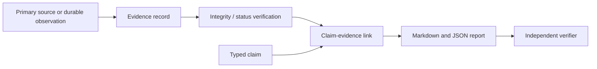
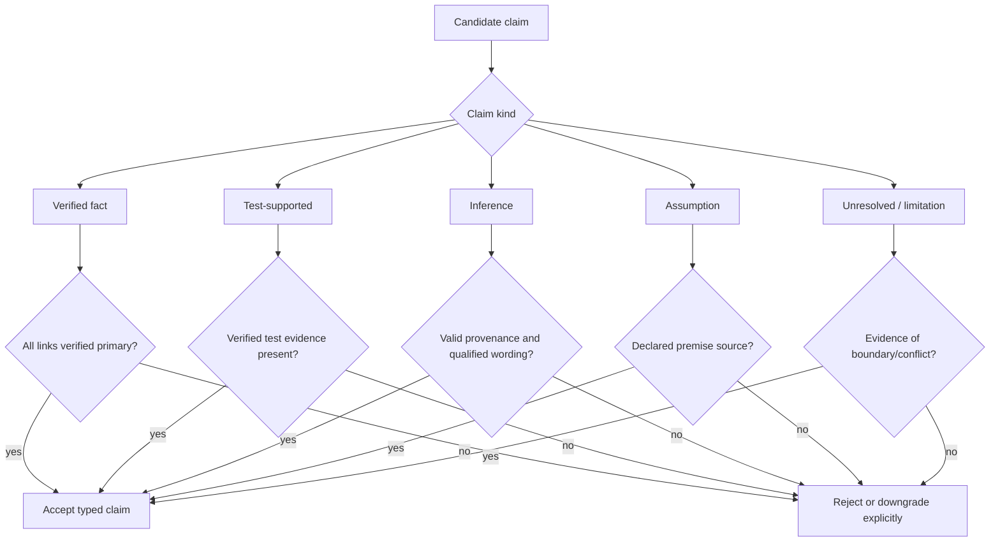
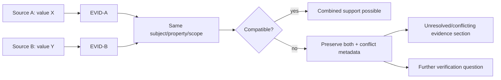
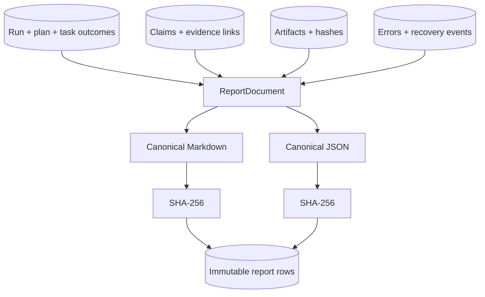
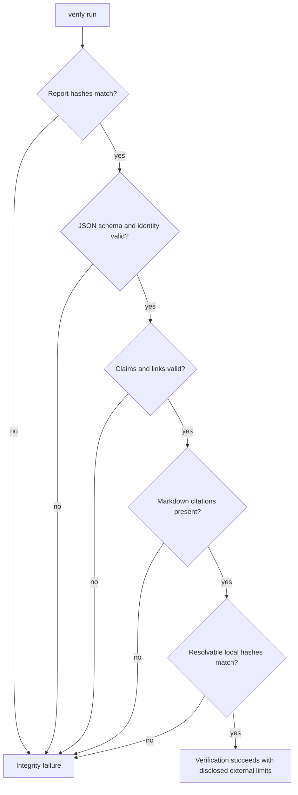
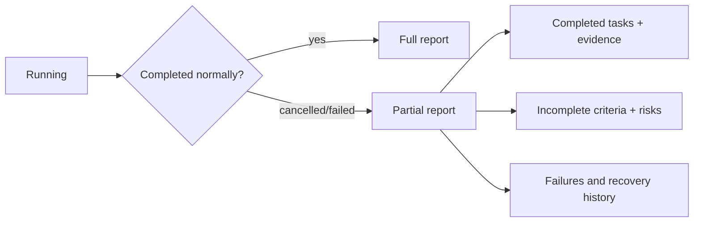

# Evidence and reporting

Evidence records are immutable primary references. Every record has a stable `EVID-*`
ID, run/task, type, source/location, optional snapshot/content hash, timestamp,
reliability, bounded excerpt/structured metadata, and verification status. Types include
repository file/snapshot, test/command result, artifact, database record, external
source, user fact, and inference.

Claims have their own IDs and kinds: verified fact, test-supported, inference,
assumption, unresolved issue, or limitation. Every claim kind requires at least one
evidence reference; the kind controls whether that reference is support, provenance for
an inference, or the source of an explicitly unresolved/limited statement.
`EvidenceLedger.verify_claim` rejects
missing and cross-run IDs, invalid evidence, and verified/test claims supported by
anything not verified. Conflicting records remain in the ledger and are surfaced rather
than averaged into false certainty. A summary cannot be primary evidence.

`ReportGenerator` constructs one `ReportDocument` and serializes it to Markdown and JSON.
The required sections are executive summary, objective, scope, assumptions, plan, work,
changed artifacts, research, verification/test results, claim mapping, conflicts,
failures/recoveries, risks, limitations, next actions, reproduction, and the evidence
ledger. Markdown renders durable citations such as `[EVID-0042]`; JSON exposes full
claim/evidence arrays. Both bytes are SHA-256 hashed and stored separately.

Verification recomputes report hashes, checks JSON identity, revalidates every claim
link, confirms each linked ID appears in Markdown, and reads each local catalogued
artifact against its durable content hash. Atomic artifact creation never overwrites an
existing ID; concurrent different content and later byte tampering are integrity errors.
Cancellation/failure uses the same generator with `partial=true`; existing evidence and
artifacts remain available.

External source content is normalized, hashed, deduplicated, timestamped, quality-rated,
and marked untrusted. Claim extraction distinguishes declared facts from agent inference.
Conflicting fixture sources prove that reports do not present either value as undisputed.

Failure modes include forged IDs, source tampering, report-byte tampering, invalidated
evidence, missing citations, and low-quality/conflicting sources. Tests exercise each
linking rule, both formats, conflicts, partial reports, and end-to-end test evidence.
Operators use `durable-agent verify RUN_ID`, the evidence endpoint, and stored hashes.

## Epistemic model

The evidence subsystem answers two different questions: “where did this information
come from?” and “what strength of conclusion does it justify?” A stable citation answers
the first; evidence type, verification status, and claim kind constrain the second.

Evidence is not synonymous with truth. A verified external source record proves which
content was retrieved and hashed; it does not prove that the publisher is correct. A
verified test result proves a named command completed with a recorded outcome in a known
environment; it does not prove all possible executions are correct.

## Evidence record semantics

Each field has a specific role:

| Field | Meaning |
|---|---|
| `evidence_id` | Durable citation identity, generated independently of display order |
| `evidence_type` | Repository range, snapshot, test/command, artifact, DB record, external source, user fact, or inference provenance |
| `source` | Stable logical origin such as relative path, tool call, source URL, or artifact URI |
| `source_location` | Line/page/range/record locator when meaningful |
| `content_hash` | Digest of exact normalized or generated bytes, not a truth score |
| `snapshot_id` | Repository version to which path and lines refer |
| `related_task_id` | Producing/using work item for audit navigation |
| `reliability` | Structured assessment of source/directness/quality |
| `excerpt` / metadata | Bounded review aid; primary bytes may live elsewhere |
| `verification_status` | Pending, verified, invalid, or conflict-aware status |
| `created_at` | Injected-clock timestamp for ordering and reproducibility |

Evidence rows are immutable. If a later check invalidates evidence, the ledger records
that status/recovery history without rewriting the bytes that an earlier checkpoint saw.
A new retrieval of changed source content receives a new evidence identity/hash.

## Claim taxonomy and admissibility

The claim kind is a compact epistemic contract:

| Claim kind | What the report may say | Minimum admissible support |
|---|---|---|
| Verified fact | Directly observed content/state | Verified primary evidence with exact provenance |
| Test-supported conclusion | Behavior observed under a recorded test | Verified test/command result plus relevant code/artifact evidence where needed |
| Inference | Reasoned conclusion, explicitly qualified | One or more valid provenance records; reasoning remains labeled inference |
| Assumption | Premise adopted for progress | User fact, configuration, or explicit decision record |
| Unresolved issue | Question/conflict not settled | Evidence showing absence, ambiguity, failure, or conflicting observations |
| Limitation | Boundary on method or result | Implementation/configuration evidence or explicit scope decision |

“Downgrade” never means quietly weakening verification status. The caller must create an
explicitly typed inference, assumption, unresolved issue, or limitation whose wording is
honest about what is known.

## Evidence creation workflows

### Repository evidence

The recorder pins snapshot ID, normalized relative path, inclusive line range, content
hash, and a bounded excerpt. Verification resolves the same file/chunk in the immutable
snapshot and checks the digest. Line numbers without snapshot/hash are insufficient
because later edits can make an old citation appear to support different content.

### Test and command evidence

The tool intent, normalized argv, sanitized environment fingerprint, start/finish time,
exit status, truncated flag, output hash, and stored result form the observation. A zero
exit status supports “this invocation passed,” not “the entire system is bug-free.” A
truncated output remains usable if the relevant structured result and hash policy permit
it, but the limitation must be visible.

### Research evidence

The research layer stores canonical source URI, publisher/title metadata, publication
time if known, retrieval time, normalized content hash, quality metadata, and bounded
excerpts. Redirect chain and fetch policy can be retained in metadata. Source claims and
agent inferences are separate records.

### User facts and assumptions

A user-provided constraint is valid provenance for “the user required X.” It is not
automatically evidence that X is externally true. This distinction preserves user intent
without laundering an assertion into a verified fact.

## Conflict detection and non-collapse

Sources conflict when normalized claims refer to the same subject/property/scope but
assert incompatible values, ranges, or outcomes. The ledger retains both evidence
records and a conflict relation. Quality scores may order investigation priorities but
never average contradictory propositions into a third “fact.”

Conflict is scoped. Two version-specific facts may be compatible when their publication
dates or software versions differ. The detector therefore compares temporal and version
metadata before declaring contradiction.

## Report construction

`ReportDocument` is the single semantic representation for both formats. The generator
does not compose Markdown and JSON independently because they could diverge. It first
loads the objective, scope, accepted assumptions, active plan/revisions, terminal and
partial task outcomes, artifact records, research findings, errors/recoveries, evidence,
and validated claims.

Required empty sections remain present and state that no item was recorded. This makes a
missing verification result distinguishable from a renderer that silently omitted the
section. Reproduction commands are data from the run/tool ledger, not invented after the
fact.

Markdown citations use stable evidence IDs near the claim. JSON exposes each claim
object and its full evidence-ID list so downstream systems do not parse prose. Evidence
order is stable for deterministic hashing.

## Independent verification algorithm

Verification is deliberately separate from generation:

1. Load stored Markdown and JSON report records and recompute their byte hashes.
2. Parse JSON into the strict report schema and confirm run/report identity.
3. Validate every claim and evidence link through `EvidenceLedger` rules.
4. Confirm every Markdown material claim contains its durable cited IDs.
5. Resolve repository snapshot/path/range hashes where catalogued locally.
6. Resolve artifact URIs under the artifact root and recompute byte hashes.
7. Validate tool-result/test evidence against stored intent/result hashes.
8. Surface invalid, missing, conflicting, or unverifiable external material without
   modifying the report.

External URLs may be unavailable or change. The stored normalized bytes and retrieval
hash preserve what was observed; current re-fetching is a separate freshness operation,
not required to prove report-byte integrity.

## Partial reports

Cancellation and terminal failure do not erase useful work. A partial report has
`partial=true`, records the terminal lifecycle reason, lists completed and incomplete
tasks, retains artifacts/evidence, and avoids language implying that unmet acceptance
criteria passed. It is generated at the last safe boundary when possible.

## Integrity, authenticity, and limitations

SHA-256 detects content changes when a trusted digest remains available. It does not
authenticate who created the digest. A database administrator able to rewrite both
content and hash can forge the local ledger. Higher-assurance deployments can sign report
and checkpoint manifests with a managed key, publish hashes to append-only storage, or
use WORM retention. Those controls complement rather than replace source provenance.

Bounded excerpts also mean a reviewer may need the source artifact to evaluate context.
Copyright, privacy, and secret-handling policies constrain what external content can be
stored. Reliability metadata is structured judgment, not a universal probability.

## Security and access control

Evidence, claims, and reports are owner/run scoped. The API checks ownership before
revealing even IDs because filenames, objectives, URLs, excerpts, and failures can be
sensitive. Source content is encoded as data, escaped during rendering, and never allowed
to inject HTML/script or alter report structure. Forged citation strings are harmless
unless a valid same-run link exists in the ledger.

Artifact resolution uses root containment and content hashes. Report verification never
follows an arbitrary URI as a local path or performs an unsolicited network fetch.
Sensitive excerpts should be minimized/redacted, while redaction metadata makes clear
that the persisted excerpt is not byte-identical to the full secret-bearing source.

## Alternatives, inspection, and tests

Inline prose citations without a ledger were rejected because they are hard to validate
and can refer to missing sources. Storing only full raw sources was rejected because it
does not express which source supports which conclusion. A single confidence score was
rejected because directness, integrity, publisher quality, conflict, and epistemic claim
kind are different dimensions.

Operators use `durable-agent report RUN_ID`, `durable-agent verify RUN_ID`, the evidence
and report API endpoints, and artifact/hash inspection. A failed verifier is an integrity
or completeness result, not a cue to regenerate over the old record; preserve the failed
report for incident analysis and create a new generation after correcting sources.

Unit tests cover every admissibility rule, same-run ownership, duplicate/missing/forged
links, summary rejection, citation rendering, deterministic JSON, and conflicts.
Integration tests persist/load the ledger and verify artifact/report bytes. Security
tests tamper with hashes and inject markup/citation-like source text. End-to-end scenarios
assert that successful, cancelled, failed, and conflicting-research runs produce honest
and independently verifiable reports.
