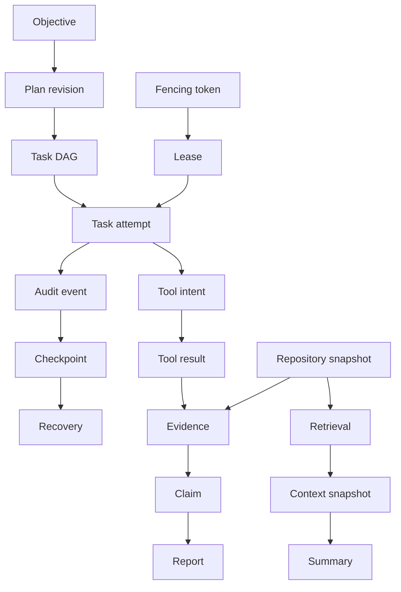
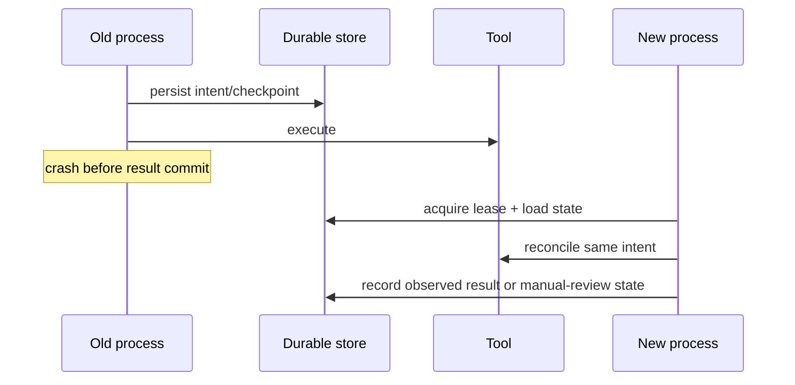
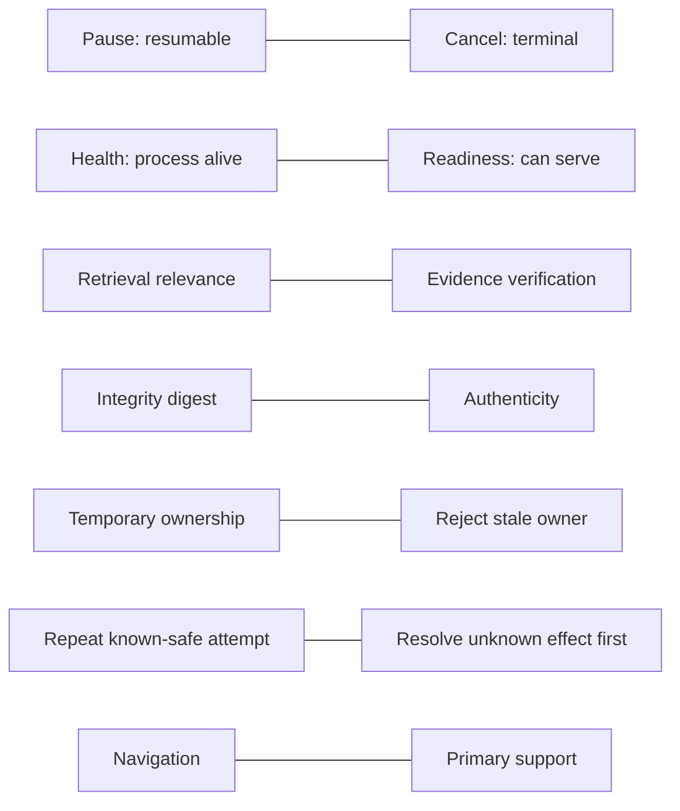

# Glossary

- **Artifact** — Durable generated bytes plus immutable catalog metadata and hash.
- **Checkpoint** — Versioned, integrity-protected resume document with durable references.
- **Claim** — Report assertion with epistemic kind and evidence links.
- **Context snapshot** — Bounded manifest of prompt/navigation items, not evidence.
- **DAG** — Directed acyclic graph representing prerequisite tasks.
- **Evidence** — Immutable primary provenance record capable of supporting a claim.
- **Fencing token** — Monotonic lease generation used to reject stale owners.
- **Idempotency key** — Stable identifier binding one logical mutation to its request hash/result.
- **Intent record** — Tool call persisted before a side effect starts.
- **Lease** — Expiring execution ownership record for one run.
- **Materialized state** — Current normalized run/task rows used for queries.
- **Optimistic concurrency** — Versioned compare-and-swap update without long-held locks.
- **Plan revision** — Immutable replacement DAG linked to its predecessor and reason.
- **Primary evidence** — Repository/source/test/tool record, excluding derived summaries.
- **Reconciliation** — Determining whether an uncertain external effect occurred.
- **Repository snapshot** — Manifest hash and exact file hashes used by a run.
- **Safe boundary** — Point where no tool effect is ambiguous and lifecycle control may apply.
- **Summary drift** — Meaning/provenance loss after repeated or stale compression.
- **Untrusted content** — Data that cannot change policy, permissions, or system instructions.

## Relationship map

## Durable-execution vocabulary

- **Agent run** — Durable aggregate representing one owner-scoped objective from creation
  through completion, failure, or cancellation. A run is not a Python process.
- **Run state** — Persisted lifecycle phase such as `CREATED`, `RUNNING`, `PAUSED`, or
  `COMPLETED`, advanced only through the transition table.
- **Task state** — Persisted lifecycle of one plan node. Task and run states are related
  but not identical; a paused run can contain succeeded and pending tasks.
- **Task attempt** — One durable execution try for a task, with its own number, timing,
  result/error, and retry accounting.
- **Safe boundary** — A point after in-flight atomic units have durable outcomes, tool
  uncertainty is reconciled or explicitly recorded, task/run state agrees, and a valid
  checkpoint can be written.
- **Checkpoint** — Versioned, canonical, integrity-protected resume document containing
  explicit state and durable references. It accelerates and validates recovery; it does
  not replace normalized database state.
- **Recovery** — Validation and reconstruction performed by a new owner: acquire fenced
  lease, select a valid checkpoint, compare configuration/repository, reconcile uncertain
  effects, repair attempts, rebuild ephemeral context, and continue safely.
- **Reconciliation** — Observation-based determination of whether an intended external
  effect occurred. It precedes any replay of an ambiguous operation.
- **Uncertainty window** — Interval after an external effect may have begun/succeeded but
  before its result is durably committed.

## Concurrency vocabulary

- **Lease** — Expiring database record granting temporary execution ownership of a run.
  Expiry enables recovery but alone cannot stop a slow former owner.
- **Fencing token** — Monotonically increasing lease generation carried by a worker's
  writes so storage can reject a stale owner after takeover.
- **Heartbeat / renewal** — Compare-and-swap extension of the exact lease version before
  expiry. A failed renewal means the worker must stop materializing outcomes.
- **Optimistic concurrency** — Update that succeeds only when the row version observed by
  the caller is still current. Conflicts cause reload/re-evaluation rather than blind
  overwrite.
- **Idempotency key** — Stable identifier for one logical mutation, bound to a canonical
  request hash and resource/result. Same request repeats safely; different payload under
  the key conflicts.
- **At-least-once delivery** — A command/scheduling notification may appear more than
  once. Durable idempotency makes duplicates safe.
- **Exactly-once effect** — Often impossible across a database and external provider.
  The system instead uses intent, idempotency, observation, and manual review to achieve
  an honest outcome.

## Planning vocabulary

- **Plan** — Typed decomposition of objective, scope, assumptions, constraints,
  acceptance, risks, tasks, dependencies, evidence, verification, and recovery policy.
- **Plan revision** — Immutable replacement plan linked to its predecessor and explicit
  reason. Old revisions remain audit evidence.
- **DAG** — Directed acyclic graph whose nodes are tasks and whose edges express
  prerequisites. A topological ordering exists only when the graph is acyclic.
- **Ready task** — Pending/retryable task whose dependencies succeeded, retry budget
  remains, and run policy permits scheduling.
- **Serial barrier** — Non-parallel task that prevents construction of a concurrent ready
  batch, especially for repository mutations.
- **Failure policy** — Per-task rule such as retry, fail run, skip descendants, or wait
  for manual review.
- **Acceptance criterion** — Observable condition that defines task/run success.
- **Verification step** — Action producing reviewable proof that an acceptance criterion
  holds; it is not the same as implementation.

## Persistence and audit vocabulary

- **Materialized state** — Normalized mutable run/task projections used for current
  queries and authoritative state transitions.
- **Event log** — Ordered append-only audit explanation of material changes. In this
  event-audit hybrid, it complements but does not replace materialized state.
- **Event sourcing** — Architecture in which current state is reconstructed from events.
  This system is deliberately not fully event-sourced.
- **Aggregate** — Small consistency boundary whose records must agree in one transaction,
  such as a tool intent and its single result relationship.
- **Canonical serialization** — Deterministic representation with normalized values and
  stable key ordering used for content hashes.
- **Content hash** — Digest of exact canonical or byte content. It detects change relative
  to trusted metadata but does not authenticate the author.
- **Schema version** — Explicit decoder/migration identity for SQL or checkpoint
  representations. Database and checkpoint versions evolve independently.
- **Tombstone** — Retained manifest/hash recording an eligible compacted event range; it
  does not reproduce removed event bodies.

## Repository and retrieval vocabulary

- **Repository snapshot** — Immutable canonical manifest of accepted relative paths,
  file hashes, limits/parser fingerprint, and snapshot ID used by a run.
- **Repository chunk** — Bounded content region with snapshot, path, inclusive lines,
  optional symbol/import metadata, and hash.
- **Incremental index** — Comparison that classifies new, modified, unchanged, and
  deleted paths and rebuilds only invalid derived material.
- **Repository map** — Deterministic navigation summary of files, symbols, and practical
  dependency relationships; it is derived, not primary evidence.
- **Keyword retrieval** — Ranking by normalized query/content terms with path/symbol
  signals.
- **Semantic retrieval** — Optional ranking by vector similarity from a fingerprinted
  embedding adapter.
- **Hybrid retrieval** — Reciprocal-rank fusion of independent rankings; raw incomparable
  scores are not averaged.
- **Provenance** — Stable origin metadata allowing a result to be resolved to snapshot,
  path/URL/tool/artifact, location, time, and hash.
- **Stale index/summary** — Derived record whose source hash, manifest, parser, embedding,
  or compressor fingerprint no longer matches.

## Context vocabulary

- **Context window** — Provider/model input-plus-output token capacity. It is bounded
  working memory, not durable storage.
- **Context budget** — Allocation of the model limit among output, system, objective,
  mandatory active material, evidence, history, and navigation.
- **Context snapshot** — Persisted manifest of selected durable items for one decision,
  including retained/removed IDs and estimates.
- **Compression** — Controlled lossy transformation of lower-priority history into a
  bounded, provenance-linked navigation artifact.
- **Hierarchical compression** — Raw event → task summary → group summary → run summary,
  with bounded generation to limit repeated degradation.
- **Summary drift** — Loss, invention, altered epistemic status, or stale meaning caused
  by summarization/repetition/source changes.
- **Mandatory context** — Constraints, negative requirements, decisions, unresolved
  questions, and active state that cannot be silently dropped.

## Evidence and reporting vocabulary

- **Evidence** — Immutable typed provenance record with source/location/hash/time/task,
  reliability, bounded excerpt, and verification status.
- **Primary evidence** — Direct repository range/snapshot, test/command result, artifact,
  database record, external source, or user-provided fact. A summary is not primary.
- **Claim** — Report assertion with an epistemic kind and one or more ledger links.
- **Verified fact** — Claim directly supported by verified primary evidence within its
  scope; verification does not imply universal truth beyond the evidence.
- **Test-supported conclusion** — Claim limited to behavior observed under a recorded
  test invocation/environment.
- **Inference** — Reasoned conclusion that remains labeled and cites its premises.
- **Assumption** — Explicit premise adopted for work, with origin and limitations.
- **Conflict** — Incompatible source claims about the same scoped subject/property;
  neither is silently averaged into fact.
- **Evidence ledger** — Run-scoped store of evidence, typed claims, and many-to-many
  links with admissibility and integrity checks.
- **Partial report** — Honest terminal report for cancellation/failure that preserves
  completed work/evidence and lists unmet criteria.
- **Report verification** — Independent hash, schema, link, citation, and source/artifact
  checks performed after rendering.

## Security and operations vocabulary

- **Untrusted content** — Repository, research, model, or tool data that cannot grant
  permissions, change system policy, or act as instructions.
- **Capability / tool permission** — Explicit named authority intersected across
  deployment, owner, run, task, and tool policy.
- **Side-effect class** — Recovery classification describing whether a tool is read-only,
  idempotent, reversible, or non-idempotent.
- **SSRF** — Server-side request forgery: attacker-controlled network destination reaches
  internal/local services. Controls include deny-by-default network, URL/DNS/redirect
  validation, and production egress enforcement.
- **Redaction** — Removal/replacement of secret-bearing data before safe persistence/log
  output; it cannot undo prior disclosure.
- **Readiness** — Whether dependencies/configuration/schema allow the instance to accept
  work. Distinct from process health.
- **RPO** — Recovery point objective: tolerable durable-data loss measured through backup
  capability.
- **RTO** — Recovery time objective: tolerable restoration time measured by drills.
- **Circuit breaker** — Shared dependency protection that temporarily stops calls after a
  failure threshold, later permitting bounded probes.

## Frequently confused distinctions

These distinctions are design invariants. Treating their terms as interchangeable is a
common route to unsafe recovery or overstated reports.
