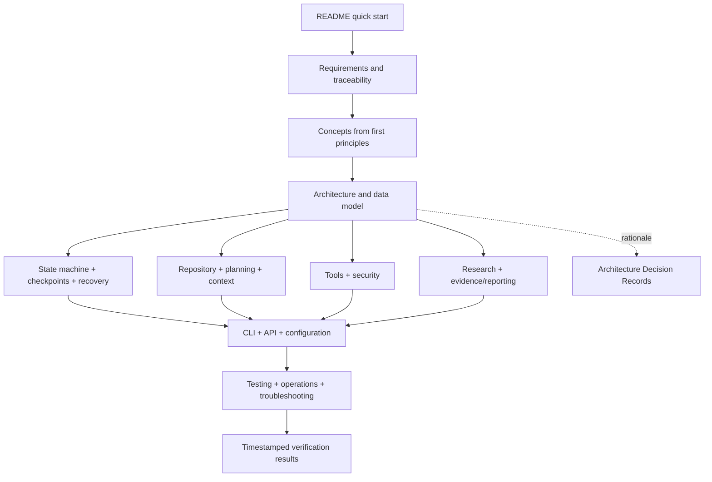
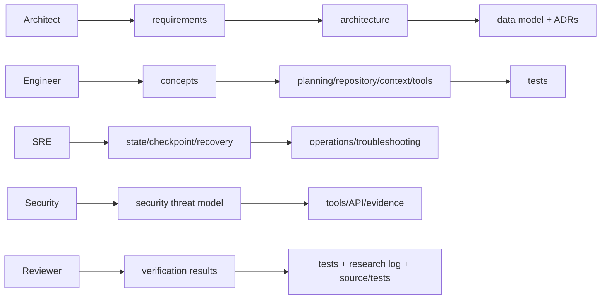
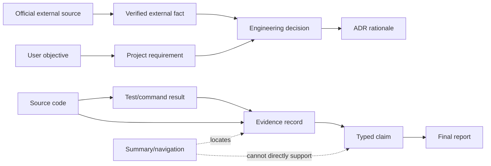
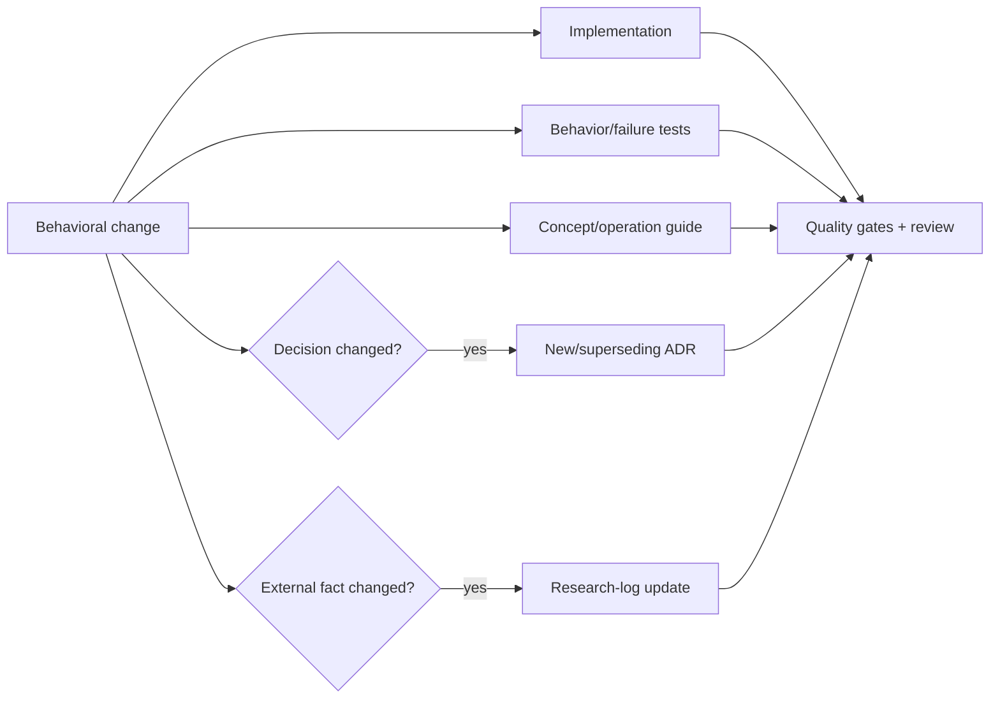

# Documentation index

Start with the [README](../README.md) for installation and a runnable example, then use
this map for design and operations.

| Audience | Documents |
|---|---|
| Architects | [requirements](requirements.md), [architecture](architecture.md), [concepts](concepts.md), [ADRs](adr/README.md) |
| Agent engineers | [planning](planning.md), [repository understanding](repository-understanding.md), [tool execution](tools.md), [context compression](context-compression.md), [evidence](evidence-and-reporting.md) |
| Reliability engineers | [state machines](state-machine.md), [checkpointing](checkpointing.md), [recovery](pause-resume-recovery.md), [data model](data-model.md) |
| Security reviewers | [threat model](security.md), [tool execution](tools.md), [configuration](configuration.md) |
| Operators | [operations](operations.md), [troubleshooting](troubleshooting.md), [API](api.md), [CLI](cli.md) |
| Contributors | [testing](testing.md), [research log](research-log.md), [glossary](glossary.md) |

The latest managed-host evidence snapshot is in
[verification results](verification-results.md).

Implementation links in each guide are repository-relative. Summaries and generated
reports are navigation artifacts; repository chunks, tool results, and source records
remain the primary evidence.

## How to read the documentation

The corpus is organized as a layered textbook. Read concepts and requirements before
component details; read state/checkpoint/recovery together; use ADRs to understand why a
design was chosen; use verification results only for the exact recorded revision/time.

## Documentation contract

Major technical guides answer the same review questions:

1. What problem and vocabulary does the subsystem define?
2. Which state/data structures are authoritative, derived, or ephemeral?
3. What algorithm and control flow does it implement?
4. Which invariants must always hold?
5. Where are transaction and trust boundaries?
6. How do crashes, retries, concurrency, and schema change affect it?
7. Which security threats and residual risks apply?
8. Which alternatives were considered and why rejected?
9. How do tests establish its claims?
10. How can an operator inspect and recover it?

Mermaid diagrams provide complementary views—component, state, sequence, data lineage,
and decision trees. Prose and tables remain authoritative when a diagram necessarily
abstracts details.

## Role-based study paths

### Architecture and research path

Read [requirements](requirements.md) for obligations and epistemic labels,
[concepts](concepts.md) for durable execution fundamentals, [architecture](architecture.md)
for boundaries/control flow, [data model](data-model.md) for persistence invariants, and
[ADRs](adr/README.md) for tradeoffs. [Research log](research-log.md) identifies external
facts that influenced rather than dictated decisions.

### Lifecycle and reliability path

Read [state machines](state-machine.md), [checkpointing](checkpointing.md), and
[pause/resume/recovery](pause-resume-recovery.md) as one protocol. Then use
[operations](operations.md) and [troubleshooting](troubleshooting.md) for deployment and
incident decisions. The [verification snapshot](verification-results.md) distinguishes
actual passed, skipped, and host-blocked gates.

### Agent intelligence path

Read [repository understanding](repository-understanding.md), [planning](planning.md),
[context compression](context-compression.md), and [evidence/reporting](evidence-and-reporting.md).
The central invariant is that retrieved/summary material navigates to primary evidence;
relevance and fluent summaries never become proof or authority.

### Interface and security path

Read [tool execution](tools.md), [security](security.md), [configuration](configuration.md),
[CLI](cli.md), and [HTTP API](api.md). Authority is intersected across trusted policy and
effect recovery begins from durable intent.

## Epistemic map

Documentation describes the implementation but is not self-authenticating proof. For a
completion claim, follow its source/test/command links and durable evidence.

## Keeping documentation synchronized

A behavior-changing change should update its implementation, tests, relevant guide,
configuration/API/CLI reference if applicable, ADR when the decision changes, and
research log when an external fact/version changed. Documentation validation checks local
links and required corpus structure; reviewers must still assess semantic consistency.

Use repository-relative links inside Markdown. Timestamp observed verification results;
never edit an old snapshot to imply later commands ran.
