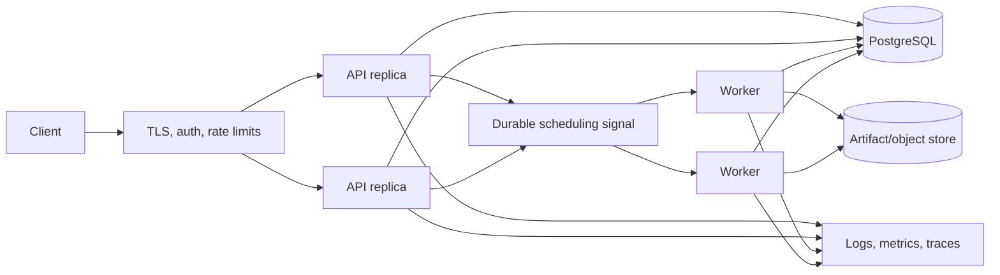
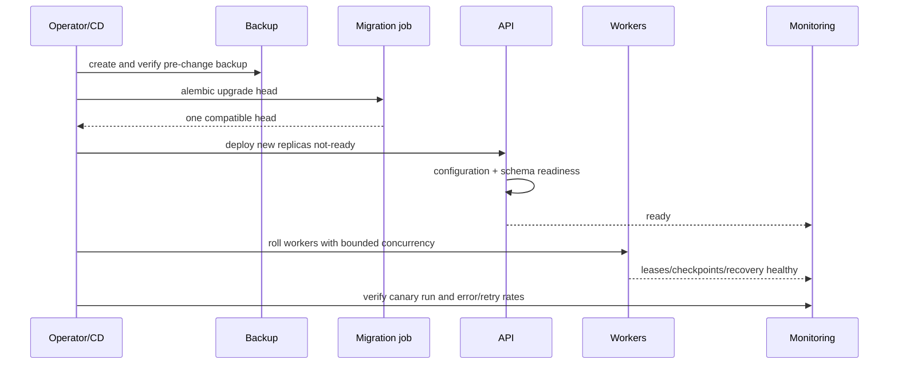
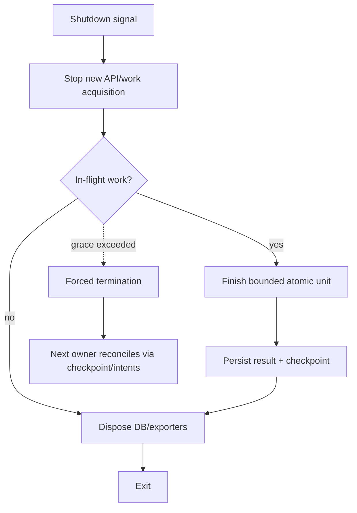
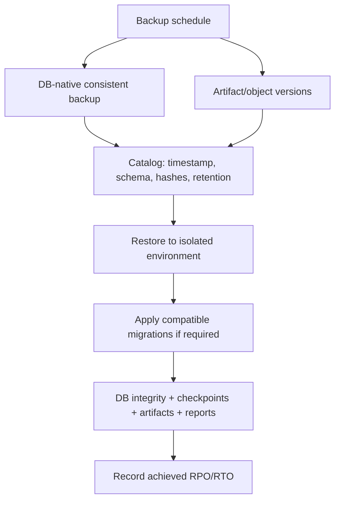
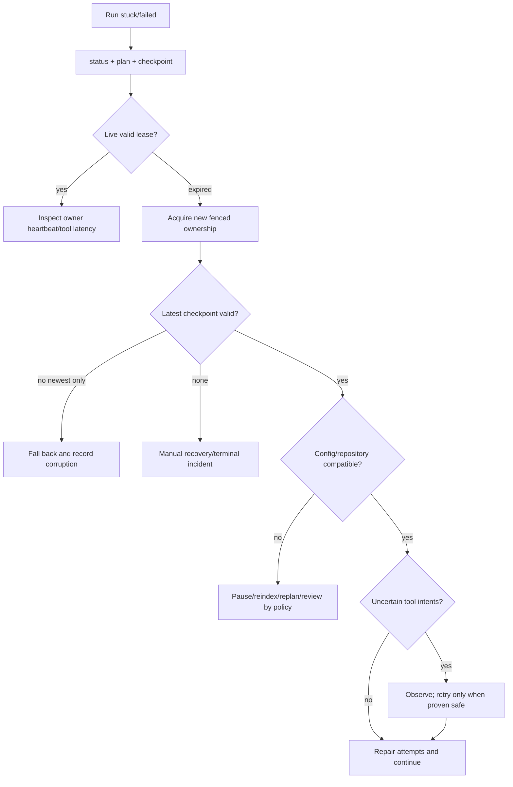
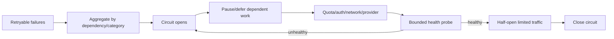
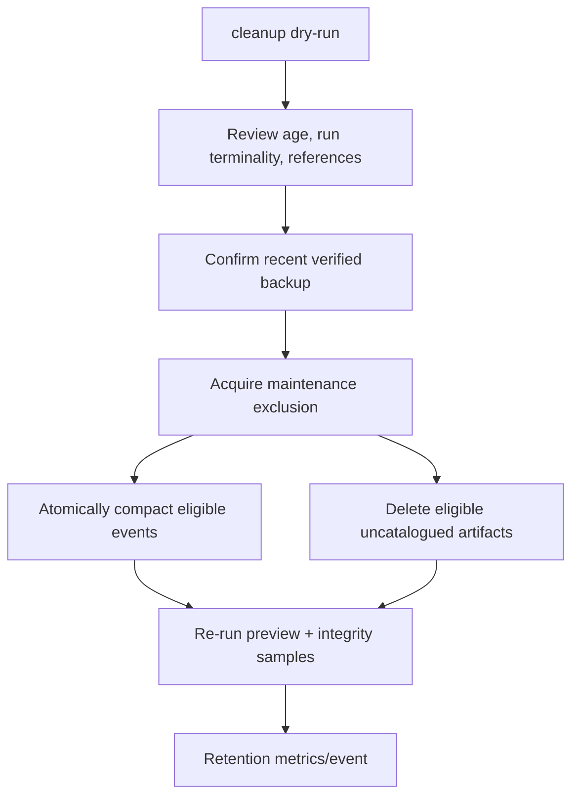
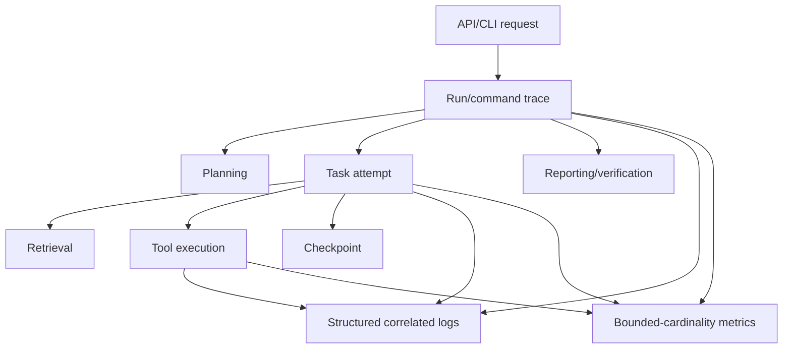

# Operations runbook

## Start, stop, and migrate

Create the environment, load secrets, run `alembic upgrade head`, then start
`uvicorn durable_agent.api.app:create_app --factory`. Check `/health` for process health
and `/ready` for database/schema readiness. Stop accepting work, request pause for active
runs, wait for safe checkpoints, then terminate workers. A forced kill is recoverable
but may create uncertain tool intents.

For Docker Compose, set a non-development database password and API token, run the
one-shot migration service, then start API/workers. Do not run SQLite on network storage
or with multiple writers. Apply migrations as a release job before deploying code; back
up first and test downgrade/restore in staging.

## Backup and restore

SQLite: pause workers, use the SQLite online backup API or `sqlite3 .backup`, copy the
artifact directory, hash both, then resume. PostgreSQL: use `pg_dump`/physical backups
consistent with your recovery objectives and version. Object/artifact storage needs
versioning. Restore into an isolated environment, run `alembic current --check-heads`,
`durable-agent doctor`, sample checkpoint/report verification, then cut over.

## Failed, paused, and stuck runs

1. `status`, `inspect-plan`, and `inspect-checkpoint` the run.
2. Inspect structured events, attempts, errors, tool calls/results, and lease expiry.
3. For a dead owner, wait for lease expiry; do not delete the lease manually unless the
   worker is proven dead and an incident record is created.
4. `resume` verifies configuration/repository/checkpoint and reconciles uncertain calls.
5. A manual-review side effect requires external/provider evidence before recording a
   result; never change it to succeeded based only on operator belief.

High retry rate: group by error category/provider/tool, inspect circuit state and latency,
reduce concurrency, verify credentials/quota/network, and pause high-impact runs. Database
conflict spikes usually mean duplicate workers or long write transactions. Checkpoint
fallback metrics indicate corruption or non-atomic storage and require backup validation.

## Corrupt database or artifacts

Stop all writers. Preserve a forensic copy and hashes. Run vendor integrity tools on a
copy (`PRAGMA integrity_check` or PostgreSQL checks), restore the last clean backup, and
reconcile artifact hashes. Never use generated reports as a source to reconstruct primary
evidence. Record lost checkpoint/event intervals and require review before resumed side
effects.

## Retention and cleanup

Checkpoint cleanup always keeps at least two per run. Run `durable-agent cleanup --json`
for a non-destructive preview, then `durable-agent cleanup --execute --json` from a
singleton maintenance job after backup. Eligible high-volume events belong only to
terminal runs and are replaced atomically by a tombstone containing the deleted sequence
range and a SHA-256 digest of their canonical manifest. Lifecycle, failure, recovery,
retention, and security events are permanent. Artifact cleanup deletes only old regular
files absent from the SQL catalogue; symlinks fail closed. Stop artifact writers or hold
deployment maintenance exclusion during execution.

Repository snapshots, evidence, claims, idempotency records, reports, and catalogued
artifacts are not deleted by this command because they may remain primary proof. Deleting
whole expired runs requires a separate archive policy and legal/audit approval. Cleanup is
idempotent after partial failure. Local `make clean` removes only documented generated
caches/demo data, never the configured production database.

## Credential rotation and incidents

Rotate provider/database/API credentials in the secret manager, deploy configuration,
and pause/resume affected runs if the configuration fingerprint changes. Revoke exposed
tokens, search redacted logs by correlation IDs, audit owner/lifecycle events, and verify
evidence/checkpoint/artifact hashes. Authentication failures, cross-owner access, forged
evidence, or unexpected network calls are security incidents.

## Capacity planning

Track run/task latency, retries, tool latency/failures, checkpoint writes/recovery,
context compression/tokens, retrieval/evidence/report counts, database size and write
latency, artifact bytes, and queue depth. PostgreSQL connections and worker concurrency
must be bounded. Repository limits and container CPU/memory prevent one run from
starving tenants. Establish RPO/RTO by restore drills, not estimates.

## Operating model and topology

The local topology combines CLI/API, orchestration, SQLite, and filesystem artifacts on
one host. The production topology separates stateless API replicas, durable scheduling
signals, workers, PostgreSQL, artifact/object storage, and observability services.

Correctness remains in database idempotency, optimistic versions, leases/fencing,
checkpoints, and tool reconciliation. A queue improves delivery latency but is not the
source of truth; duplicate or lost scheduling notifications are recovered from durable
run state.

## Deployment sequence

Use an immutable build artifact and separate migration credential. A safe release is:

For expand/migrate/contract schema changes, old and new workers must both understand the
expanded form until the rollout completes. Never allow an old worker to write a schema or
checkpoint representation the new recovery code cannot validate.

## Startup checklist

1. Load non-secret configuration and mount/inject secrets.
2. Confirm database and artifact backup state.
3. Apply migrations as a singleton and verify exactly one head.
4. Run `durable-agent doctor --json` using the service identity.
5. Validate repository/artifact roots and effective deny-by-default tool policy.
6. Start API/worker processes as non-root with resource and egress controls.
7. Wait for readiness, then route traffic or enable scheduling.
8. Execute a bounded canary run and verify its report/checkpoint.

Readiness failure must prevent new traffic but preserve logs for diagnosis.

## Graceful shutdown

API replicas stop accepting new requests and drain connections. Workers stop acquiring
new runs, request/observe pause where operationally required, finish the current atomic
tool/task boundary, persist outcomes and checkpoints, release/allow leases to expire,
then terminate.

A forced kill is an expected failure mode, but its uncertainty window may require manual
review for irreconcilable tools.

## Migration runbook

Before migration, inspect current revision/heads, test the exact upgrade against a recent
restored copy, estimate locks/backfill duration, back up, and ensure old workers are
compatible with the expand phase. Run `alembic upgrade head` once. Verify schema head,
application readiness, representative queries, and canary lifecycle operations.

Downgrade is not automatically the safest rollback when new data has been written. Prefer
forward repair unless the revision documents a lossless downgrade and no incompatible
writer has run. Restore is the recovery path for destructive/incompatible migration
failure.

## Backup objectives and procedure

Define recovery point objective (RPO) and recovery time objective (RTO) per deployment.
For example, a five-minute RPO requires database/artifact backup or replication that can
actually reproduce a mutually consistent point within five minutes. Only a restore drill
measures RTO.

Encrypt backups, restrict restoration credentials, protect catalogs, test point-in-time
recovery where used, and retain according to legal/audit policy. A database-only backup
can leave artifact/evidence references dangling.

## Restore and cutover

Stop writers or restore to a new isolated environment. Restore database and matching
artifact version, verify vendor integrity, schema version, foreign keys, latest checkpoint
chains, sampled artifact/report hashes, and owner boundaries. Run `doctor` and a canary
resume whose external effects are disabled or safely reconcilable. Cut over only after
verification; preserve the failed environment for forensic review.

## Run recovery decision tree

Never delete a lease simply to make progress while its worker may still execute. Wait for
expiry and use fencing, or prove/stop the worker under an incident procedure.

## Investigating stuck runs

Correlate run state, active task, plan dependencies, attempt state/time, lease owner/
expiry/fence, latest checkpoint sequence, pause/cancel requests, tool intents/results,
provider circuit state, and recent errors.

| Observation | Interpretation/action |
|---|---|
| `RUNNING`, lease renews, tool span active | Bounded operation may still be healthy; compare timeout/SLO |
| `RUNNING`, lease expired | Worker died or lost DB; recover with new fenced owner |
| No ready nodes, pending tasks | Failed/waiting dependency or graph-state defect; inspect plan |
| `PAUSE_REQUESTED` | Wait for safe boundary; inspect in-flight effect |
| Intent without result | Reconcile tool before retry |
| Repeated retryable provider errors | Circuit/rate/quota/network issue; reduce load/pause |
| Checkpoint fallback count rises | Corruption/storage atomicity incident |
| Drift detected | Apply configured FAIL/REINDEX/REPLAN; do not waive silently |

## Retry storm and provider incident

Group failures by provider/tool/error category, not individual run. Confirm whether the
circuit breaker is opening, rate-limit guidance, credential validity, DNS/egress, and
latency. Reduce concurrency and stop admitting provider-dependent work. Preserve retry
budgets; restarting workers must not reset attempts.

## Database incident response

For high latency/locks, inspect connection saturation, long transactions, lock holders,
disk space/IO, WAL/replication, and duplicate workers. External tools/providers must not
run inside database transactions. SQLite “database locked” under multiple writers is a
topology violation; move to PostgreSQL rather than growing unbounded busy timeouts.

For suspected corruption, stop writers, snapshot bytes and logs, analyze a copy with
vendor tooling, restore a verified backup, reconcile artifacts and checkpoint/report
hashes, and disclose lost intervals. Do not run speculative repair directly on the only
copy.

## Artifact integrity and retention workflow

Monitor logical catalog bytes, physical store bytes, orphan candidates, write failures,
hash mismatches, and free quota. A missing catalogued object is an integrity failure; an
old uncatalogued regular file is a cleanup candidate. Object-store lifecycle rules must
understand catalogue retention so primary evidence does not expire early.

Whole-run archive/erasure is a separate governed process because evidence, reports,
snapshots, idempotency, and legal requirements are connected.

## Credential rotation

Inventory affected service/provider/database credentials, issue new least-privilege
versions, deploy dual-valid or coordinated rotation when possible, verify new connections,
revoke old versions, and audit failures. Never log secret values. A credential-only
rotation does not change the semantic configuration fingerprint, though access failure
during rollout may produce retryable provider/database errors.

If exposure is suspected, also block egress, identify workers/tools that received the
secret, inspect redacted logs and intent histories, notify affected owners, and rotate any
downstream credential reachable through it.

## Observability model

Logs carry run/task/attempt/checkpoint/tool/event IDs and trace IDs where available.
Prometheus metrics do not use those IDs as labels. Dashboards should include run terminal
rates, age by state, task latency/retries, tool latency/failures/uncertain calls,
checkpoint writes/fallbacks, compression pressure, retrieval/evidence/report counts,
lease contention, DB latency/connections, artifact capacity, and API readiness/errors.

High-signal alerts include readiness failure, migration-head mismatch, no checkpoints
while runs advance, checkpoint integrity failure, uncertain non-idempotent calls, lease
conflict spikes, sustained retry/circuit opening, owner authorization denials, artifact/
report hash mismatch, database saturation, and runs exceeding expected state age. Every
alert should identify whether the safe first action is observe, pause admissions, pause
affected runs, or stop writers.

## Capacity planning

Model capacity per bounded resource: API request rate, concurrent runs/tasks, provider
quota, subprocess slots, repository bytes/chunks, database write/connection throughput,
artifact growth, and telemetry volume. Maximum task concurrency is constrained by the
minimum safe capacity among worker, database, provider, and tool resources.

Use production-like load tests for queueing and contention, and measure checkpoint/
artifact growth per representative run. Retention reduces storage only after evidence
reachability and legal requirements. Maintain headroom for retries and recovery; a
provider outage creates deferred demand that can surge when service returns.

## Disaster and security incident checklist

1. Declare scope/severity and freeze destructive maintenance.
2. Stop admission or writers as appropriate; fence compromised workers.
3. Preserve database, artifacts, logs, configuration versions, and relevant host state.
4. Rotate/revoke credentials and restrict egress for security events.
5. Verify backup/catalog integrity in isolation.
6. Restore/forward-repair, migrate, and validate checkpoint/evidence/report hashes.
7. Reconcile every uncertain external effect before resuming.
8. Resume a bounded canary, then gradual workload.
9. Record lost/ambiguous work, owner impact, timeline, and corrective actions.

## Known operational limits

Docker Compose is a production-like demonstration, not a high-availability or hostile-code
sandbox. The reference service does not bundle a distributed queue, external secret
manager, identity provider, egress proxy, PostgreSQL backup controller, or telemetry
backend. These are explicit deployment integrations. Reliability claims apply to the
implemented state/effect protocols when the underlying database/artifact guarantees and
tool reconciliation contracts hold.
