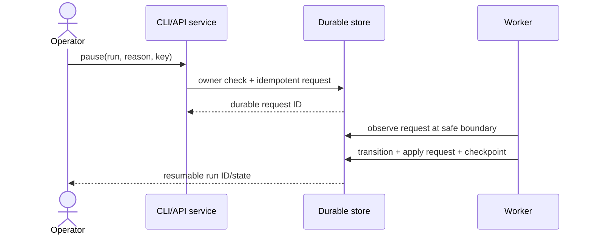
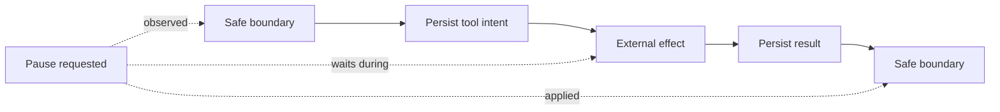
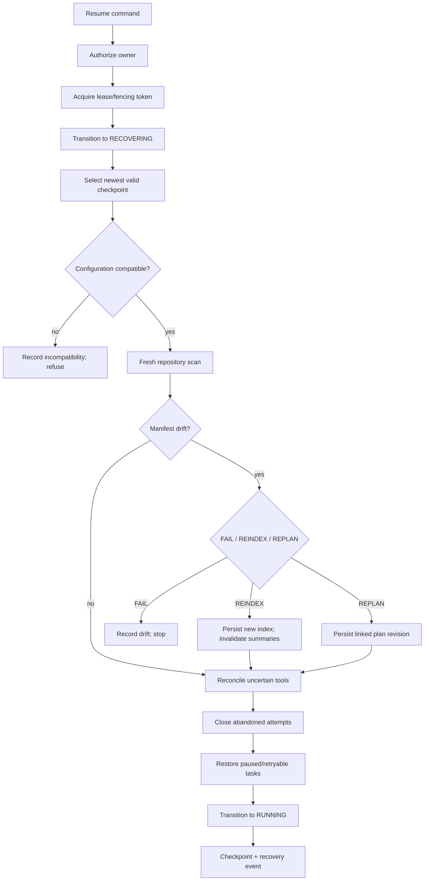
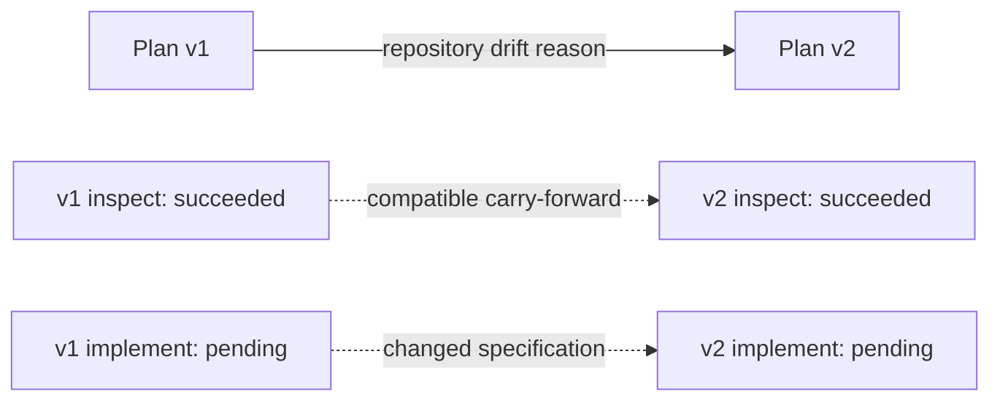
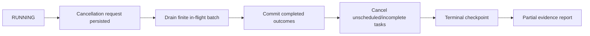

# Pause, resume, cancellation, and recovery

Pause and cancel requests are durable, owner-scoped, and idempotent. The request is
recorded first. The orchestrator checks pending requests before scheduling the next task.
Pause moves to `PAUSED`, applies the request, and writes a final checkpoint. Cancellation
marks incomplete tasks, checkpoints, and emits a partial evidence report.

Resume performs this sequence:

1. Acquire or renew a lease and fencing token.
2. Move the run to `RECOVERING` through the state machine.
3. select the newest valid checkpoint, falling back after corruption.
4. Compare the resume-sensitive configuration fingerprint.
5. Re-index the repository and compare its manifest to the checkpoint.
6. Reconcile tool intents without committed results.
7. Close attempts abandoned by a dead worker and retry only within the task bound.
8. Restore paused tasks to ready, move the run to `RUNNING`, and emit a recovery event.

Repository drift follows `FAIL`, `REINDEX`, or `REPLAN`. Reindex invalidates summaries;
replan also persists a linked plan revision, switches the run's active plan, and carries
forward task state only when the task specification is unchanged. Historical plan/task
rows remain available for audit. Completed compatible tasks remain succeeded and are not
scheduled again. A non-idempotent uncertain call without a reconciliation
proof moves to manual review by raising `ManualReviewRequiredError`.

Provider errors use bounded backoff and jitter. Attempts and structured errors are
persisted. Circuit breakers prevent retry storms. A terminal task failure fails the run
and preserves a partial report. Database conflicts require reload; they are never hidden
by broad exception handling.

The exact uncertainty window is intent committed/result absent. A retry-safe call that
failed definitively reopens the same idempotency record and atomically increments its
attempt; an ambiguous call is reconciled before any retry. Named repository snapshots and
atomic writers reconcile their durable IDs/final hashes;
high-impact tools require explicit approval plus a provider key/reconciliation contract.
See [tool execution](tools.md), `recovery/manager.py`, `tools/executor.py`, and
lifecycle/fault-injection tests.

## Lifecycle controls are durable commands

Pause and cancellation are not process signals. A Unix signal can stop one process, but
it cannot explain operator intent after restart, authorize a different worker, deduplicate
a repeated HTTP request, or guarantee a final checkpoint. The application persists a
lifecycle request containing run, kind, reason, requesting owner, timestamp, idempotency
key, and request hash.



Repeated transport delivery of the same key and request hash returns the existing
request. The same key with a different reason/payload is rejected. This makes the
control plane safe under client retry without making arbitrary state changes idempotent.

## Safe-boundary definition

A safe boundary is a point at which every dispatched external operation has one of these
durable interpretations:

1. no intent exists, so it did not begin through this platform;
2. an intent and result exist, so its observed outcome is known;
3. an intent exists without a result, but reconciliation has classified the outcome;
4. an irreconcilable operation is explicitly in manual review.

It is unsafe to pause by killing a coroutine after effect execution but before recording
its result. Cooperative pause stops *new scheduling* and waits for the finite in-flight
batch to reach the boundary.



This trades pause latency for side-effect clarity. Timeouts bound operations where the
platform controls the subprocess/provider call. Truly uncooperative external systems
remain a deployment risk and must expose cancellation/idempotency or be isolated.

## Pause algorithm

At a boundary, the orchestrator reloads the run and unapplied lifecycle requests to avoid
committing from stale pre-execution state. It then:

1. stops deriving additional ready nodes;
2. preserves succeeded tasks and committed evidence/artifacts;
3. moves eligible active/ready tasks through pause states;
4. transitions the run to `PAUSED`;
5. marks the request applied;
6. writes an unconditional lifecycle checkpoint;
7. emits the pause event and returns the stable run/checkpoint IDs.

If all work completed while the pause was pending, the valid transition is
`PAUSE_REQUESTED → COMPLETED`. A pause request is not allowed to falsify completion.

## Resume algorithm in depth



### Ownership and fencing

Resume first acquires ownership. A duplicate simultaneous resume cannot produce two
legitimate schedulers: one lease acquisition/renewal wins and the other receives a
concurrency conflict. Takeover after expiry increments the fencing token, invalidating
late commits from the old worker.

### Checkpoint selection

The newest schema/hash/chain-valid checkpoint is selected. Corrupt newer rows remain
forensic evidence and produce a `checkpoint.recovered` event identifying rejection
reasons. With no valid candidate, resume fails rather than constructing state from logs.

### Configuration compatibility

The fingerprint covers settings that can alter semantics or authority: database dialect,
repository root, provider/model identity and budgets, concurrency, filesystem/shell/
network permission, size limits, and drift policy. Secrets and observability exporters
are excluded. A changed log level should not block recovery; granting write authority or
changing the repository root should.

### Repository validation

The indexer scans the configured root under current safety limits and computes a manifest
from relative paths, content hashes, and deletion markers. The checkpoint manifest
identifies exactly what the run previously used. Path equality alone is insufficient.

### Tool reconciliation

Intent-without-result rows are inspected before task retry. Read-only/retry-safe absent
effects can be marked failed and retried through the same idempotency record. Named
repository snapshots and atomic writes can inspect their final state and synthesize a
durable reconciled result. Non-retry-safe uncertainty becomes `NEEDS_REVIEW` when no proof
exists.

### Attempt repair

An open attempt from a dead worker is never deleted. Recovery records it as abandoned/
failed, updates task accounting through valid transitions, and observes the task's maximum
attempts/failure policy. Completed compatible work is not rerun.

## Repository drift policies

| Policy | Behavior | Appropriate when | Risk |
|---|---|---|---|
| `FAIL` | Record mismatch and stop recovery | Reproducibility/compliance requires exact source | Operator must decide how to proceed |
| `REINDEX` | Persist a new snapshot and invalidate stale summaries | Changes are expected and plan remains valid | Previously selected affected-file assumptions may be stale |
| `REPLAN` | Reindex, create linked plan revision, and switch active plan | Evidence invalidates task assumptions/scope | More expensive and needs careful state carry-forward |

Replan does not mutate the prior plan. It creates a new immutable version with predecessor
and reason. A task state can be carried forward only when its specification remains
compatible; historical tasks stay queryable.



## Cancellation semantics

Cancellation differs from pause in intent and terminality. It stops scheduling, attempts
graceful completion of already dispatched work, closes open attempts at the boundary,
marks incomplete tasks cancelled, transitions the run to terminal `CANCELLED`, and emits
a partial report from existing evidence/artifacts. Resume is not a cancellation undo.



Preserving completed batch members is important: cancellation means “do not continue,”
not “pretend durable work never happened.” Rollback, if required, is a separate planned
operation using recorded before/after evidence.

## Failure taxonomy during recovery

| Failure | Retry automatically? | Durable outcome |
|---|---:|---|
| Lease/version conflict | After reload/backoff | Conflict event/error; no stale commit |
| Provider timeout/rate limit | When task/tool is retry-safe and budget remains | Failed attempt and retry counter |
| Corrupt newest checkpoint | Yes, select older valid | Recovery event with rejected rows |
| No valid checkpoint | No | Corruption failure/manual intervention |
| Unsupported checkpoint schema | No guessing | Unsupported-schema failure |
| Configuration mismatch | No | Compatibility failure |
| Repository drift | Policy-dependent | Drift event plus fail/reindex/replan |
| Reconciled external effect | Continue | Synthesized verified result |
| Irreconcilable effect | No | Manual-review waiting/pause |
| Exhausted task attempts | No | Declared failure policy and partial report |

## Backoff, jitter, and circuit behavior

Exponential backoff spaces repeated provider attempts:

```text
delay(attempt) = min(max_delay, base_delay × 2^(attempt-1)) × jitter_factor
```

The jitter source is injected, allowing deterministic tests. Maximum attempts and delay
prevent unbounded retry. Circuit breaking is provider-scoped protection against a failing
dependency; task failure policy is graph-scoped behavior after attempts. They must not be
conflated.

## Security implications

Resume is an authority-bearing operation. The application verifies owner before lease
acquisition. Lifecycle idempotency is owner/run/action scoped. Configuration compatibility
prevents a run created under read-only policy from silently resuming with write/network
authority. Fresh repository scanning treats every new file as untrusted. Reconciliation
accepts only tool-defined observable proofs, never instructions embedded in output.

## Alternatives considered

- **Immediate thread/process suspension:** rejected because it can freeze an operation in
  the uncertainty window and does not create durable intent.
- **Replay from the last checkpoint only:** rejected because later materialized
  intents/results may have committed.
- **Blindly reset running tasks to ready:** rejected because it duplicates effects and
  erases attempt history.
- **Automatically accept repository drift:** rejected because evidence/source identity
  would become ambiguous.
- **Use cancellation as rollback:** rejected because reversal semantics are tool/domain
  specific and completed evidence must remain auditable.

## Testing and operational inspection

End-to-end tests pause, close one application container, build a second process, resume,
and prove succeeded work is not repeated. Fault tests crash after tool intent, corrupt the
newest checkpoint, inject transient failures, and modify the repository during pause.
Concurrency tests issue duplicate resume and pause/completion races. Cancellation tests
verify partial reports and closed attempts.

Operators should inspect in this order:

1. `durable-agent status RUN_ID --json`
2. `durable-agent inspect-checkpoint RUN_ID --json`
3. `durable-agent inspect-plan RUN_ID --json`
4. tool calls/results and open attempts in SQL
5. lease owner, expiry, fencing token, and version
6. recovery/drift/checkpoint events and latest structured error
7. `durable-agent verify RUN_ID`

The [operations runbook](operations.md) provides incident procedures; the
[checkpoint guide](checkpointing.md) explains integrity selection; and
[tools.md](tools.md) gives effect-specific reconciliation contracts.
