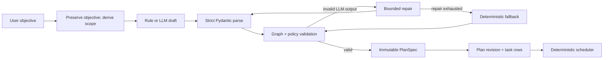
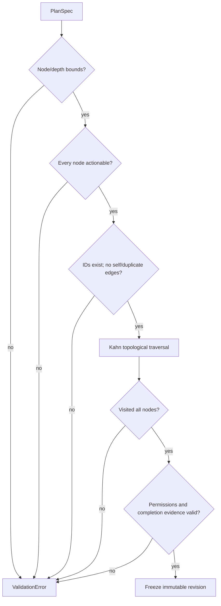
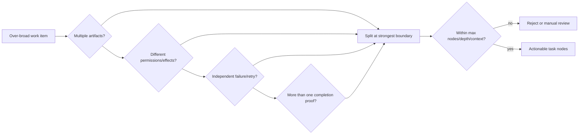
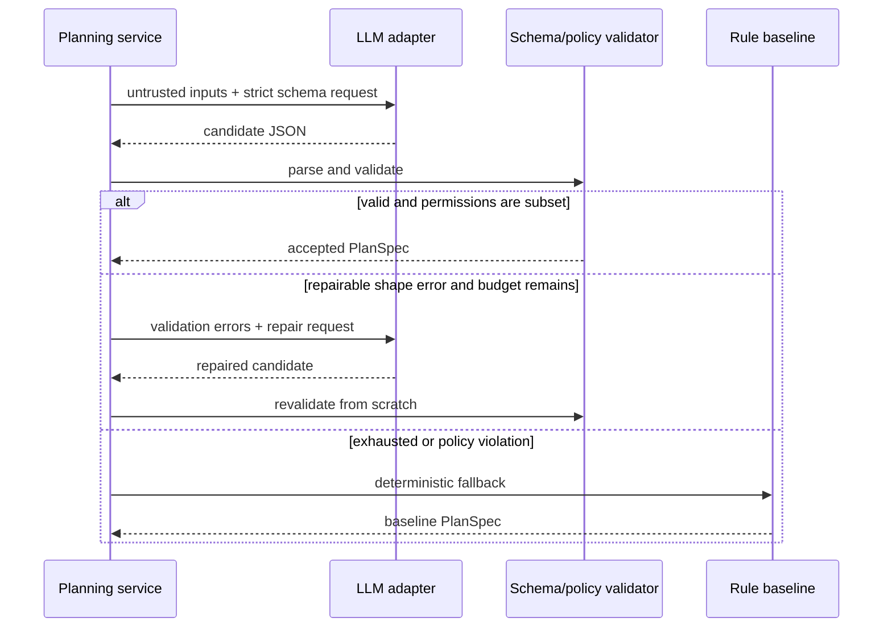
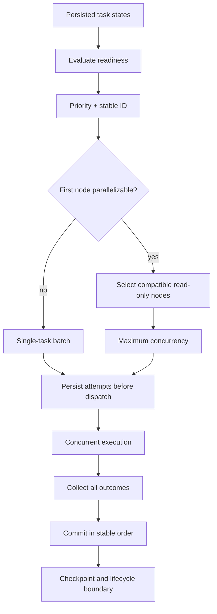
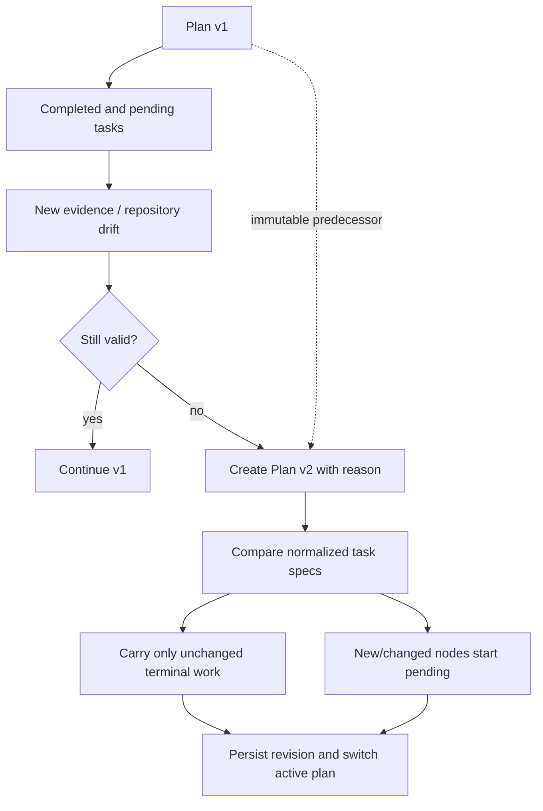

# Planning and scheduling

The planner converts an objective into a strict `PlanSpec`: goal, scope, assumptions,
constraints, acceptance criteria, research questions, risks, expected artifacts,
verification, rollback, and bounded `TaskSpec` nodes. Every node declares dependencies,
priority, attempt limit, inputs/outputs, completion criteria, required evidence/tools,
permissions, context estimate, checkpoint policy, and failure policy.

`RuleBasedPlanner` is the deterministic baseline used offline. It creates inspect,
constraint research, implementation, verification, and reporting work. `LLMAssistedPlanner`
passes objective text only as untrusted data, requests the same Pydantic schema, validates
run identity and the DAG, and retries malformed output a bounded number of times before
falling back to the rule planner. It never lets model output grant tool permissions.

Validation rejects duplicate/self/missing dependencies, cycles, excessive graph depth,
descriptions too small to act on, tasks too broad for the configured context, and tasks
without outputs, evidence, acceptance criteria, or verification. Stable topological
ordering and dependency levels identify parallelizable batches. The scheduler executes a
stable ready-task prefix up to `maximum_concurrency` only when every selected node opts in
with `parallelizable=true`. A serial node is a priority barrier, and repository write or
patch permissions are never accepted on parallel nodes. Batch attempts are persisted
before dispatch, share one lease heartbeat, and commit in deterministic order even when
workers finish out of order.

Plans are immutable revisions. `revise` creates a new plan ID/version, predecessor, and
reason. Repository `REPLAN` policy invokes this path during recovery, persists the new
plan/task rows, switches the active plan, and carries task state forward only for an
unchanged task specification. Previous plan/revision/task rows remain auditable. The
maximum task/depth and bounded repair count prevent endless decomposition.

Failure policies are executable contracts: `RETRY` uses retryability and attempt bounds;
`FAIL_RUN` terminates immediately; `SKIP_DEPENDENTS` marks transitive descendants skipped
while independent nodes continue; and `MANUAL_REVIEW` closes the attempt in `WAITING`,
pauses at a checkpoint, and requires explicit resume before another attempt.

Pause and cancellation remain safe-boundary operations: they wait for every in-flight
batch member, preserve each outcome, and schedule no new node. A transient failure retries
only its failed member; successful siblings are checkpointed and never repeated.

Rejected alternatives include free-form model plans (unverifiable), nested recursive
agents without limits (unbounded), and encoding state in prompt text (not durable). Unit,
integration, and property tests cover deterministic output, strict LLM repair/fallback,
revisions, cycles, granularity, ready selection, actual execution overlap, lifecycle races,
and selective retry. `inspect-plan` and the API expose the exact stored revision.

## Planning as compilation

The planner is better understood as a compiler than as a prose generator. It translates
an ambiguous objective into a typed, executable intermediate representation. Parsing and
semantic validation happen before persistence; scheduling operates only on the validated
graph.

The objective is preserved verbatim for audit. Derived scope and assumptions are labeled
as planner output, not retroactively attributed to the user.

## Plan representation

A plan is a tuple `P = (G, S, A, C, Q, T, E, V, R)`: goal, scope, assumptions,
constraints, research questions, task nodes, dependency edges, verification obligations,
and risks/recovery considerations. Its executable core is a directed graph
`D = (T, E)` where `(u, v) in E` means task `v` may not become ready until `u` satisfies
its dependency semantics.

Each `TaskSpec` is deliberately self-contained:

| Field family | Scheduling question answered |
|---|---|
| Identity/title/description | What stable unit is this? |
| Dependencies/priority/parallelizable | When and with what peers may it run? |
| Inputs/expected outputs | What enters and must be produced? |
| Acceptance/verification/evidence | What makes success reviewable? |
| Permissions/tools/effect policy | What authority may execution use? |
| Context estimate/checkpoint policy | What resources and durable boundaries are needed? |
| Attempt limit/failure policy | How does failure change the graph? |

Stable task IDs are logical identities within a plan, not worker-assigned row IDs. This
allows an unchanged task specification to be recognized across a justified plan revision.

## Validation algorithm and invariants

Validation first checks local node completeness, then edge integrity, then global graph
properties. Kahn's algorithm supplies both cycle detection and stable topological order.
Starting with every zero-indegree node, it repeatedly removes the highest-priority node
using task ID as a deterministic tie-breaker. If fewer than `|T|` nodes are emitted, a
cycle exists.

The following invariants hold for an accepted plan:

1. Every dependency names exactly one task in the same plan.
2. No node depends directly or transitively on itself.
3. The graph's node count and longest dependency chain are configured and finite.
4. Every task has observable completion criteria and a verification action.
5. Required evidence can be produced by declared, policy-allowed tools.
6. Attempt counts are positive and bounded.
7. Estimated context does not exceed the task budget; a larger task must be decomposed.
8. Write-capable tasks cannot opt into uncontrolled parallel execution.
9. Model-proposed permissions are a subset of caller/system policy, never an expansion.

## Granularity and bounded decomposition

A task is too small when its output cannot be reviewed independently or its coordination
cost dominates the work—for example, separate tasks to open and then read the same file.
It is too broad when it spans unrelated artifacts, lacks a single completion test,
requires more context than allowed, or cannot be retried without repeating unrelated
effects.

The planner uses four decomposition lenses: artifact boundary, evidence boundary,
side-effect boundary, and failure boundary. An inspect task and a write task are separated
because only the latter needs mutation permission. Implementation and test execution may
be separate because a test failure has different retry semantics and evidence.

Maximum nodes, graph depth, repair attempts, and context estimates prevent recursive
decomposition from becoming an unbounded agent loop.

## Deterministic baseline planner

The rule planner guarantees a usable offline plan. It derives a conservative pipeline:
inspect the repository and constraints; answer explicitly necessary research questions;
perform the requested implementation or analysis; verify acceptance criteria; and build
the evidence-backed report. It omits a mutation task when the objective is read-only and
omits network research unless the objective/policy requires it.

Determinism means equal normalized objective, configuration fingerprint, and repository
snapshot produce the same task IDs, edges, priorities, and specifications. Time and
random IDs are injected after plan construction and do not influence graph content.

## LLM-assisted planning without delegated authority

An LLM may improve task phrasing and repository-specific decomposition, but its output is
untrusted structured data. The prompt includes the objective, bounded repository
observations, available tool descriptions, and output schema. It does not include secrets
or imply that repository text is authoritative.

Repair is bounded and does not patch objects permissively. The complete candidate is
reparsed so duplicate fields, unknown states, missing criteria, cycles, oversized graphs,
and permission escalation remain errors. The model cannot choose its own fallback,
increase retry limits, or enable network/write tools.

## Readiness and scheduling

For a node `t`, readiness is a pure predicate over persisted state:

\[
ready(t) = state(t) \in \{PENDING, FAILED\_RETRYABLE\}
\land attempts(t) < maxAttempts(t)
\land \forall d \in deps(t): state(d)=SUCCEEDED.
\]

Cancellation or pause prevents selection even when the predicate otherwise holds. The
scheduler sorts ready nodes by priority and stable task ID. It builds a batch up to the
configured concurrency only if all selected nodes explicitly permit parallel work. A
serial task is a barrier.

Persisting all batch attempts before dispatch ensures a crash does not make launched work
invisible. Committing results in stable order makes event and checkpoint histories
reproducible even though wall-clock completion order varies. Parallel repository writers
are rejected because deterministic commit ordering cannot undo conflicting external file
effects.

## Failure-policy semantics on the graph

| Policy | Failed-node transition | Descendant behavior | Run behavior |
|---|---|---|---|
| `RETRY` | `FAILED_RETRYABLE` while budget remains | Remain pending | Backoff then reselect failed node |
| `FAIL_RUN` | `FAILED_TERMINAL` | No new work | Run becomes `FAILED` after checkpoint |
| `SKIP_DEPENDENTS` | `FAILED_TERMINAL` | Transitive descendants become `SKIPPED`; independent branches remain eligible | Completes or partially reports per plan |
| `MANUAL_REVIEW` | `WAITING` | Remain pending | Safe-boundary checkpoint and pause |

Retries are selective: a successful sibling in a parallel batch stays succeeded. Backoff
is derived from persisted attempt number and injected randomness, so process restart does
not reset the retry budget. A terminal task failure is not silently converted into a
success merely because a partial artifact exists; the artifact is retained and reported.

## Plan revision and evidence-triggered replanning

Plans are immutable because overwriting the graph would erase the basis on which earlier
work ran. New evidence may invalidate an assumption, change repository state, or reveal
that acceptance criteria are infeasible. Revision requires a reason and predecessor.

Carrying state by title alone would be unsafe. The implementation compares the material
task specification—inputs, outputs, acceptance, evidence, permissions, dependencies, and
policy. If any execution-relevant field changes, the new node does not inherit success.
Prior reports, evidence, attempts, and plans remain addressable.

## Security analysis

Planning is a major authorization boundary because a plan controls future tool demand.
The system intersects task permissions with configured run/owner policy. Retrieved text
can suggest an investigation but cannot add network, shell, filesystem, or high-impact
permissions. Shell strings in an objective remain data until a separately authorized
tool validates an argument array.

Resource bounds resist denial-of-service plans: node/depth limits, context estimates,
attempt caps, maximum concurrency, and bounded repair. Plan payloads are stored as
validated JSON rather than executable serialization. Cross-run plan/task identifiers are
checked by owner-scoped persistence operations.

## Inspection, failures, and verification

`durable-agent inspect-plan RUN_ID` shows the active immutable revision, node states,
dependencies, evidence obligations, permissions, and revision reason. The API plan and
task endpoints expose the same owner-scoped data. Operators investigating a stuck run
should distinguish: no ready nodes due to a failed dependency; a waiting manual-review
node; an exhausted retry budget; a lease owner; or an invalid graph, which should never
have been persisted.

Tests cover schema rejection, missing/self/duplicate dependencies, cycle detection,
stable topological order, node/depth/granularity bounds, permission intersection,
malformed/adversarial LLM output, bounded repair and fallback, readiness, serial barriers,
real overlapping read-only execution, deterministic result commit, selective retry,
skip propagation, manual review, immutable revision, and safe carry-forward. Property
tests generate graphs and assert every accepted order respects every edge.

## Alternatives and limits

A behavior tree provides reactive control but is less natural for auditable artifact and
evidence dependencies. A general workflow engine could provide mature scheduling, but
would add an operational service and still require domain-specific evidence, context,
repository, and tool semantics. Fully autonomous recursive agents were rejected because
authority, cost, and completion become hard to bound. The explicit DAG is deliberately
less expressive than arbitrary code: loops are represented as bounded retries or
auditable revisions, which makes recovery decidable and reviewable.
