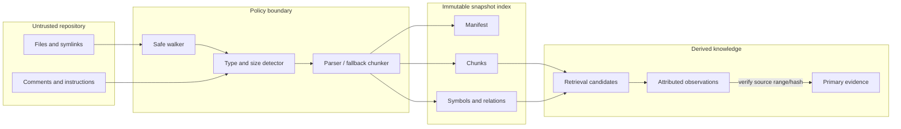
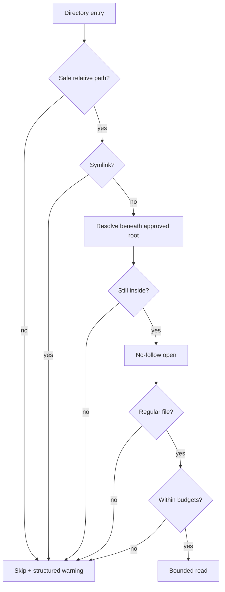
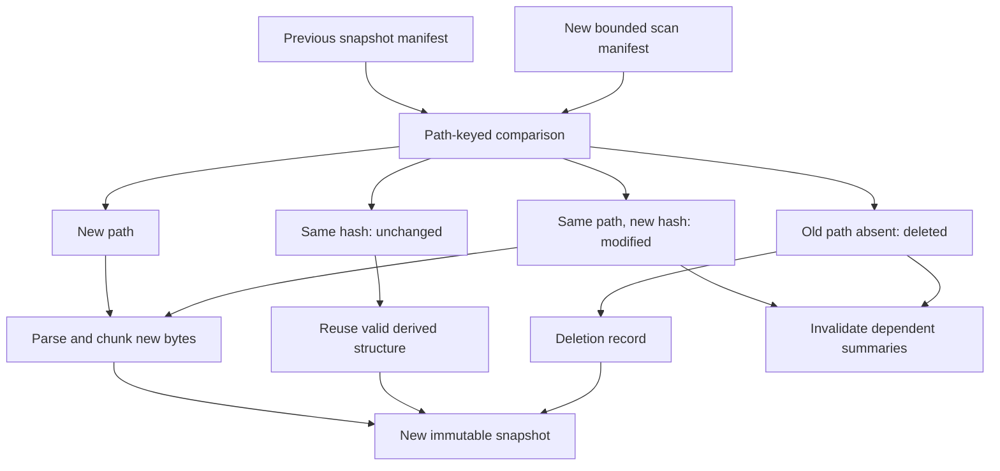
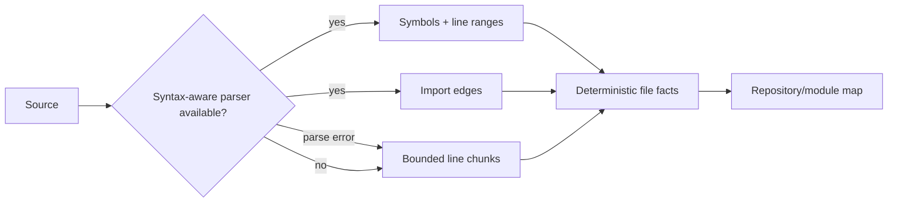
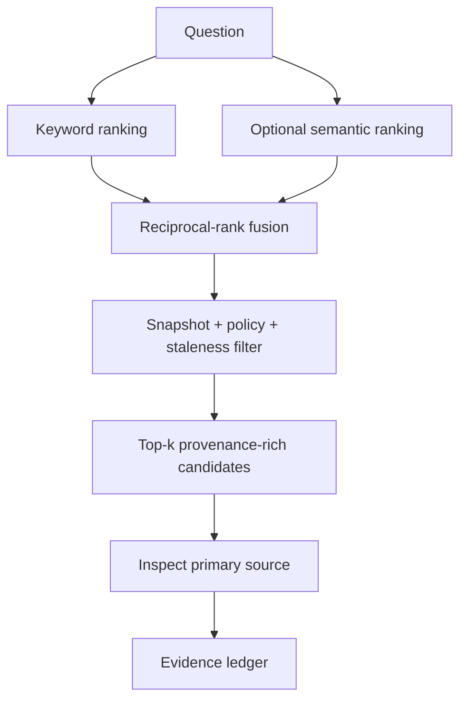
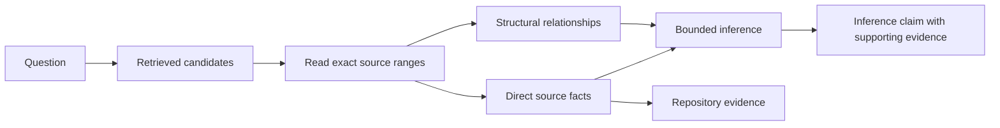

# Repository and document understanding

`LocalRepositoryIndexer` builds immutable, content-addressed snapshots. It walks
top-down without following symlinks, prunes policy and root or nested `.gitignore` matches,
re-resolves every file beneath the root, reads final components with `O_NOFOLLOW` where
available, and accepts regular files only. Per-file and aggregate byte limits bound
resource use. NUL-bearing or undecodable files are skipped with warnings.

Supported text detection covers Python, JavaScript/TypeScript, Go, Rust, Java/Kotlin,
C/C++, Ruby, shell, SQL, CSS, Markdown/reStructuredText/plain text, JSON, YAML, TOML,
XML, HTML, INI, common extensionless configuration files, and a robust line fallback.
Python uses `ast` for functions/classes/imports and line ranges. Other formats preserve
file/line chunks. PDF is an optional `pypdf` adapter boundary; the core safely skips PDF
bytes when that extra is not installed.

Each file records relative path, media/language, byte hash, size, snapshot, and change
kind. Incremental indexing compares a prior snapshot and emits new, modified, unchanged,
and deleted records. Chunks carry file/snapshot IDs, line bounds, symbol, imports, and
their own content hash. A repository map summarizes files/symbols and a module dependency
map records practical import relationships. Changed/deleted sources invalidate derived
summaries.

Keyword retrieval uses normalized term frequency with path/symbol boosts. Semantic
retrieval accepts an embedding protocol and cosine ranks. Hybrid retrieval uses
reciprocal-rank fusion so incompatible raw scores are not mixed. All results include
source locations and snapshot IDs. Retrieval answers are candidates; claims cite
repository evidence records, not ranks or summaries.

`RepositoryIntelligence` turns common purpose, dependency, test-coverage, impact, and
configuration questions into bounded deterministic answers. Every observation embeds its
supporting retrieval item, including immutable snapshot ID, file, line range, and content
hash. Observations remain explicitly marked as inference; retrieval relevance never
becomes a verified fact without primary-evidence review.

Untrusted-content classification flags prompt-like instructions but never executes
them. Repository text cannot add permissions, change roots, or alter system policy.
Known limits are conservative cross-language symbols, best-effort nested ignore negation,
no bundled vector database, and no safe claim that arbitrary repository tests form a
sandbox. Tests cover incremental deletion, binary/size/symlink handling, injection text,
symbol/import extraction, search provenance, and stale invalidation.

## Knowledge pipeline and trust boundary

Repository intelligence is a provenance-preserving pipeline. At no point does source
text become an instruction to the agent. It remains an observation whose authority is
limited to describing the repository snapshot in which it appeared.

The boundary enforces root containment, byte budgets, allowed media, and no-follow
behavior before parsing. Parsers receive bounded bytes, not arbitrary filesystem paths.
Retrieval can prioritize an item; it cannot verify the item's claim or authorize a tool.

## Filesystem safety in detail

Lexical normalization alone is insufficient. A path such as `root/docs/link/file` may
look contained while `link` resolves outside the root. The indexer therefore combines
three checks:

1. Normalize candidate relative paths and reject absolute paths or `..` traversal.
2. Resolve the repository root and candidate, then require the candidate to be beneath
   the resolved root.
3. Avoid following directory symlinks, and open final components with `O_NOFOLLOW` when
   the platform provides it; accept regular files only.

There remains a platform-dependent time-of-check/time-of-use risk when strong directory
handle APIs are unavailable. The no-follow final open, post-open file-type check, and
read-only indexing policy reduce its impact. A hardened multi-user deployment should
mount repositories read-only in an isolated worker or use an `openat2`-style containment
service.

`.gitignore` is a selection policy, not a security boundary. Rules are accumulated from
root and nested ignore files, while configured exclusions always win. The indexer never
uses ignore negation to authorize leaving the approved root. Git metadata, virtual
environments, dependency caches, generated build trees, credentials, and large media are
excluded by secure defaults.

## Classification and bounded decoding

Detection considers well-known filenames, extension, MIME hints, NUL bytes, and strict
decoding. An extension claiming to be text does not override binary evidence. UTF-8 is
the default deterministic decoder; unsupported or malformed bytes are skipped rather
than silently replaced because replacement characters would change hashes and line
provenance.

| Input class | Treatment | Rationale |
|---|---|---|
| Supported source/config/text | Parse or structured line chunk | High-value inspectable content |
| Unknown decodable text | Plain-text fallback | Preserve discoverability without invented structure |
| NUL-bearing/binary | Skip and warn | Avoid binary parser/resource hazards |
| Oversized file | Skip before full read | Bound memory and adversarial inputs |
| PDF with optional adapter | Extract bounded pages/text and retain page metadata | Explicit dependency and provenance |
| PDF without adapter | Skip with capability warning | No misleading empty index |

Repository-wide byte and file-count budgets stop a tree of individually small files from
exhausting memory. All skip reasons are observable so an operator can distinguish “not
present” from “present but excluded.”

## Snapshot and incremental algorithm

For every accepted file, the indexer computes SHA-256 over the exact bytes and a stable
file identity from snapshot/path. A canonical manifest sorts normalized relative paths
and their hashes before hashing the whole snapshot. Timestamps and directory iteration
order do not affect identity.

Unchanged content may reuse derived chunks only if the parser/configuration fingerprint
also matches. A parser upgrade or exclusion-policy change can require reprocessing even
when file bytes are unchanged. Rename detection is intentionally conservative: an old
path deleted and a new path created with the same hash may be reported as delete/create,
because path itself is part of citation identity.

## Structure extraction

Python parsing uses the standard AST, which gives deterministic function, async
function, class, decorator, import, and source-range information without executing code.
Module relationships are resolved conservatively from import syntax. Dynamic imports,
runtime monkey-patching, generated modules, framework registration, and reflection are
not claimed as complete dependencies.

Chunks prefer symbol boundaries when a symbol fits the configured size. Large symbols
are subdivided into overlapping line windows, and small adjacent fragments may be
grouped. Every chunk retains its inclusive line range and content hash. Overlap improves
retrieval continuity but means hit counts are not counts of independent evidence.

## Retrieval mathematics

Keyword retrieval normalizes query terms and assigns a bounded lexical score using term
frequency plus path and symbol-name boosts. Semantic retrieval maps query and chunks into
the same embedding space and uses cosine similarity:

\[
\operatorname{cos}(q,d)=\frac{q\cdot d}{\lVert q\rVert\lVert d\rVert}.
\]

Raw lexical and cosine scores are not calibrated to one another. Hybrid retrieval uses
reciprocal-rank fusion (RRF):

\[
\operatorname{RRF}(d)=\sum_{r\in R}\frac{1}{k+\operatorname{rank}_r(d)}
\]

where `R` is the set of retrievers and `k` dampens top-rank dominance. Stable path and
line ordering break ties, making fake-provider tests reproducible.

An embedding adapter is optional because deterministic offline use must remain complete.
The adapter contract covers model identity and vector dimensions so changing models
invalidates the semantic index rather than comparing incompatible vectors.

## From retrieved text to repository answers

`RepositoryIntelligence` decomposes a question into bounded search intents and labels the
result epistemically:

- “This file declares X” is verifiable if the cited exact range contains the declaration.
- “Module A imports B” is test-supported repository structure when the parser extracted
  the import from the pinned snapshot.
- “File C is likely affected” is an inference supported by import, symbol, test, and
  configuration evidence; it is not a proof of runtime impact.
- “Tests cover behavior Y” requires evidence connecting assertions or execution results
  to Y; matching a test filename alone is insufficient.

Repository purpose is synthesized from high-signal files such as package metadata,
entrypoints, README, configuration, and module map. Feature location uses symbol, path,
and usage evidence. Dependency and impact answers traverse the conservative relationship
map within a depth/result bound. Test-coverage answers search imports, named behavior,
fixtures, assertions, and actual test-result evidence when available.

## Summary invalidation and staleness

Derived summaries store the source manifest hash and referenced chunk IDs. If any
referenced source changes or disappears, the summary becomes invalid navigation. An
unchanged summary may remain valid across snapshots only when every dependency hash and
the summarizer fingerprint match. Invalid summaries never become primary evidence and
must not be copied into a final claim without returning to the source ledger.

Repository drift at resume compares the run's pinned manifest with a fresh scan. The
configured policy can reject, pause for review, or re-index and re-plan. It never silently
retargets old citations to the same line numbers in new content.

## Failure, security, and observability

| Failure or attack | Detection/control | Result |
|---|---|---|
| Symlink escape | no-follow walk, resolved-root check | file excluded and warning emitted |
| Gigantic/generated tree | per-file/repository/file-count budgets | bounded partial index with exclusions |
| Parser exception | typed parser error and fallback where safe | other files continue; limitation recorded |
| Prompt injection comment | content classification; no instruction channel | searchable untrusted text only |
| Secret-looking value | exclusions/redaction and bounded excerpts | not logged; retrieval access still owner-scoped |
| Stale summary | dependency/manifest mismatch | invalidate and regenerate navigation |
| Embedding model change | provider fingerprint mismatch | rebuild semantic vectors |
| Hash mismatch on retrieval | integrity recheck | quarantine record; do not cite |

Index logs include snapshot, path, outcome, bytes, parser, and skip category without full
file content. Metrics cover scanned/indexed/skipped files, bytes, parse failures,
incremental changes, retrieval latency, result count, and invalidations. Operators inspect
the repository map and snapshot metadata through `durable-agent index ... --json` and
run drift through `status`, `inspect-checkpoint`, and recovery events.

## Alternatives, limits, and tests

Executing language servers would yield richer cross-file semantics but introduces
untrusted build hooks, toolchain complexity, and nondeterminism. Tree-sitter would broaden
syntax-aware coverage but adds native dependencies and grammar lifecycle management. A
managed vector database would scale semantic search but violates the offline baseline.
These remain replaceable adapters behind repository and embedding protocols.

The index is not a malware sandbox, compiler, or proof of runtime behavior. It cannot
fully resolve metaprogramming, code generation, native build graphs, or every gitignore
edge case. Tests therefore assert conservative claims: containment under traversal and
symlink attacks, stable hashes, deterministic snapshots, new/modified/unchanged/deleted
classification, AST line provenance, parser fallback, budget enforcement, injection
neutrality, ranking stability, hybrid fusion, summary invalidation, and exact evidence
resolution.
