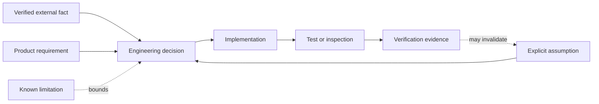
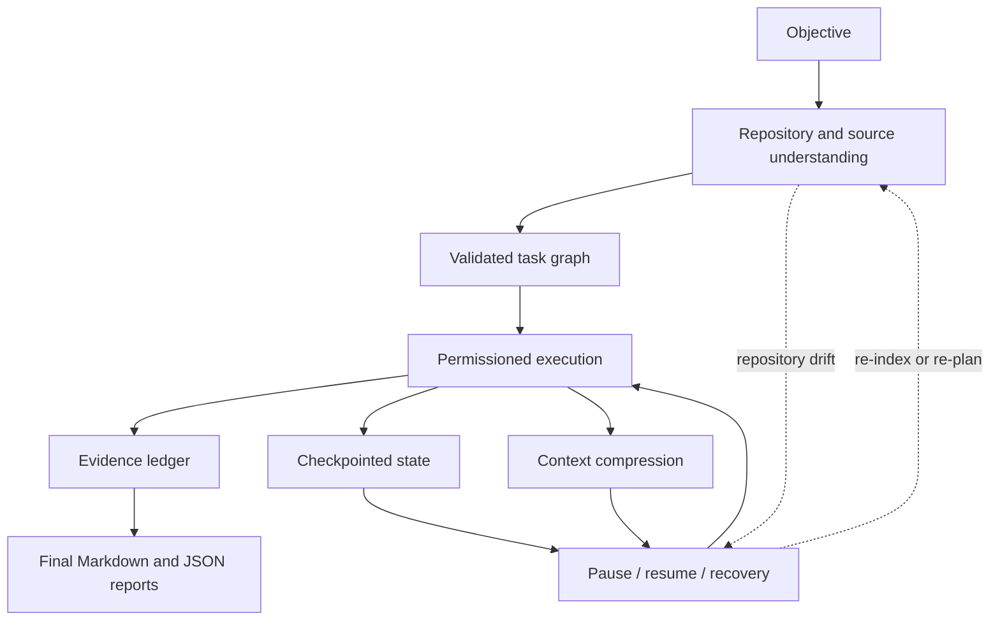
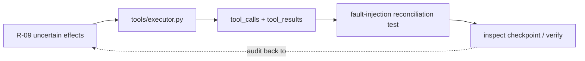

# Requirements and traceability

## Product intent

The system executes long-running coding and research objectives safely across process
boundaries. It is local-first, vendor-neutral, deterministic in tests, auditable, and
structured for a future authenticated multi-tenant deployment.

## Functional requirements

| ID | Requirement | Components | Verification |
|---|---|---|---|
| R-01 | Index supported text/code formats within a bounded root, incrementally | `repository`, persistence | repository unit/integration/security tests |
| R-02 | Search keyword, semantic (optional), and hybrid with provenance | `retrieval`, providers | retrieval contract tests |
| R-03 | Normalize/deduplicate research and preserve conflicts | `research`, `evidence` | offline conflicting-source E2E |
| R-04 | Produce and validate a bounded acyclic task graph | `planning`, domain plan | plan and property tests |
| R-05 | Enforce run/task state transitions | domain state machine | full transition-table tests |
| R-06 | Atomically persist explicit versioned checkpoints and append audit events | `checkpoints`, persistence | integrity, concurrency, corruption tests |
| R-07 | Compress context hierarchically without creating evidence | `context` | budgeting, provenance, drift tests |
| R-08 | Pause/resume/cancel only at safe boundaries | orchestrator, recovery | lifecycle E2E tests |
| R-09 | Reconcile uncertain side effects and suppress duplicates | tools, recovery, persistence | crash/fault-injection E2E |
| R-10 | Execute tools under explicit filesystem/command/network policy | tools, security | tool and security tests |
| R-11 | Link every report claim to a durable evidence record | evidence, reporting | report verification tests |
| R-12 | Expose required CLI commands and HTTP endpoints | CLI, API | CLI/API integration tests |
| R-13 | Record repository snapshots and detect resume drift | repository, recovery | drift E2E |
| R-14 | Emit correlated logs, metrics, and trace spans | observability | observability unit/API tests |

## Non-functional requirements

| ID | Requirement | Design response |
|---|---|---|
| N-01 Durability | Committed task boundaries survive restart | SQL transactions, checkpoints, event audit |
| N-02 Determinism | Offline tests have stable IDs/time/providers | injected clock, ID generator, fake providers |
| N-03 Security | Untrusted content has no authority | typed data boundary, tool policy, safe paths/subprocess |
| N-04 Portability | SQLite local and PostgreSQL production | SQLAlchemy portable types and constraints |
| N-05 Concurrency | Duplicate workers cannot own one run | renewable leases plus optimistic versions |
| N-06 Integrity | Tampering and partial writes are detectable | canonical JSON SHA-256 hashes and atomic commits |
| N-07 Auditability | Decisions and recovery are reviewable | ordered append-only event writes, retention tombstones, plan revisions, evidence ledger |
| N-08 Operability | Health, readiness, backup, cleanup | API probes, CLI doctor, runbook, maintenance scripts |
| N-09 Quality | Typed, linted, tested, reproducibly packaged | Ruff, mypy, pytest, CI, pinned lock input |

## Lifecycle acceptance criteria

1. A fresh Alembic upgrade creates every documented entity and reports one head.
2. Indexing never follows a symlink or resolved path outside the configured root.
3. Plans reject missing dependencies, cycles, missing completion tests, and excessive
   decomposition.
4. A checkpoint sequence is monotonic per run and a conflicting expected sequence is
   rejected.
5. Corrupt newest checkpoints are skipped and a recovery event identifies fallback.
6. A pause commits after the current operation, never while tool status is ambiguous.
7. Resume refuses incompatible configuration and applies the configured repository-drift
   policy.
8. Each non-idempotent tool requires an idempotency key and persisted intent; uncertain
   status is reconciled or paused for review, never blindly rerun.
9. Context compression retains constraints, open questions, decisions, and evidence IDs;
   summaries cannot be cited as primary evidence.
10. Report verification rejects missing evidence, unverified evidence for a verified
    claim, forged citations, and hash-mismatched serialized reports.

## Assumptions and constraints

- Production baseline is CPython 3.12. Source compatibility down to 3.10 is retained for
  the supplied execution host and does not change the container/CI target.
- Local mode is a single trusted operator using SQLite. Multi-user mode requires the
  documented authentication/authorization integration hook and PostgreSQL.
- Core operation needs no network. External fetching is disabled by default and adapters
  must enforce DNS/IP and response-size policy.
- The baseline planner and compressor are deterministic. LLM adapters only return strict
  Pydantic schemas; invalid output is rejected or repaired within a bounded attempt count.
- “Production-ready” means safe, deployable foundation and documented operational
  boundaries; it does not claim that arbitrary generated code can be executed safely
  outside an OS/container sandbox.

## Out of scope and known limits

- Distributed consensus, a hosted identity provider, and a hardened arbitrary-code
  sandbox are deployment integrations, not embedded substitutes.
- Semantic vectors use an adapter and deterministic local hashing implementation; a
  production vector database is not bundled.
- PDF text extraction is an optional extra because native PDF dependencies vary.
- Code symbol extraction is syntax-aware for Python and structurally conservative for
  other languages.

## How to read these requirements

The project separates five kinds of statements because confusing them creates systems
that are persuasive on paper but impossible to verify:

| Statement class | Meaning | Example | Required treatment |
|---|---|---|---|
| External fact | A claim about a dependency, protocol, or platform | SQLite permits one writer at a time | Cite a primary source in the research log |
| Product requirement | Behavior the system must exhibit | A paused run must be resumable by ID | Map to code, a test, and an inspection path |
| Engineering assumption | A condition accepted for this implementation | Local mode has one trusted operator | State explicitly and revalidate at deployment |
| Design decision | A chosen way to satisfy requirements | Use an event-audit hybrid | Record alternatives and consequences in an ADR |
| Known limitation | A requirement or threat only partially closed | No embedded hostile-code VM sandbox | Disclose without converting it into an assumption |

This distinction is an epistemic control. For example, “the report says tests passed” is
not evidence that tests passed. A test-result row containing the command, exit code,
bounded output, timestamp, and result hash is evidence. Similarly, a summary stating
that a file contains a constraint is not primary evidence; the line-addressed repository
chunk is.

## Requirement decomposition

The six product capabilities are not independent features. They form a dependency
network. Understanding precedes planning because a useful plan needs repository facts.
Planning precedes execution because lifecycle and retry decisions refer to stable task
IDs. Checkpointing surrounds execution because every later recovery decision depends on
what was durably committed. Reporting depends on primary evidence produced throughout
the workflow, not on a reconstruction performed at the end.

The architecture therefore cannot satisfy the objective with a planner alone, a vector
database alone, or a chat transcript alone. The durable unit is the entire run state:
plan version, task graph, attempts, tool intents, evidence, source snapshot, context
manifest, and checkpoint chain.

## Formal safety and liveness properties

The acceptance criteria can be restated as properties that hold over all executions.
They are useful during design review because they remain meaningful when implementation
details change.

### Safety properties

Safety means “nothing bad happens.” The critical properties are:

1. **Transition safety:** every persisted run or task transition is an edge in the
   authoritative state machine.
2. **Ownership safety:** at most one unexpired lease/fencing generation may commit work
   for a run.
3. **Filesystem confinement:** every file opened or replaced resolves beneath the
   configured root at the time of the security check.
4. **Side-effect safety:** no ambiguous non-retry-safe effect is automatically repeated.
5. **Checkpoint integrity:** a checkpoint is selectable only if its schema, payload hash,
   parent relationship, and configuration fingerprint validate.
6. **Evidence referential integrity:** a claim never points to missing or cross-run
   evidence.
7. **Epistemic safety:** summaries and unverified sources cannot silently become verified
   primary evidence.
8. **Tenant safety:** an owner cannot inspect or mutate another owner's run through the
   application service or HTTP API.

### Liveness properties

Liveness means “something good eventually happens,” subject to declared assumptions:

1. A runnable DAG with available providers and no lifecycle request eventually reaches a
   terminal run state.
2. A retryable failure either succeeds within its bounded attempt count or becomes an
   explicit terminal/manual-review result; it never retries forever.
3. A pause request is honored after the finite current safe-boundary operation.
4. An expired lease can be acquired by another worker, permitting recovery after process
   death.
5. A corrupt newest checkpoint does not prevent recovery when an older valid checkpoint
   exists.

Liveness is deliberately bounded. The platform does not promise completion when a tool
hangs beyond an unenforceable external boundary, the database is unavailable forever,
or a human-review operation receives no decision. Those conditions become observable
waiting or failure states rather than hidden loops.

## Quantitative budgets and capacity requirements

Several requirements are enforceable only when expressed as budgets:

| Budget | Enforced by | Failure behavior |
|---|---|---|
| Per-file bytes | Repository indexer and readers | Skip with warning or reject direct read |
| Aggregate repository bytes | Indexer | Abort index without committing a partial snapshot |
| Tool output bytes | Tool runner and executor | Drain process pipes, store bounded/redacted preview, mark truncation |
| Context tokens | Context manager | Compress lower-priority material while preserving sentinels |
| Attempts per task | Task specification and orchestrator | Apply declared failure policy at exhaustion |
| Plan depth/node count | Plan validator | Reject over-decomposition before persistence |
| Lease TTL/renewal | Settings and SQL lease adapter | Expire ownership and permit fenced takeover |
| Checkpoint retention | Checkpoint manager | Retain a valid recovery window and prune older rows |
| Event/artifact retention | Maintenance service | Preview, then compact/delete only eligible terminal data |

These limits are not merely performance knobs. They are security boundaries against
malicious repositories, runaway providers, disk exhaustion, and denial of service.

## Traceability method

Traceability is maintained in both directions:

- **Forward:** requirement → component → durable data → test → operator command.
- **Backward:** observed row/event/report claim → implementation path → originating
  requirement and decision.

Unit tests establish local invariants; integration tests establish adapter contracts;
end-to-end tests establish multi-component outcomes; property tests explore state spaces;
security tests attempt prohibited behavior; and the demonstration establishes that the
documented workflow is reproducible. A requirement is not considered verified solely
because its implementation module exists.

## Requirement tensions and chosen priorities

Some requirements pull in opposite directions:

| Tension | Chosen priority | Consequence |
|---|---|---|
| Throughput vs deterministic commits | Deterministic plan-order commit | Parallel work may wait briefly before its outcome is materialized |
| Complete audit history vs bounded storage | Audit retention with digest tombstones | Old high-volume events are not individually queryable after compaction |
| Automatic recovery vs side-effect safety | Safety for ambiguous effects | Some runs require manual review instead of automatic progress |
| Rich model context vs provenance | Provenance and constraints first | Less conversational history may be sent to the model |
| Local simplicity vs distributed scale | SQLite local, PostgreSQL production | The local topology is intentionally not a multi-worker benchmark |
| Extensibility vs schema certainty | Provider protocols plus strict boundary schemas | Adapters perform more validation and conversion work |

These priorities are part of the contract. A future optimization that violates them must
be presented as a new decision with new evidence, not as an invisible refactor.

## Review and change-control protocol

When a requirement changes, reviewers should follow this sequence:

1. Update the requirement and identify affected safety/liveness properties.
2. Record or revise the relevant ADR when the design choice changes.
3. Modify explicit domain schemas and state transitions before infrastructure adapters.
4. Add a migration when durable shape changes; never mutate historical migration logic.
5. Add failure, concurrency, and security tests in addition to the happy path.
6. Update operational inspection and recovery instructions.
7. Run the complete quality and demonstration gates and record only actual results.

This protocol prevents documentation, implementation, migrations, and operations from
describing four subtly different systems.
