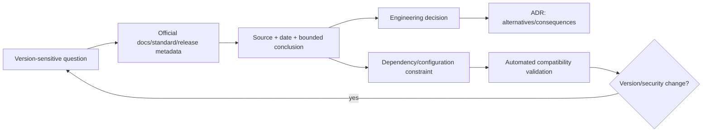
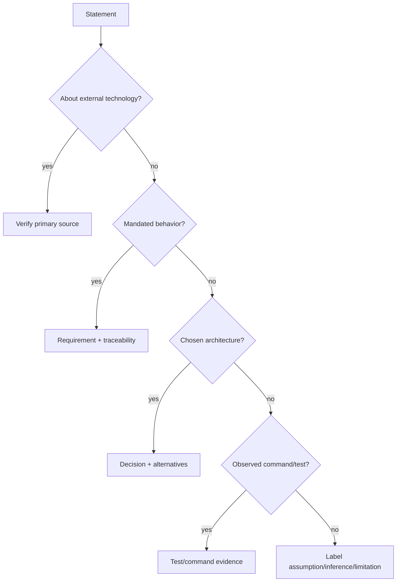
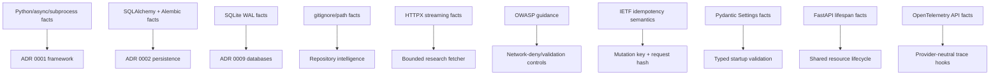

# Research log

Retrieved 2026-08-04. Sources are official project documentation or primary standards.
Package pins are reviewed in CI; significant-minor upgrades require an ADR update.

| Question | Source | Verified conclusion | Influence / ambiguity |
|---|---|---|---|
| Python baseline | [Python 3.12 documentation](https://docs.python.org/3.12/whatsnew/3.12.html) | Python 3.12 is stable and includes `asyncio`, `pathlib`, and `sqlite3` improvements. | Production/container target is 3.12; host-compatible syntax remains 3.10+. |
| SQL ORM/API | [SQLAlchemy 2.0 overview](https://docs.sqlalchemy.org/en/20/intro.html) and [asyncio guide](https://docs.sqlalchemy.org/en/20/orm/extensions/asyncio.html) | SQLAlchemy 2.0.51 docs define the current 2.0 API; asyncio support uses the documented async extension and greenlet. | Use 2.0 `select`, typed mappings, `AsyncSession`; install `sqlalchemy[asyncio]`. |
| Schema migrations | [Alembic 1.18 docs](https://alembic.sqlalchemy.org/en/latest/front.html) | Alembic 1.18.5 supports Python 3.9+ and SQLAlchemy 1.4+; significant minor releases may be incompatible. | Pin exact 1.18.5 and validate one migration head in CI. |
| Typed configuration | [Pydantic Settings](https://pydantic.dev/docs/validation/latest/concepts/pydantic_settings/) | `BaseSettings` loads typed environment values; complex values are JSON and defaults are validated. | `DURABLE_AGENT_` prefix, nested delimiter, startup validators; Pydantic 2.13.4. |
| HTTP lifecycle | [FastAPI lifespan](https://fastapi.tiangolo.com/advanced/events/) | Lifespan context is the recommended place for shared startup/shutdown resources. | Application service/database are created and disposed in lifespan. |
| CLI tests | [Typer testing guide](https://typer.tiangolo.com/tutorial/testing/) | `CliRunner` supports deterministic command tests. | CLI routes through application service and has integration tests. |
| Prometheus ASGI | [prometheus-client ASGI](https://prometheus.github.io/client_python/exporting/http/asgi/) | `make_asgi_app` exposes metrics as an ASGI application. | Mount `/metrics`; avoid run/task IDs as labels to limit cardinality. |
| SQLite concurrency | [SQLite WAL](https://www.sqlite.org/wal.html) | WAL improves reader/writer concurrency but still has a single writer and same-host constraints. | Local single-worker default; PostgreSQL for multi-worker production. |
| Git ignore semantics | [Git gitignore documentation](https://git-scm.com/docs/gitignore) | Later patterns and negation affect matching; patterns occur at multiple levels. | Use `pathspec` gitwildmatch with directory-scoped root and nested `.gitignore` patterns; complex nested negation remains best effort. |
| Bounded HTTP fetching | [HTTPX async streaming](https://www.python-httpx.org/async/) and [HTTPX quick start](https://www.python-httpx.org/quickstart/) | `AsyncClient.stream` is an async context manager, `aiter_bytes` supports bounded streaming, and redirects are disabled by default unless explicitly enabled. | Keep automatic redirects off, revalidate each `Location`, stream with a byte cap, close through context managers, and inject `MockTransport` for offline tests. |
| HTTP idempotency | [IETF Idempotency-Key draft](https://datatracker.ietf.org/doc/draft-ietf-httpapi-idempotency-key-header/) | An idempotency key identifies retries of unsafe HTTP methods and must not be reused for a different payload. | Persist key + request hash + response reference and reject mismatched reuse. |
| Trace API | [OpenTelemetry Python](https://opentelemetry.io/docs/languages/python/instrumentation/) | Manual spans can be created without requiring a vendor exporter. | Core exports optional hooks and uses no-op behavior when SDK/exporter absent. |
| Secure subprocess | [Python subprocess](https://docs.python.org/3/library/subprocess.html#security-considerations) | Argument sequences and `shell=False` avoid implicit shell interpretation; shell invocation has quoting responsibility. | Tool runner accepts argv only, uses `shell=False`, sanitized environment, timeout/output caps. |
| Tool schema validation | [jsonschema 4.26.0 release](https://pypi.org/project/jsonschema/4.26.0/) | The stable 4.26.0 release supports Python 3.10+ and supplies validator selection/schema validation APIs. | Declare the previously implicit runtime dependency and pin 4.26.0. |
| SSRF | [OWASP SSRF prevention](https://cheatsheetseries.owasp.org/cheatsheets/Server_Side_Request_Forgery_Prevention_Cheat_Sheet.html) | URL allowlisting and IP/domain validation are key controls; redirects and DNS need care. | Network disabled by default; fetch adapters must reject non-HTTP(S), private/link-local IPs, and redirects unless revalidated. |
| Supply-chain scanning | [PyPA dependency groups / packaging](https://packaging.python.org/en/latest/guides/writing-pyproject-toml/) and [pip-audit](https://github.com/pypa/pip-audit) | PEP 621 metadata and installable extras support repeatable dependency inputs; pip-audit checks known vulnerabilities. | Use PEP 621, exact direct pins, build and audit gates. The checked-in input does not hash-lock transitive wheels; release automation must add that control. |
| Direct dependency metadata | Official PyPI JSON for [FastAPI 0.139.2](https://pypi.org/pypi/fastapi/0.139.2/json), [Pydantic 2.13.4](https://pypi.org/pypi/pydantic/2.13.4/json), [SQLAlchemy 2.0.51](https://pypi.org/pypi/SQLAlchemy/2.0.51/json), and [Alembic 1.18.5](https://pypi.org/pypi/alembic/1.18.5/json) | Release metadata confirms Python compatibility and declared dependency constraints; Pydantic 2.13.4 specifically requires `pydantic-core==2.46.4`. | Keep every declared direct/optional dependency exact, consume `requirements.lock` as a constraint in CI/container/development, and validate lock/project agreement. A platform-specific, hash-locked transitive resolution still requires an online resolver. |

## Decisions versus facts

Facts above are source-backed. The event-audit hybrid, lease duration, checkpoint
frequency, deterministic hash embeddings, and local artifact layout are project design
decisions, not claims made by those sources. Alternatives and consequences are in ADRs.

## Unresolved ambiguity

The IETF Idempotency-Key work may evolve before final RFC publication; the implementation
uses stable semantics (key uniqueness scoped to owner/action and a request fingerprint)
rather than depending on draft-specific wire details. External provider SDK versions are
not pinned because the core ships only provider-neutral protocols and deterministic fakes.

## Research method

The log separates external facts from project choices. A fact entry answers a narrowly
stated question from a primary source and records the retrieval date. The architecture
then references the fact without implying that the source selected the design.

Research is reproducible when another reviewer can identify the exact official page or
release metadata, see what conclusion was drawn, and find the implementation/ADR it
influenced. Search-result snippets and generative-model memory are discovery aids, not
recorded authorities.

## Source-selection hierarchy

1. Normative standards and official language/framework documentation.
2. Official release notes, migration guides, and package metadata.
3. Maintainer-authored security/advisory documentation.
4. Primary implementation/repository material where public docs are incomplete.
5. Secondary sources only to identify a primary source or explicitly compare experience.

For a technical implementation claim, the log prefers the narrow source that directly
supports it. A package index can verify declared Python requirements; it does not prove
runtime correctness. An OWASP cheat sheet informs a threat-control design; the resulting
application plus tests prove which mitigations were actually implemented.

## Epistemic labels used by this project

| Label | Review standard | Example |
|---|---|---|
| Verified external fact | Direct primary-source support and retrieval date | SQLite WAL still has one writer |
| Project requirement | Explicit acceptance criterion | Offline tests are required |
| Engineering assumption | Necessary premise with uncertainty disclosed | Local default targets a single worker |
| Design decision | Selected alternative with consequences in an ADR | Event-audit hybrid |
| Test-supported conclusion | Actual recorded command/test result | Checkpoint fallback scenario passed |
| Limitation | Known boundary not represented as complete | App SSRF validation cannot eliminate DNS rebinding |

## Version-review protocol

Dependency pins are not updated merely because a newer version exists. For each direct
upgrade:

1. Read official release and migration/security notes from current to candidate version.
2. Confirm Python and transitive compatibility from official metadata.
3. Update this conclusion and the ADR if behavior or architecture changes.
4. Regenerate the platform-specific hash lock/SBOM in the release environment.
5. Run formatting, lint, types, offline tests, migrations, build, container, and
   vulnerability gates.
6. Record actual verification results and every skipped/unavailable gate.

Security advisories may require urgent pins or removal. A scanner result is temporal; its
advisory database date and execution environment belong in release evidence.

## Fact-to-decision influence map

The arrows mean “informed,” not “mandated.” SQLite documentation establishes its
concurrency constraints; the decision to use it only locally is ours.

## Research-content security

External pages are untrusted even when hosted on an official-looking domain. Fetching is
policy-controlled, SSRF-restricted, byte-bounded, normalized, hashed, and timestamped.
Text cannot alter tool permission, repository root, system instruction, or evidence
verification rules. Redirects are revalidated. Stored excerpts observe copyright,
privacy, and secret-minimization requirements.

Conflicting or ambiguous sources remain separate evidence. Publication/retrieval dates,
software versions, and scope are compared before calling a contradiction. The research
log may summarize a conclusion, but final report claims resolve to primary evidence, not
this navigation document.

## Maintenance and review triggers

Review relevant entries when the Python baseline, framework version, database dialect,
authentication model, network fetcher, provider SDK, migration strategy, tool execution
policy, container base, or vulnerability guidance changes. Also review an entry when its
URL disappears or official documentation contradicts the recorded conclusion.

Open ambiguity is not a defect when disclosed and bounded. It becomes a defect when the
implementation depends on one interpretation without tests or a migration plan.
