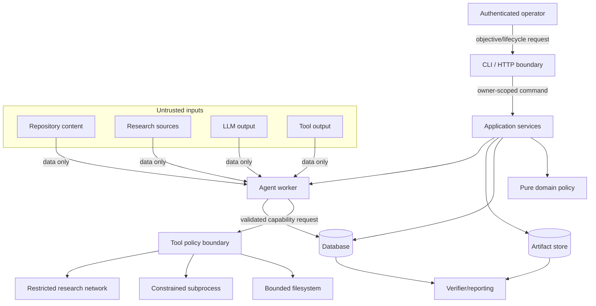
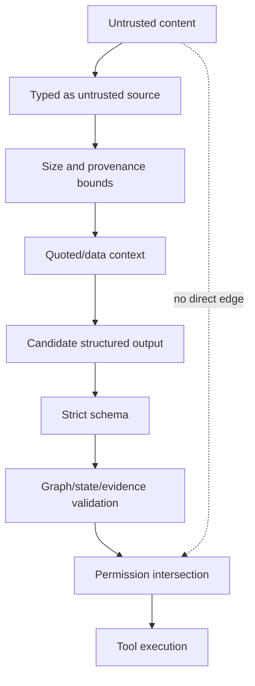
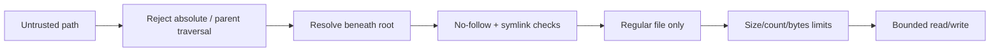
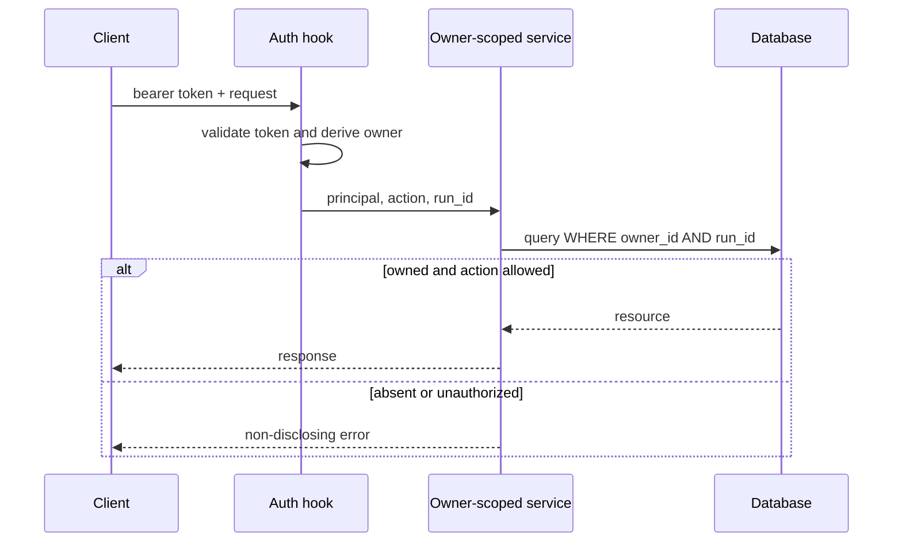
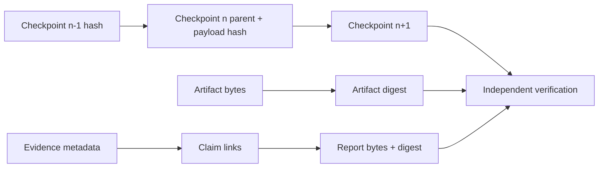

# Security threat model

## Assets, actors, and trust boundaries

Assets are repository contents, credentials, durable state, artifacts, evidence
integrity, compute, and cross-run confidentiality. Actors are authenticated operators,
workers, external providers, repository authors, and attackers controlling retrieved
content. Boundaries are HTTP/CLI input, tenant ownership, filesystem, subprocess,
network/DNS, provider output, SQL, logs/traces, checkpoints, and artifact storage.

| Threat | Implemented controls | Residual risk / production requirement |
|---|---|---|
| Prompt injection in files/web | Content marked untrusted; strict schemas; no content-derived permissions; injection warnings | Model providers may still be influenced; isolate authority and review high impact |
| Path traversal / absolute / symlink escape | Resolve beneath approved root, `relative_to`, parent resolution, `O_NOFOLLOW`, regular-file checks, symlink-free walk | Filesystem races on exotic platforms; use read-only mounts/container isolation |
| Command injection / arbitrary execution | argv arrays, `shell=False`, plain executable allowlist, root-bound cwd, timeout, sanitized env | Allowed tests execute repository code; hostile repos require disposable VM/container |
| Secret exfiltration/log injection | Network off by default, environment allowlist, recursive credential redaction, CR/NUL handling | Secret manager and egress proxy required in production |
| Dependency confusion | Exact direct pins, isolated build, audit/pre-commit/CI, no credentials | Produce hash-locked SBOM and trusted index policy for releases |
| Unsafe deserialization / DB injection | Pydantic/JSON only; SQLAlchemy bound statements; no `eval`, pickle, or shell strings | Validate migration/operator access separately |
| SSRF | HTTP(S) only, no credentials/nonstandard ports, resolve all IPs and reject non-global; `HttpDocumentFetcher` revalidates each redirect and caps text bodies; network disabled by default | DNS rebinding between validation and connection still requires an egress proxy/firewall in hostile production networks |
| Resource exhaustion / DoS | file/repository/output/task/context limits, timeouts, bounded retries/decomposition | Add per-tenant quotas, worker cgroups, request rate limits |
| Cross-run leakage | Owner checks on every API resource, allowed-owner/auth hooks, run-scoped evidence validation | Integrate real identity/RBAC and PostgreSQL row-level controls if required |
| Unauthorized lifecycle mutation | Bearer hook, owner header allowlist, owner-scoped service, idempotency hashes | Development auth is off; production startup must require auth/TLS |
| Forged evidence | Immutable IDs, FK links, source/report hashes, snapshot IDs, verification status | DB administrator can rewrite rows; use signed/WORM audit storage for stronger threat |
| Checkpoint/artifact tampering | Payload/parent/report/artifact hashes and fallback; no opaque objects | Parent chain is not externally signed; protect backups and database credentials |
| Duplicate/external effects | Intent-before-effect, idempotency key, effect class, reconciliation/manual review | Provider must honor its contract; human approval for irreconcilable actions |

The API token comparison is constant-time. Error responses do not expose details beyond
category/message. Metrics avoid run/task labels to bound cardinality. Structured logs
support correlation fields but application code must bind run/task/attempt/checkpoint/
tool/event IDs when available.

Secure defaults deny network, file writes, patching, shell, and unauthenticated production
configuration. PostgreSQL, TLS termination, a secret manager, immutable images, read-only
root filesystems, non-root users, seccomp/AppArmor, egress controls, and tenant-aware
authorization are deployment responsibilities. Docker Compose demonstrates a non-root,
no-new-privileges/read-only service but is not a hostile-code sandbox.

The complete tool catalogue, permission map, intent/result flow, and recovery semantics
are in [tool execution and policy](tools.md). Planner-declared tools are checked against
the production registry by a contract test.

Security tests cover traversal, absolute and symlink escape, shell metacharacters,
environment leakage, output caps, redaction, SSRF, prompt injection, malformed model
output, forged evidence, checkpoint tampering, and unauthorized HTTP operations. Run
Bandit and `pip-audit` as additional gates; vulnerability results are time-sensitive.

## Security objectives and non-objectives

The primary objectives are containment of granted authority, confidentiality between
owners/runs, integrity and auditability of durable state/evidence, availability under
bounded adversarial input, and fail-closed recovery. The local reference deployment is
not a sandbox for executing hostile code, not an identity provider, and not a substitute
for host/database/object-store hardening.

Security properties are prioritized as follows:

1. Untrusted content must not become policy or authority.
2. A caller must not observe or mutate another owner's run.
3. A filesystem/network/process operation must remain inside explicit policy.
4. A crash must not cause blind repetition of an uncertain non-idempotent effect.
5. Tampered durable content must be detected before it is trusted for recovery/reporting.
6. Resource use must be bounded before parsing, execution, or persistence.

## System and data-flow trust boundaries



Crossing a boundary always means validation and re-establishing invariants. A Pydantic
model validates shape; domain checks validate identity/state/permissions; infrastructure
checks validate path, DNS, arguments, bytes, and timeouts.

## Threat actors and capabilities

| Actor | Assumed capability | Not assumed |
|---|---|---|
| Repository author | Controls filenames, links, source bytes, tests, build/config text | Host/database administrator access |
| Research publisher/MITM at untrusted source | Controls retrieved bytes and redirect targets | Ability to bypass TLS/egress policy by assumption |
| Malicious model/provider output | Emits arbitrary malformed/adversarial structured text | Direct tool or database access |
| Authenticated malicious tenant | Sends valid API requests and guesses IDs | Authorization to another owner's resources |
| Compromised worker | Uses its OS/database credentials | Protection from privileges already granted to that credential |
| Database/artifact administrator | Can alter storage within their privilege | Defeated by unhashed local records alone |
| Accidental operator/developer | Misconfiguration, duplicate commands, failed deploys | Malicious intent required for impact |

The strongest local integrity checks do not defeat a fully privileged attacker who can
rewrite both data and hashes. Signed external manifests and separation of duties are the
production escalation path.

## Prompt-injection defense

Prompt injection is an authority-confusion attack. Repository text, web pages, comments,
tool output, and model content may say “ignore previous instructions” or imitate a tool
call. The defense is architectural rather than keyword-only:



Injection detection is telemetry and review assistance, not the primary control: novel
wording can evade a classifier. The decisive properties are that content cannot register
tools, grant permissions, alter roots, change retry/effect policy, forge same-run evidence
links, or bypass authenticated application services.

## Filesystem and malicious-repository threats

Paths are normalized as repository-relative values, resolved beneath an approved root,
and checked again at operation time. Directory traversal does not follow symlinks;
regular-file and no-follow checks reject devices, sockets, FIFOs, and link escapes.
Per-file and aggregate limits apply before full content loading.



There is a residual filesystem race on platforms without strong directory-handle
resolution. Production treatment is read-only repository mounts for indexing, isolated
write workspaces, a dedicated low-privilege UID, and container/VM boundaries for
untrusted sources.

Repository tests are arbitrary code even when invoked as `pytest`. They can import
malicious modules before tests begin. Command allowlisting prevents command injection but
does not make an allowed interpreter safe. Hostile test execution requires no secrets,
denied network, disposable VM/container, resource/process limits, restricted mounts, and
kernel isolation.

## Command and process threats

The runner receives argv, never a shell command string. The executable is a simple
allowlisted name; cwd is root-contained; stdin is closed; environment is built from an
allowlist; output and duration are bounded. Metacharacters remain argument bytes because
`shell=False`.

Child-process termination and descendants are platform concerns. A hardened executor
uses process groups/namespaces, cgroups, PID limits, seccomp/AppArmor, a read-only root
filesystem, and a disposable writable volume. No in-process Python restriction can
reliably sandbox arbitrary Python code.

## Network and SSRF threats

Network research is disabled by default. When enabled, fetch policy permits HTTP(S),
rejects embedded credentials and non-approved ports, resolves every hostname, rejects
loopback/private/link-local/multicast/reserved targets, revalidates redirects, bounds
redirect count and bytes, and accepts expected media.

```mermaid
flowchart TD
  URL[Candidate URL] --> Parse{HTTP(S), no credentials, allowed port?}
  Parse -->|no| Deny[Reject]
  Parse -->|yes| DNS[Resolve all addresses]
  DNS --> Global{Every address globally routable?}
  Global -->|no| Deny
  Global -->|yes| Fetch[Egress-limited fetch]
  Fetch --> Redirect{Redirect?}
  Redirect -->|yes within bound| Parse
  Redirect -->|no| Type{Allowed type/size?}
  Type -->|no| Deny
  Type -->|yes| Normalize[Normalize, hash, mark untrusted]
```

DNS rebinding can occur between validation and connection. A production egress proxy or
firewall that enforces destination policy at connection time is required for hostile
multi-tenant network access. Cloud metadata and internal service ranges must be denied at
the network layer as well.

## Identity, authentication, and authorization

The API has an authentication hook and constant-time bearer comparison suitable for a
development/static-token integration. Production must integrate a real identity
provider, TLS termination, rotation, audience/issuer validation, and authorization policy.
All resource access starts with authenticated owner scope and then run ID; possession of
a UUID is not authorization.



Lifecycle mutations additionally use idempotency keys and request hashes. Authorization
is rechecked on resume because ownership or policy may have changed while paused. A
multi-user PostgreSQL deployment may add row-level security as defense in depth, but
application owner scoping remains mandatory.

## Secret handling and exfiltration resistance

Credentials enter through environment/secret-manager integration, never committed
configuration. Tools receive only explicitly allowed environment variables. Research
network access and repository/process permissions are independent, reducing the chance
that a malicious repository can both read a secret and send it externally.

Recursive redaction recognizes configured names and credential-shaped values before
structured logging or persisted bounded output. Control characters are escaped to resist
log forging. Redaction is defense in depth: once a secret is exposed to an untrusted
provider or child process, replacing it in logs does not undo disclosure. Deployments
must minimize credential scope, use short lifetimes, rotate on suspected exposure, and
deny egress by default.

## Durable-state and evidence integrity

Checkpoints form a parent-linked hash chain over canonical explicit schemas. Artifacts,
tool results, source normalizations, and reports carry content hashes. Resume scans from
the newest checkpoint to the most recent valid retained chain point and records fallback.
Evidence links are foreign-keyed and same-run validated.



Hashes detect mutation relative to trusted metadata; they do not establish authorship.
Database least privilege, encrypted/authenticated transport, protected backups, signed
manifests, WORM audit storage, and independent key custody strengthen authenticity.

## Side effects and crash safety

A pre-execution tool intent contains stable idempotency key, normalized argument hash,
effect class, and status. A crash after external success but before result commit produces
an uncertain intent. Recovery reconciles observable state; it retries only when absence
of effect is proven and the contract is retry-safe. Irreconcilable non-idempotent effects
pause for human review.

This protocol prevents duplicate effects caused by assuming that missing database output
means a call never happened. Providers supporting native idempotency keys or transactional
outboxes should receive the durable key.

## Resource exhaustion and availability

Limits are layered because no single timeout covers all attacks:

| Layer | Principal bounds |
|---|---|
| API/config | request/objective size, pagination, concurrency, authentication rate |
| Planning | task count/depth, repair attempts, task context estimate |
| Repository | file size/count, total bytes, parsers, exclusions |
| Retrieval/research | result count, redirects, response bytes, domains/ports |
| Tools | timeout, argv, cwd, output bytes, environment |
| Context | hard capacity, reservations, hierarchy generation |
| Persistence | short transactions, busy timeout, retention, artifact quotas |
| Runtime | CPU/memory/PID/disk/network quotas supplied by deployment |

When a hard safety limit is reached, the system records an explicit failure or limitation;
it does not silently discard constraints/evidence or broaden permissions to continue.

## Supply-chain security

Direct dependencies are pinned and built in isolated environments; CI performs static
analysis, tests, package construction, migration validation, container build, Bandit, and
time-sensitive vulnerability auditing. Production release practice should additionally
use hashes/lock files for transitive dependencies, a trusted package index, dependency
provenance, SBOM generation, signed images, minimal bases, and reproducible build review.

An audit finding is evaluated for reachability and environment, but is never hidden.
Dependency scanners require refreshed advisory data and may be unavailable offline; CI
and verification reports distinguish “clean scan,” “finding,” and “not executed.”

## Threat-to-control verification map

| Threat | Primary automated proof | Additional production control |
|---|---|---|
| Traversal/symlink escape | security path and repository-index tests | read-only isolated mounts |
| Shell injection/env leak | subprocess argv/env tests | sandboxed worker runtime |
| Prompt injection | repository/research/model policy tests | model isolation and approval |
| SSRF | URL, DNS, redirect, size tests | egress proxy/firewall |
| Cross-run access | authenticated API owner tests | IdP/RBAC/RLS |
| Forged evidence/report | ledger and tamper tests | signed/WORM manifests |
| Checkpoint tampering | hash-chain/fallback fault tests | protected backup/audit keys |
| Duplicate side effect | intent crash/reconciliation tests | provider idempotency/outbox |
| DoS | limit/property/performance tests | quotas/rate limits/cgroups |
| Dependency compromise | pin/static/audit/build gates | trusted index/SBOM/signing |

## Security operations and incident response

Security logs include principal, owner, action, run/task/tool IDs, outcome, and reason
category without secrets or full untrusted payload. Metrics avoid attacker-controlled
high-cardinality labels. Alerts should cover repeated authentication failures, policy
denials, path/SSRF rejection spikes, integrity failures, uncertain tool calls, excessive
retries, and owner-scope anomalies.

On suspected compromise: stop scheduling affected runs; preserve database/artifact/log
snapshots; rotate exposed credentials; block egress; verify checkpoints, tool intents,
artifacts, evidence, and reports; identify affected owners/snapshots; restore only from a
verified backup; and document any manual state repair. Do not erase the failed/tampered
record before evidence collection.

## Residual risks and review triggers

Residual risks include model manipulation within allowed read-only decisions, incomplete
secret patterns, filesystem/DNS races, malicious code within an insufficient sandbox,
privileged storage tampering, and dependency zero-days. The threat model must be reviewed
when adding a tool, new file parser, new model/research provider, multi-tenant deployment,
network access, a new artifact backend, authentication method, or non-idempotent external
effect.

The chosen posture favors secure local defaults and explicit production hooks over a
false claim that an application-level framework alone secures hostile multi-tenant code
execution.
