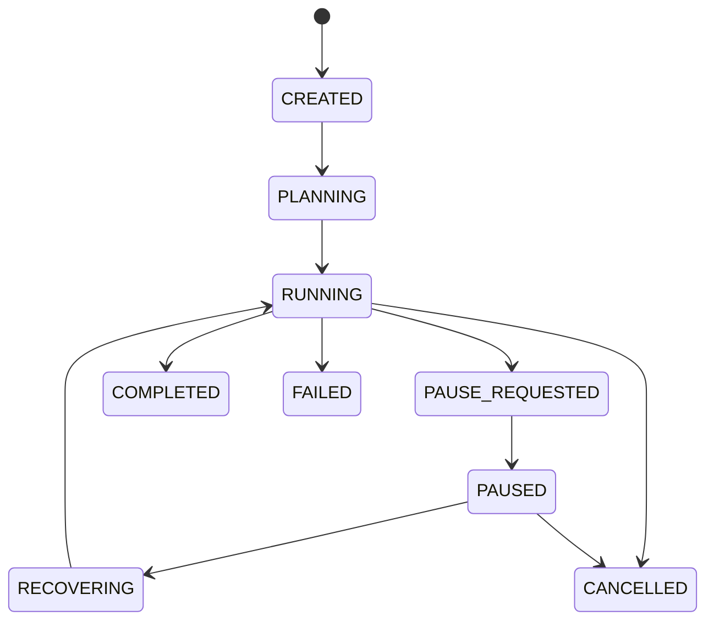
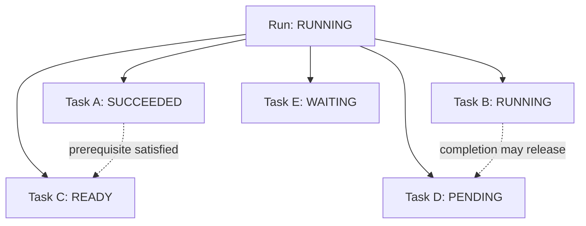
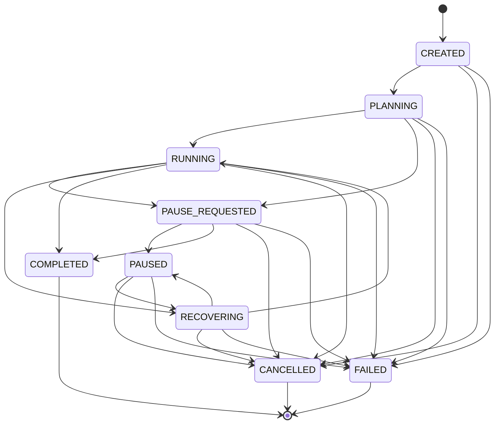
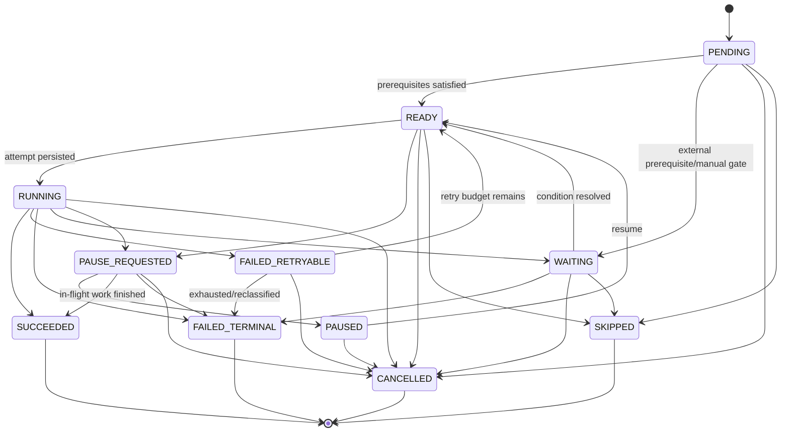

# State machines

The authoritative transition tables are in `src/durable_agent/domain/state_machine.py`.
They are pure domain code and have no CLI, HTTP, or persistence dependency.



Tasks use `PENDING`, `READY`, `RUNNING`, `WAITING`, `PAUSE_REQUESTED`, `PAUSED`,
`SUCCEEDED`, `FAILED_RETRYABLE`, `FAILED_TERMINAL`, `CANCELLED`, and `SKIPPED`.
Readiness is derived from the DAG and prerequisite success. A retry moves
`RUNNING -> FAILED_RETRYABLE -> READY`; a dead worker follows the same explicit path
after its open attempt is closed. Manual review moves `RUNNING -> WAITING`, pauses the
run, and an explicit recovery moves `WAITING -> READY`. A skip-dependent policy uses the
declared `SKIPPED` terminal state for transitive descendants. Terminal task states cannot
transition.

The orchestrator observes lifecycle requests only between operations. Pause never
interrupts a tool between its intent and result. Cancellation marks unscheduled work
cancelled, preserves completed work, checkpoints, and creates a partial report.

Failure modes include optimistic version conflict, expired ownership, invalid imported
state, and no runnable node in an incomplete graph. The last case fails the run rather
than spinning. Security-sensitive callers cannot supply a target state; they request a
use case and the application chooses a validated transition.

`tests/unit/test_state_machine.py` covers every listed edge and rejects others;
`tests/property/test_invariants.py` samples all enum pairs. Lifecycle E2E tests inspect
materialized state and audit events after process reconstruction.

## Why two state machines are necessary

Run state answers a control-plane question: “What may happen to this objective as a
whole?” Task state answers a scheduler question: “What may happen to this node?” They are
related but cannot be collapsed. A `RUNNING` run can contain `PENDING`, `READY`,
`RUNNING`, `SUCCEEDED`, `WAITING`, and retryable-failure tasks at the same time. A paused
run may have completed tasks that remain terminal forever.



Storing only run state would lose which work completed. Storing only task states would
lose lifecycle intent, ownership, and whether new scheduling is permitted.

## Complete run transition graph

The abbreviated diagram above shows the common path. The authoritative graph also
supports cancellation/failure during creation and planning, completion racing with a
pause request, and recovery initiated after a worker interruption.



`PAUSE_REQUESTED → COMPLETED` is intentional. If a pause request arrives after the final
task has been dispatched, the finite in-flight work may complete at the safe boundary.
The terminal result is more accurate than manufacturing a paused run with nothing left
to resume. Similarly, a recovery may return to `PAUSED` when policy or manual review says
execution must not continue.

## Complete task transition graph



`FAILED_RETRYABLE` is a durable observation, not a scheduler sleep. The task first records
the failed attempt/error, then returns to `READY` only after retry policy computes and
waits the bounded delay. This makes an operator able to distinguish “never tried,”
“currently executing,” and “failed once but will be retried.”

## Transition function semantics

The pure transition functions implement:

```text
transition(current, target, table):
    if current == target:
        return current
    if target not in table[current]:
        raise InvalidTransitionError(details={from, to, kind})
    return target
```

Self-transition is idempotent to support repeated observations and request replay. It
does not increment versions on its own; persistence decides whether a write is necessary.
All other unlisted edges fail closed. Callers cannot request “the nearest legal state” or
silently coerce malformed imported data.

## Readiness is derived, not a free transition

Although `PENDING → READY` is legal, it is legal only when the scheduler proves every
declared dependency exists and is `SUCCEEDED`. Plan validation proves the graph is a DAG;
runtime readiness evaluates its current frontier.

```text
ready(task) =
    task.state in {PENDING, FAILED_RETRYABLE}
    and every dependency.state == SUCCEEDED
    and run.state == RUNNING
    and no pending pause/cancel command
    and task is not fenced by another active attempt
```

This predicate prevents a direct database/API caller from treating the transition table
as sufficient authorization. The table defines possible lifecycle edges; the application
service and orchestrator enforce use-case preconditions.

## Run/task consistency invariants

Cross-machine consistency is checked at boundaries:

- A `COMPLETED` run has no non-terminal task in the active plan.
- A `CANCELLED` run schedules no new work and incomplete tasks become `CANCELLED` or
  remain preserved terminal states.
- A task is `RUNNING` only with a persisted open attempt owned by the current batch.
- A `SUCCEEDED` task never returns to ready during normal recovery.
- A new plan revision creates new task rows; historical task states are not overwritten.
- An active batch may contain several `RUNNING` tasks, so `run.active_task_id` is only a
  display hint and is null for multi-task batches.
- Terminal run and task states have empty outbound transition sets.

## Races at safe boundaries

Lifecycle requests are data races by design: an operator can request pause while a task
finishes. The orchestrator resolves them by reloading current run/request state after the
batch, rather than committing from the stale version loaded before execution.

```mermaid
sequenceDiagram
  participant O as Orchestrator
  participant DB as Store
  participant U as Operator
  participant T as Task batch
  O->>DB: load RUNNING version 10
  O->>T: execute batch
  U->>DB: persist pause; run PAUSE_REQUESTED v11
  T-->>O: outcomes complete
  O->>DB: reload v11 + pending request
  O->>DB: commit outcomes in plan order
  O->>DB: PAUSE_REQUESTED → PAUSED + checkpoint
```

A competing completion may validly win, producing `PAUSE_REQUESTED → COMPLETED`. A
competing cancellation stops new work but preserves completed batch members. Version and
lease checks ensure a stale owner cannot overwrite the winner.

## Failure and recovery interpretation

State does not encode the entire error. `FAILED_RETRYABLE` says what scheduling may do;
the error row says why, which category, and which attempt. `WAITING` says automated work
must stop; an event/error/manual-review record explains the unresolved condition.

After process death, recovery closes abandoned open attempts before moving affected
tasks through a declared retry/failure transition. It never simply changes all
`RUNNING` tasks to `READY`, because that would erase attempt accounting and bypass
uncertain tool reconciliation.

## Security properties

State transitions are security-sensitive because `RUNNING`, `RECOVERING`, and lifecycle
states grant different scheduling authority. The HTTP API accepts commands such as
pause/resume/cancel, not arbitrary target states. Owner checks happen before transition;
idempotency keys bind repeated lifecycle requests; the domain transition function then
validates the edge. Imported checkpoint task states are Pydantic-validated and reconciled
with authoritative SQL rows before use.

## Alternatives and tradeoffs

- **Boolean flags** (`paused`, `failed`, `done`) were rejected because contradictory
  combinations are easy and legal transitions remain implicit.
- **One combined run/task machine** was rejected because graph-local and run-global
  concerns have different cardinality and recovery rules.
- **Deriving all state from events** was rejected for the baseline because event schema
  evolution and replay add operational complexity; normalized rows remain authoritative.
- **Implicit exception-driven states** were rejected because restart cannot inspect a
  vanished stack frame.

The explicit tables require deliberate edits when adding a state. That friction is a
benefit: schema, migrations, orchestration, API behavior, tests, and runbook procedures
must be reviewed together.

## Testing and operator inspection

`tests/unit/test_state_machine.py` enumerates every declared edge, self-transition, and
terminal closure. Property tests sample every pair of enum values and assert that no
undeclared edge is accepted. Integration and end-to-end tests add persistence versions,
pause/completion races, batch cancellation, dead-worker attempts, and restart.

Operators should use `durable-agent status`, `inspect-plan`, and
`inspect-checkpoint`; then correlate `runs`, `tasks`, `task_attempts`, lifecycle request,
lease, error, and event rows. Direct state edits are not a recovery procedure because
they bypass transition invariants and audit events.
