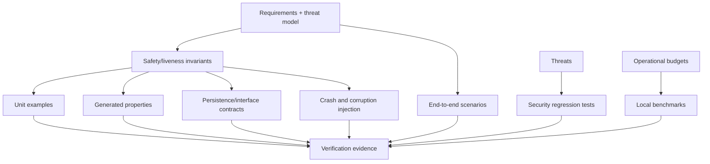
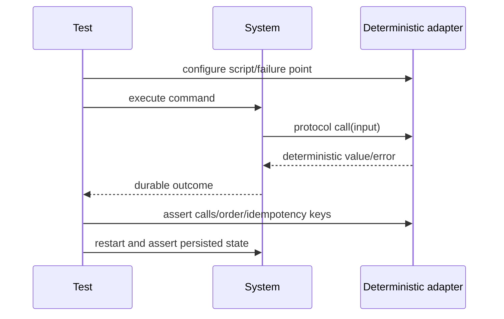
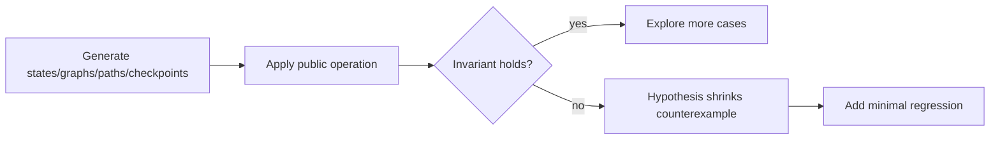
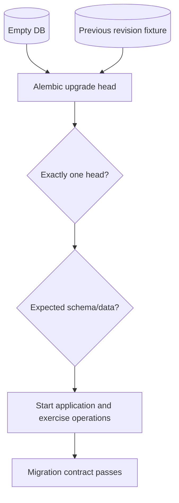
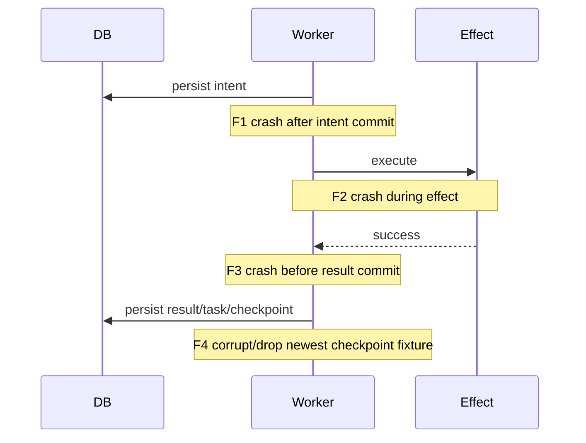

# Testing guide

The suite is offline and deterministic. No paid model, live search, or external network
is required. `providers/fakes.py` supplies stable clocks, IDs, embeddings, search, LLM
responses, and named failure injection. Fixture repositories are copied to temporary
roots before writes.

| Layer | Purpose | Location |
|---|---|---|
| Unit | Pure models, transitions, plans, retry, context, evidence, tools, security helpers | `tests/unit`, `tests/security` |
| Property | Transition, checkpoint, DAG/path/idempotency invariants | `tests/property` |
| Integration/contract | SQL repositories, indexes, checkpoints, recovery, API/CLI, provider/tool contracts | `tests/integration`, `tests/contract` |
| E2E/fault | Coding task, restart pause/resume, retry, cancellation, drift, corruption, uncertain effects | `tests/end_to_end`, `tests/fault_injection` |
| Performance | Local indexing/checkpoint/event/evidence/report measurements | `tests/performance` |

Critical paths use behavior assertions, not only coverage: invalid transitions never
commit; checkpoint hashes/parents fail closed; leases fence; tool intents precede
effects; verified claims require verified evidence; and resumed completed tasks are not
repeated. Fault injection crashes after a tool intent and corrupts the newest checkpoint.

Run CI locally:

```bash
python -m pip install --constraint requirements.lock -e '.[dev,pdf,postgres]'
python scripts/validate_dependency_lock.py
ruff format --check .
ruff check .
mypy src
pytest -m 'not performance'
pytest --cov=src/durable_agent --cov-branch --cov-report=term-missing
pytest -m performance -q
python scripts/validate_migrations.py
bandit -c pyproject.toml -r src
pip-audit
python -m build
docker build .
```

Coverage gates target 90% overall and at least 95% for transitions/checkpoint/recovery/
evidence. Branches for safety rules receive explicit cases. A measured exception must be
documented; generated migrations and interface-only protocol ellipses do not replace
behavior tests.

Performance tests report elapsed time and fixture sizes without asserting universal
throughput. Record CPU, storage, Python version, warm/cold cache, repository file/byte
count, and rounds. CI hardware is variable, so only generous regression ceilings should
fail a build. The canonical local reference is a single worker on SQLite WAL.

Third-party pytest plugin autoload is disabled inside repository test tools to prevent
untrusted/global plugins from starting network clients or threads. The project test
suite itself uses explicitly installed pytest plugins. Use `PYTEST_ADDOPTS` only in a
controlled developer environment.

## Test strategy as an assurance argument

The suite is organized around risk and invariants, not module count. Unit tests prove
pure rules; property tests explore rule spaces; integration tests prove adapters preserve
domain semantics; fault tests cut execution at uncertainty windows; end-to-end scenarios
prove user-visible capabilities; security/performance tests challenge boundaries.



Coverage indicates exercised lines/branches; it does not establish correctness. Critical
claims name the behavior test that demonstrates them.

## Determinism architecture

Time, identifiers, model output, embeddings, research, tools, retry failure points, and
jitter are injected behind protocols. Tests use fakes with explicit scripts and call
histories.

| Fake | Controlled behavior | Assertions enabled |
|---|---|---|
| Clock | Fixed time and explicit advancement | Lease expiry, retry schedule, timestamps |
| ID generator | Stable prefixed sequence | Exact graph/checkpoint/evidence snapshots |
| LLM | Queued valid/malformed/raising responses | Repair, fallback, schema rejection |
| Embeddings | Stable numeric vectors | Semantic/hybrid ranking without a service |
| Research provider | Fixture sources and failures | Deduplication, conflicts, injection neutrality |
| Tool runner | Typed outcomes and call counts | Retry/no-repeat and evidence production |
| Failure injector | Named one-shot/repeated crash points | Intent/checkpoint uncertainty windows |



Tests avoid wall-clock sleeps. The fake clock advances past lease/backoff deadlines, and
synchronization primitives coordinate concurrency cases. Stable IDs and ordering reduce
flaky snapshots without masking actual races.

## Unit and property tests

Unit tests isolate one semantic component and exercise both accepted and rejected paths:

- run/task transition tables, terminality, and pause/cancel races;
- task graph identity, cycle/missing edge validation, granularity, readiness, and skip
  propagation;
- retry classification, caps, exponential delay, jitter bounds, and circuit state;
- context arithmetic, protected categories, hierarchical summaries, and invalidation;
- checkpoint canonical serialization, hash/parent validation, version rejection;
- claim/evidence admissibility, conflicts, report citation rendering;
- root/path/symlink policy, command policy, redaction, URL/SSRF policy;
- typed configuration and semantic fingerprint behavior.

Hypothesis explores invariants across many generated states and inputs. Examples include:

\[
acceptedTransition(s,t) \Rightarrow t \in Allowed(s)
\]

\[
topologicalOrder(G) \Rightarrow \forall(u,v)\in E: pos(u)<pos(v)
\]

\[
decode(encode(checkpoint))=checkpoint.
\]



Security path properties resolve every accepted path beneath the approved root.
Compression properties assert successful manifests fit and retain protected data.
Idempotency properties assert duplicate equal requests map to one resource while a
different payload under the same key conflicts.

## Persistence and migration integration tests

Database tests use real SQLAlchemy engines and migrated temporary SQLite files, not an
in-memory fake for behavior that depends on transactions/constraints. They verify foreign
keys, uniqueness, cascade behavior, append ordering, optimistic conflicts, leases,
idempotency, repository snapshots, and report/evidence round-trips.

Migration tests start with an empty database, run `upgrade head`, assert exactly one head
and every required table/index/constraint, and compare the frozen revision schema with
released application metadata. Upgrade-from-previous fixtures are added for every future
revision. Runtime schema creation is limited to isolated tests/demo fallback and is not a
deployment path.



## Concurrency testing

Concurrency tests create intentional contention rather than hoping threads overlap.
Barriers pause workers after both observe the same version/lease/checkpoint tip, then
release them together.

| Race | Required invariant |
|---|---|
| Two workers claim one task | One valid owner/attempt; stale worker fenced |
| Lease expiry and takeover | Old fencing token cannot commit |
| Concurrent checkpoints | Unique monotonic sequence; loser reloads |
| Duplicate create/resume keys | One logical resource/action |
| Pause versus task completion | Valid terminal/safe-boundary state only |
| Parallel sibling completion | Stable commit order; successful sibling not retried |

SQLite tests exercise portable behavior, while PostgreSQL CI/integration is the
production concurrency target when available. Tests do not claim SQLite lock scheduling
is equivalent to row-level PostgreSQL concurrency.

## Fault-injection methodology

Named fault points surround every durable/effect boundary:



Each test terminates the logical process, constructs a fresh application object against
the same durable files/database, resumes, and asserts no unsupported memory survived.
Failure injection is named and deterministic so the test proves a precise window.

## End-to-end scenario matrix

| Scenario | Main proof |
|---|---|
| A: coding task | Index, plan, modify fixture, test, evidence, verified report |
| B: pause/resume | New process continues; completed work not repeated |
| C: retryable failure | Persisted attempt/backoff recovers within cap |
| D: process crash | Intent reconciliation prevents duplicate side effect |
| E: corrupt checkpoint | Hash failure and fallback to retained valid predecessor |
| F: repository drift | Changed source detected; summary invalidated; policy applied |
| G: context compression | Protected constraints/evidence survive restart |
| H: conflicting research | Both sources retained; no undisputed false claim |
| I: cancellation | New work stops; artifacts/evidence and partial report remain |

The sample service is copied into a temporary directory for any modifying scenario, so
the committed fixture remains stable and tests are parallel-safe.

## Security and performance testing

Security tests send traversal (`../`), absolute paths, symlink escapes, command
metacharacters, malicious environment names/values, oversized output, malformed model
JSON, prompt injection text, internal/non-global URLs, forged/cross-run evidence, altered
checkpoint bytes, and unauthorized owner operations. The assertion is both denial and
absence of side effects or secret-bearing logs.

Bandit statically checks common Python security hazards. `pip-audit` checks installed/
locked dependencies against current advisories and is inherently time-sensitive; offline
absence of advisory data is reported as not run, never as a clean result.

Performance tests are benchmarks with explicit input size and environment, not marketing
throughput claims. Measure repository cold/full and warm/incremental index, checkpoint
write/read/validation, event scan/compaction, evidence lookup, and report generation.
Record CPU allocation, memory, OS/filesystem, Python/database versions, fixture sizes,
warm-up, rounds, median/tail, cache state, and tracing. Generous ceilings catch
orders-of-magnitude regressions; capacity planning uses deployment load tests instead of
fixture extrapolation.

## Coverage policy and mutation resistance

Statement coverage is at least 90% overall and 95% for state transitions, checkpointing,
recovery, and evidence linking; branch coverage is enabled. Critical branches should be
named in tests even if another test happens to execute their lines. Coverage exclusions
are limited to protocols/type-only paths and defensible platform guards.

Reviewers ask: could replacing the security/recovery condition with its opposite still
pass? Where valuable, mutation testing can validate assertion strength, especially for
transition tables, hash comparison, permission intersection, and evidence verification.

## CI stages and reproducibility


CI uses pinned direct constraints and cache keys tied to dependency files. Tests run
without live network/provider credentials. Exact commands appear above and in the
Makefile/workflow. A stage marked skipped or unavailable is not reported as passed.

## Writing and reviewing tests

A good durability test names initial durable state, interruption point, new-process
construction, expected recovered state, and prohibited duplicate behavior. A good
security test verifies denial before mutation and checks logs/results for leakage. A good
evidence test resolves cited primary bytes, not only the presence of an `EVID-*` string.

Flaky tests are defects. Diagnose clocks, unordered collections, uncoordinated races,
shared fixture paths, leaked environment, and third-party plugins; do not add sleeps or
blind reruns. Operators can reproduce a failure from the test node ID, seed/example,
temporary artifacts retained by configuration, and correlated structured logs.
