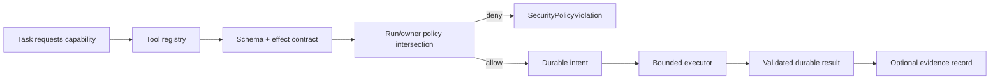
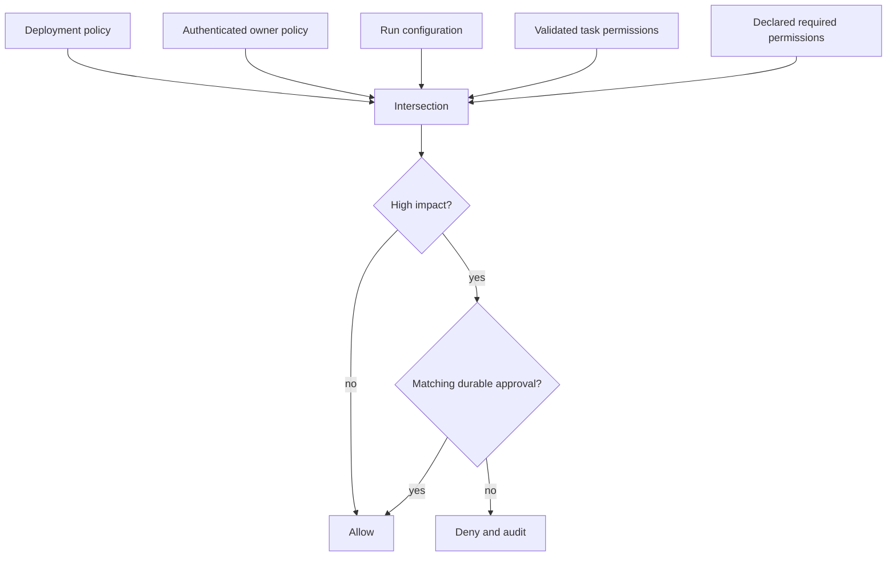
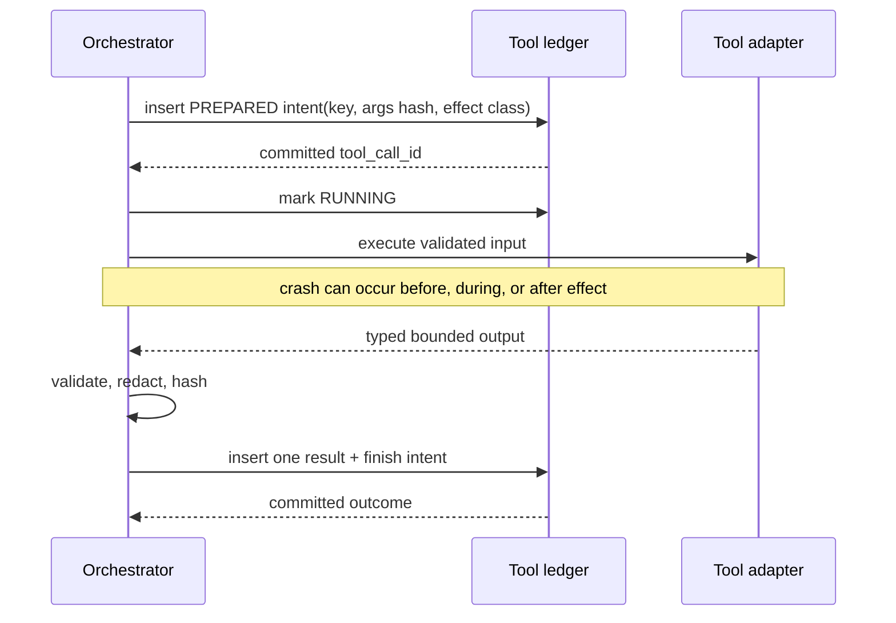
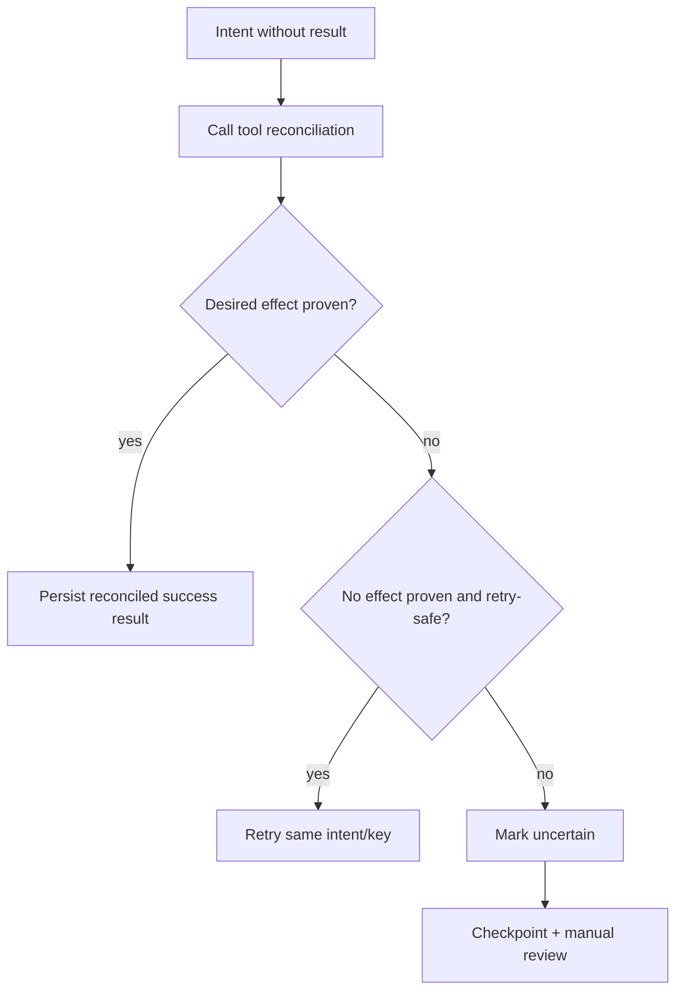
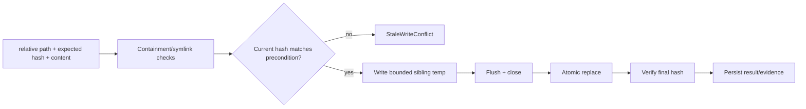
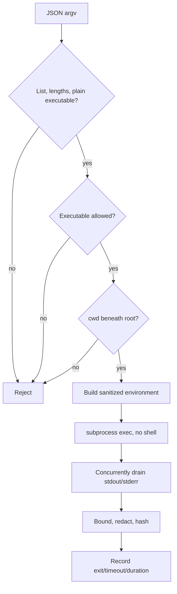

# Tool execution and policy

Tools are infrastructure adapters with explicit authority, schema, side-effect, retry,
and evidence contracts. The planner may request a tool, but only application assembly
and `ToolPolicy` can grant its permission. Repository and research content is always
data; it cannot add a permission or approve a high-impact action.

## Production tool catalogue

| Tool | Permission | Effect / retry semantics | Purpose |
|---|---|---|---|
| `repository.index` | `repository.read` | Idempotent; named snapshot reconciles after a crash | Safely traverse the fixed root and persist an immutable index |
| `repository.search` | `repository.read` | Read-only and retry-safe | Hybrid-search one explicit snapshot with line/hash provenance |
| `repository.read` | `repository.read` | Read-only and retry-safe | Read a bounded regular file beneath the root |
| `document.retrieve` | `repository.read` | Read-only and retry-safe | Return a bounded local document explicitly marked untrusted |
| `repository.write` | `repository.write` | Idempotent compare-and-write with final-hash reconciliation | Atomically create or replace an approved file |
| `repository.patch` | `repository.patch` | Idempotent exact replacement with result-hash reconciliation | Apply one narrowly specified patch |
| `shell.run` | `process.execute` | Reversible classification, not automatically retry-safe | Run an allowlisted argv with `shell=False` |
| `test.run` | `process.execute` | Not automatically retry-safe; only pytest argv accepted | Run repository tests with a sanitized environment |
| `research.search` | `network.research` | Read-only and retry-safe | Query an injected provider and return explicitly untrusted results |
| `artifact.record` | `artifact.write` | Content-addressed idempotent write | Persist a bounded generated artifact |

`repository.read`, repository search, and artifact recording are enabled by the local
default policy. Writes, patches, subprocesses, and research network access are denied by
default. `build_application(..., research_provider=...)` is the provider-neutral
integration point; without an injected provider, research search fails closed even if
network permission is enabled.

## Execution and recovery flow

1. Resolve a stable tool name from `ToolRegistry`.
2. Check declared permissions and high-impact approval.
3. Validate arguments against the declared JSON Schema.
4. Persist a unique idempotency key, argument hash, and intent.
5. Mark the call running and execute within its timeout/output policy.
6. Validate, redact, bound, hash, and persist the result.
7. On restart, inspect intent-without-result calls before scheduling work.

A retry-safe call that failed before producing a result reopens the same durable intent,
increments its attempt counter atomically, and retains the original idempotency key. An
ambiguous call is never replayed first: the tool must reconcile observable state.
`repository.index` reconciles its caller-selected immutable snapshot ID; file mutation
tools reconcile final hashes. An uncertain non-retry-safe or non-idempotent operation
moves to manual review when it cannot prove its outcome.

Subprocess output is bounded while both pipes are drained to avoid deadlock, decoded
with replacement, recursively redacted, and stored with exit status and a hash. The
executable is a plain allowlisted name, the working directory must remain beneath the
root, environment variables are allowlisted, stdin is closed, and no shell parser is
invoked. Tests execute repository code, so hostile repositories still require an
external disposable VM/container sandbox.

## Inspection, failure modes, and tests

Operators inspect `tool_calls` and `tool_results` by run/task/idempotency key, then use
checkpoint inspection and structured events to correlate recovery. Expected failures
include denied permissions, invalid schemas, missing snapshots, output truncation,
timeouts, non-zero test commands, stale expected hashes, and manual-review uncertainty.

Implementation is in `tools/`, application registration is in
`application/factory.py`, and SQL intent/result behavior is in `persistence/store.py`.
Unit, contract, security, integration, and fault-injection coverage lives in
`tests/unit/test_tools.py`, `tests/contract/test_tool_contracts.py`,
`tests/security/test_subprocess_tool.py`, `tests/integration/test_sql_store.py`, and
`tests/fault_injection/test_uncertain_tool_reconciliation.py`.

## Tools as capability objects

A tool is not just a callable function. It is a declared capability whose metadata lets
the planner request it, policy decide whether it is allowed, the executor contain it,
recovery decide whether replay is safe, and reporting decide whether its result can
become evidence.

The registry is assembled by the application layer. Domain code refers to stable tool
names and permission strings through protocols; it does not import subprocess,
filesystem, HTTP, SQL, or a vendor SDK.

## Complete tool declaration

Every registered tool exposes the following contract:

| Attribute | Recovery/security use |
|---|---|
| Stable name and description | Auditable plan and registry lookup |
| Input/output JSON schema | Reject malformed or over-broad provider/model output |
| Timeout and output limit | Bound resource consumption |
| Required permissions | Least-authority policy intersection |
| Side-effect class | Read-only, idempotent write, reversible, or non-idempotent |
| Idempotency characteristics | Defines key scope and same-intent replay behavior |
| Retry safety | Determines whether retry can occur without reconciliation |
| Evidence behavior | Defines structured evidence type and verification data |
| Reconciliation capability | Resolves intent-without-result uncertainty |

Schema validation occurs before intent persistence so invalid arguments do not pollute
the effect ledger. Policy validation occurs before execution and is repeated when a
resumed worker might have different configuration.

## Authority derivation

Effective permission is an intersection, never a union:

\[
P_{effective}=P_{deployment}\cap P_{owner}\cap P_{run}\cap P_{task}\cap P_{tool}.
\]

The plan may narrow `P_task`; it cannot expand any other set. A high-impact tool can also
require a durable approval whose scope binds owner, run, task, tool, normalized argument
hash, and expiry.

Repository comments, model output, research pages, and tool stdout never enter this
authority calculation.

## Intent-before-effect protocol

External side effects create an uncertainty window: the process may crash after the
effect succeeds but before its result is committed. Durable intent narrows the ambiguity
and gives reconciliation a stable identity.

The idempotency key is derived from stable execution identity rather than a fresh retry
ID. Reusing a key with a different canonical argument hash is a concurrency/security
conflict. The stored `attempt` counts calls against the same intent; it does not create a
new logical side effect.

## Effect classes and recovery matrix

| Effect class | Example | Crash after intent, before result |
|---|---|---|
| Read-only | repository read/search | Retry same intent if provider contract is retry-safe |
| Content-addressed idempotent write | artifact record | Check target hash; return existing match or detect conflict |
| Compare-and-write idempotent mutation | repository write/patch | Compare precondition and desired final hash; record observed outcome |
| Reversible bounded effect | approved local file replacement | Reconcile current state; retry or compensate only under declared policy |
| Non-idempotent/irreconcilable | future external message/payment-like operation | Never replay automatically; require provider key, outbox, or manual confirmation |

Absence of a result is never interpreted as absence of an effect. A reconciliation
method returns observed/proven status; it does not guess based on elapsed time.

## Filesystem tools

Reader, writer, patcher, and document retriever share a boundary service. They accept
normalized repository-relative paths, reject absolute and parent traversal, resolve
under an approved root, reject symlink final components, and require regular files. Reads
and outputs are bounded.

The writer uses an expected prior hash (including an explicit “must not exist” state),
writes bytes to a sibling temporary file, flushes as configured, then atomically replaces
the target. Reconciliation compares the desired final hash. The patch tool performs
exact expected-text/hash replacement and fails on zero or ambiguous multiple matches;
it is not a fuzzy patch engine that might mutate an unintended region.

Atomic replace protects readers from partial bytes, but it does not make a multi-file
change transactional. Multi-file changes need a patch manifest, ordered operations,
preconditions, checkpointed progress, and rollback/forward-repair policy.

## Subprocess and test execution

The shell runner is intentionally not a general shell. Input is an array of arguments;
the executable must be a plain allowlisted name; `shell=False` prevents metacharacters
from gaining syntax. The working directory must be within the approved root. The child
receives a minimal environment allowlist instead of inheriting process secrets. Standard
input is closed.

Both output pipes are drained concurrently so a full stderr pipe cannot deadlock a child
whose stdout is being read. On timeout, the process is terminated and then killed after
a grace interval; platform-specific process-group containment is a deployment concern.
The test runner further restricts the executable/argument shape to pytest.

An allowlist is not a sandbox. Python tests can read files, fork processes, and use the
network according to their operating-system privileges. Untrusted repositories require
a disposable container/VM, read-only mounts except a scratch workspace, no credentials,
network denial, CPU/memory/process quotas, and syscall policy.

## Research and document tools

`document.retrieve` is local and root-bound. `research.search` invokes only an injected
provider when both provider availability and `network.research` policy permit it. Results
are normalized, size-bounded, deduplicated, source-attributed, timestamped, and marked
untrusted. Search snippets cannot trigger additional tools or rewrite the query policy.

Network fetch adapters validate scheme, port, DNS resolution, redirect destinations,
content type, and byte limits to mitigate SSRF. Strong production deployment still uses
an egress proxy because application-level DNS validation cannot eliminate all rebinding
races.

## Output validation, redaction, and evidence

Successful execution is not committed until output matches the tool's schema. Strings
are recursively redacted for configured secret patterns and credentials, line/control
characters are made log-safe, and content is bounded. The exact persisted safe output is
hashed. Truncation is an explicit result field rather than an invisible logging detail.

Evidence-producing tools return enough metadata for independent verification: file and
snapshot hashes for repository operations; argv, exit status, and output hash for tests;
URI and content hash for artifacts; source metadata and retrieval hash for research.
The evidence manager—not the tool output prose—assigns a durable evidence ID.

## Timeouts, retries, and circuit breakers

A timeout is classified according to the effect contract. A read-only provider timeout
is retryable; a write timeout after dispatch may be uncertain and needs reconciliation.
Backoff is bounded exponential delay with injected jitter and persisted attempt number.
A circuit breaker belongs to a provider/tool identity and opens after configured
retryable failures, preventing a fleet of runs from hammering an unhealthy dependency.
It does not convert failures into success; runs wait, retry later, or pause according to
policy.

## Failure and observability model

| Condition | Classification | Operator signal |
|---|---|---|
| Invalid input/output schema | Validation/provider-contract failure | Tool event with schema path; no unsafe payload log |
| Permission/approval absent | Security-policy violation | Denial counter and audit event |
| Timeout | Retryable or uncertain by effect class | Duration, intent ID, reconciliation status |
| Non-zero command exit | Tool execution result, generally task failure | Exit code and bounded stdout/stderr hash |
| Output limit reached | Valid truncated result or failure by tool contract | `truncated=true`, byte counters |
| Expected file hash stale | Concurrency conflict | Expected/observed digest metadata |
| Result hash/integrity mismatch | Corruption/tampering | Quarantine and recovery event |
| Reconciliation inconclusive | Manual-review condition | Run checkpoint and paused reason |

Trace spans wrap policy validation, intent commit, execution, output validation, and
reconciliation. Metrics avoid unbounded run IDs as labels; logs carry correlation IDs in
structured fields.

## Extension checklist

A new tool is production-ready only when it has strict schemas, permission name, effect
classification, timeout/output bounds, idempotency key rules, recovery behavior, redaction
tests, evidence contract, fake implementation, and security review. Registration is
explicit; importing a Python module cannot auto-grant a new capability.

Alternatives such as arbitrary shell strings, implicit model function calling, or
retrying every exception were rejected because they erase authority and effect semantics.
Tests cover contract conformance for every registered tool, policy denial, schema errors,
path and symlink escapes, exact writes/patches, timeout/output behavior, environment
leakage, shell metacharacters as inert arguments, intent-before-effect crashes,
idempotency conflicts, reconciliation outcomes, and evidence production.
