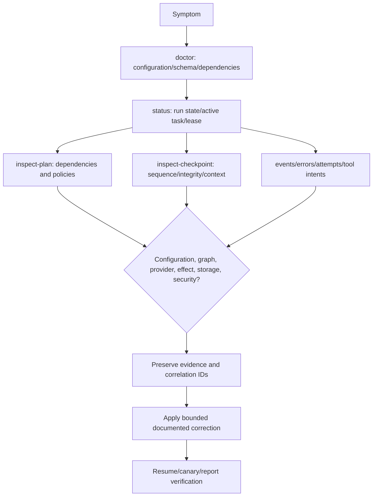
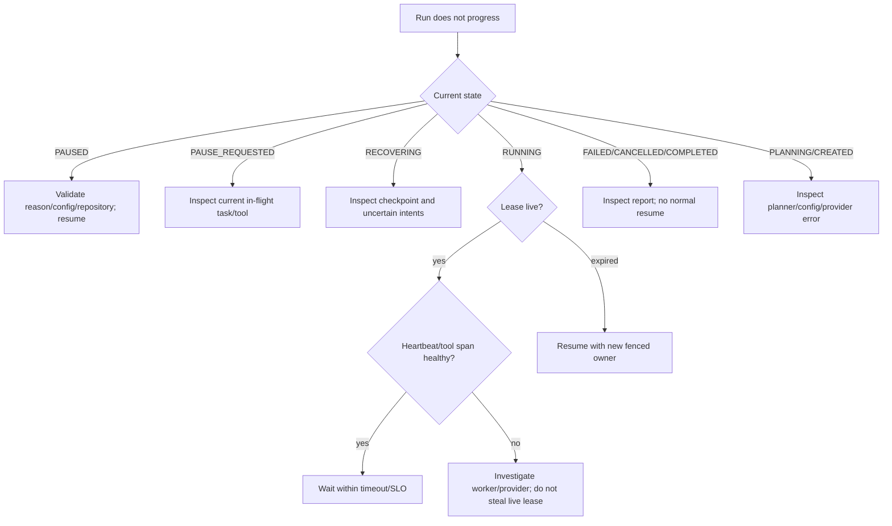
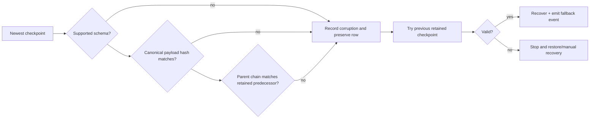
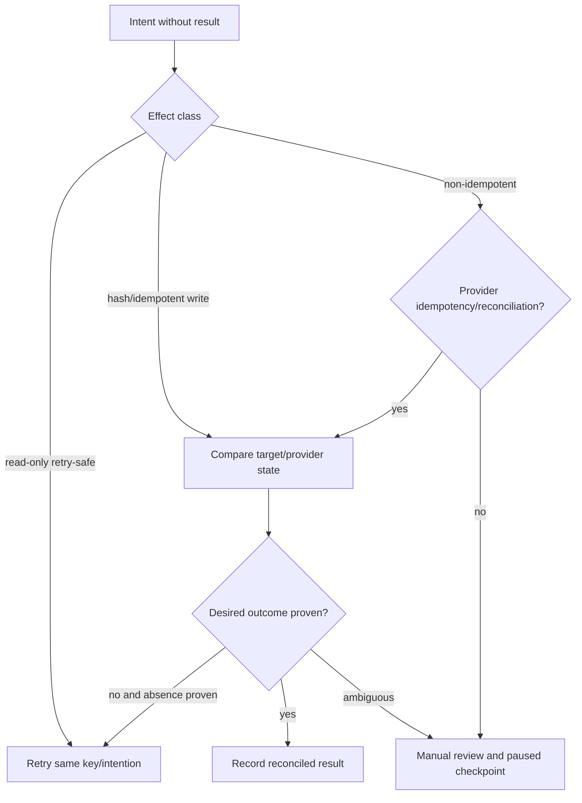

# Troubleshooting

| Symptom | Likely cause | Action |
|---|---|---|
| `doctor` says migration required | Database reachable but tables absent/wrong URL | Check sync/async URLs point to the same DB; run `alembic upgrade head` |
| Resume says configuration incompatible | Root/model/limits/permissions/drift policy changed | Restore compatible config or create a reviewed new run; do not bypass hash check |
| Repository drift detected | Files changed while paused | Inspect changed hashes; choose fail/reindex/replan policy; re-verify conclusions |
| Run stuck `RUNNING` | Live/unexpired lease, open attempt, or worker died | Inspect lease/tool/attempt rows; wait for expiry and call resume |
| Manual review required | Uncertain non-idempotent/non-retry-safe effect | Reconcile with provider evidence; never blindly replay |
| Checkpoint fallback | Newest JSON/hash/parent invalid | Preserve forensic bytes, inspect recovery event, validate storage/backups |
| Tool denied | Permission, executable, cwd, network, or root policy | Confirm least authority in settings; do not widen based on retrieved text |
| Test runner timeout | Repository test hangs or global resource pressure | Reproduce with explicit argv in isolated container; inspect bounded stderr |
| `database is locked` | SQLite concurrent writers/long transaction | Stop duplicate workers; move multi-worker deployment to PostgreSQL |
| Report verify fails | Missing/invalid evidence or changed report bytes | Treat as integrity incident; regenerate only from primary durable records |
| Import for PDF/Alembic/driver fails | Optional/development extra not installed | Install `.[pdf]`, `.[dev]`, or `.[postgres]` as documented |

Enable `DURABLE_AGENT_LOG_LEVEL=DEBUG` only temporarily; logs remain redacted but may
contain repository metadata. Correlate run/task/attempt/checkpoint/tool/event IDs. Do not
paste credentials, full untrusted documents, or unbounded tool output into incident
channels.

On the supplied managed host, `aiosqlite` worker shutdown is unreliable, so local tests
use the async-shaped synchronous SQLite facade. Production PostgreSQL uses SQLAlchemy's
async engine. This host-specific adapter choice does not change persisted schemas or
application interfaces.

## Diagnostic method

Troubleshooting begins with durable facts, then narrows by subsystem. Avoid changing state
until the failure and uncertainty window are understood.

Collect the package/Python version, configuration fingerprint (not secret values),
database migration head, run/task/attempt/checkpoint/tool IDs, repository snapshot and
current manifest hashes, last state transitions, and exact safe error category. Do not
paste full source/tool output into tickets when hashes and bounded excerpts suffice.

## Run-state decision tree

If the state is `RUNNING` but no task is ready, inspect dependency states. A waiting or
failed prerequisite may correctly block descendants; a cycle should have been rejected
before persistence and indicates data corruption or a defect.

## Resume failures

Resume validates owner/lease, checkpoint chain/schema, configuration, repository
snapshot/drift, uncertain tools, interrupted attempts, context references, and finally
scheduling. The earliest failed stage is usually the root cause.

| Error category | Evidence to inspect | Safe action |
|---|---|---|
| Lease conflict | owner, expiry, fencing token, worker heartbeat | Wait/stop proven owner; retry after expiry |
| Corrupt checkpoint | envelope bytes, payload/parent hashes, retained predecessor | Preserve corrupt row; allow recorded fallback or restore |
| Unsupported schema | checkpoint version and deployed binary version | Deploy compatible reader/migration; do not edit version |
| Config mismatch | old/current non-secret fingerprints and setting diff | Restore config or explicit reviewed migration/new run |
| Repository drift | old/new manifests and changed paths/hashes | Apply configured FAIL/REINDEX/REPLAN policy |
| Uncertain tool | intent, argument hash, effect class, observed external state | Reconcile; never infer non-execution from missing result |
| Interrupted attempt | attempt/task/checkpoint/event ordering | Recovery repair closes/retries according to policy |
| Missing summary/context | source manifests and evidence references | Rebuild derived context from primary durable state |

## Checkpoint integrity failure

Do not delete the corrupt newest checkpoint merely to make the command quiet. It is
forensic evidence and may reveal disk, database, application, or malicious tampering.
Repeated fallback across runs escalates to a storage integrity incident.

## Tool uncertainty and duplicate-effect risk

A `tool_calls` intent without `tool_results` says only that execution was prepared and no
result was durably observed. Determine the effect class and call its reconciliation
contract.

Never create a fresh idempotency key for the same logical retry; that tells a remote
provider it is a different operation.

## Repository indexing and drift problems

For unexpectedly missing files, inspect skip warnings: ignore rule, configured exclusion,
binary/NUL detection, decode error, symlink/non-regular type, per-file limit, or aggregate
budget. `.gitignore` is selection, not containment; widening exclusions does not fix a
root/symlink rejection.

If drift appears after pause, compare exact manifests. Line numbers in the old snapshot
must not be applied to current bytes. `REINDEX` invalidates affected summaries and updates
retrieval; `REPLAN` also creates an immutable revised graph. Review changed paths and plan
dependencies rather than assuming all drift invalidates all work.

## Planning and scheduler problems

| Symptom | Diagnosis | Correction |
|---|---|---|
| LLM plan rejected | Inspect schema validation category, not raw secret-bearing prompt | Fix adapter/schema or use deterministic fallback |
| No ready task | Examine dependencies and terminal/waiting states | Resolve prerequisite/manual review; do not force state |
| Parallel work never occurs | Nodes may be serial, write-capable, or concurrency=1 | Review plan permissions and maximum concurrency |
| Successful task runs again | Compare plan revision spec, attempts, checkpoint, idempotency | Fix carry-forward/recovery defect; preserve evidence |
| Endless retries | Attempt counter may not persist or error is misclassified | Stop run; fix taxonomy/cap before resume |
| Revised task lost success | Execution-relevant spec changed | Expected safety behavior; verify/re-execute new node |

## Context and evidence failures

When mandatory context alone exceeds the model budget, split the task, choose a genuinely
larger supported context, or reduce fixed reservations through reviewed configuration.
Do not mark constraints optional. High compression frequency often means verbose tool
output, overly broad tasks, or insufficient context estimates. A stale summary is rebuilt
from source hashes; missing primary evidence is not replaceable by a summary.

Report verification isolates byte-hash mismatch, JSON identity/schema failure, invalid
claim links, missing Markdown citations, and source/artifact digest mismatch. Preserve the
failed report. Correct the primary producer and generate a new report generation; never
overwrite a digest to match altered bytes.

## Database and API problems

Verify async and sync URLs identify the same database, migration head matches the binary,
foreign keys are enabled in SQLite, storage is writable, and connection limits are not
exhausted. External provider/tool work must occur outside transactions. Persistent SQLite
lock failures with multiple writers indicate an unsupported topology; move to PostgreSQL.

| HTTP result | First checks |
|---|---|
| `401` | Bearer token presence/rotation, trusted proxy forwarding |
| `403` | Derived owner and allowlist/action policy; do not reveal another owner's run |
| `404` | Owner-scoped ID, database/environment, retention |
| `409` | Reused idempotency-key payload hash, state transition, optimistic conflict |
| `422` | Exact JSON schema, unknown fields, bounds, reason/key requirements |
| `503` | `/ready`, database/migration/dependency readiness |
| Timeout/connection loss | Retry mutation with the same key, then query state |

Do not send a new key after an ambiguous HTTP timeout: the first request may have
committed.

## Security symptoms and escalation

Repeated path/SSRF/policy denials, owner-scope failures, hash mismatches, unknown tool
names, malformed provider output, or secret-like redaction spikes may indicate hostile
input. Stop affected scheduling, preserve logs/database/artifacts, restrict egress,
rotate exposed credentials, and follow the security incident checklist in the runbook.

A safe support bundle contains versions, migration head, `doctor --json`, redacted
non-secret settings/fingerprint, status, plan/checkpoint metadata, bounded event/error/
tool-intent metadata, snapshot hashes, verifier output, and reproduction command. Exclude
passwords, tokens, unrestricted repository files, full documents, and raw environments.

Escalate immediately for cross-owner exposure, forged evidence, repeated checkpoint/
artifact hash failure, irreconcilable high-impact effects, suspected credential leakage,
database corruption, or data loss. Record any manual repair as an auditable event and
independently verify the resulting report.
