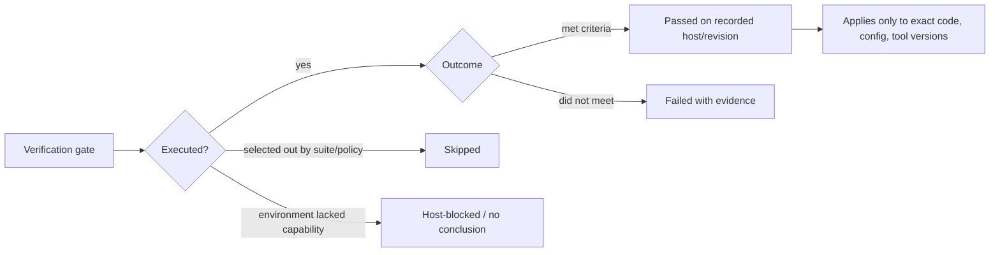
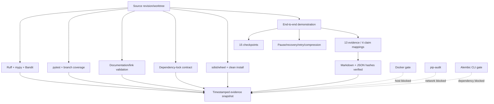
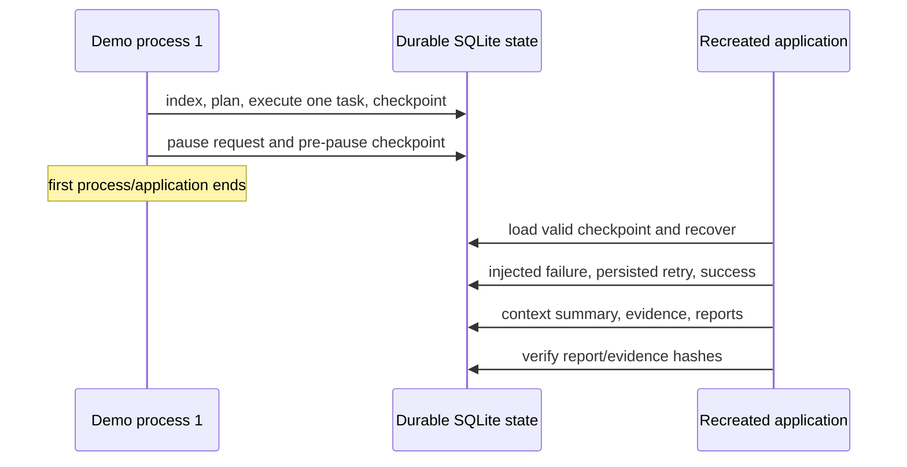

# Verification results

These results were captured on 2026-08-04 in the managed execution host (Linux,
CPython 3.10.12). They are an evidence snapshot, not a promise about future commits.
Production and CI target CPython 3.12.

## Quality gates

| Command | Actual result |
|---|---|
| `ruff format --check .` | Passed; 129 files formatted |
| `ruff check .` | Passed; no findings |
| `mypy src` | Passed; 75 source files, strict mode |
| `pytest` | 220 passed, 1 skipped in 92.76 s; machine-counted JUnit result |
| `pytest --cov=src/durable_agent --cov-branch --cov-report=term-missing` | 220 passed, 1 skipped in 57.14 s; 90.65% branch-aware coverage |
| Critical coverage | state transitions 100%, checkpoint manager 99%, evidence ledger 100%, recovery manager 97% |
| `pytest -m performance -q --durations=10` | 2 passed; storage/report case 1.43 s, 200-file indexing case 0.13 s |
| `python scripts/validate_docs.py` | Passed; 34 Markdown files and 64 local links |
| `python scripts/validate_dependency_lock.py` | Passed; 31 exact direct pins agree |
| `bandit -c pyproject.toml -r src` | Passed; zero issues |
| `python -m build` | Passed; sdist and wheel created |
| Clean wheel install | Package import and migration assets passed in an empty no-dependency venv; CLI help passed in a separate venv exposing the host runtime dependencies |

## End-to-end demonstration

The host lacked Alembic, so the isolated test-only metadata bootstrap was used; normal
developer/CI reproduction uses Alembic.

```bash
DURABLE_AGENT_LOG_LEVEL=ERROR PYTHONPATH=src python3 scripts/run_demo.py \
  --workspace /tmp/durable-agent-demo-release-20260804-v2 \
  --schema-mode metadata
```

Important actual output:

```json
{
  "checkpoint_count": 15,
  "context_compressed": true,
  "evidence_count": 13,
  "final_state": "COMPLETED",
  "initial_tasks_executed": 1,
  "recovery_event": true,
  "retry_attempts": {"research_constraints": 2},
  "run_id": "run-ef268815104c42c1bd574d8c89cda7dd"
}
```

Report verification found 13 valid evidence records, 4 claim mappings, and valid
Markdown/JSON hashes. The generated report records the pause, checkpoint recovery, and
injected retry. An independent `pytest -q` against the modified sample repository passed
all 4 tests.

A preliminary direct fixture-test invocation exposed an undeclared source-tree import
assumption. Adding `pythonpath = ["."]` to the fixture's pytest configuration removed the
assumption; both the source fixture (2 tests) and the agent-modified demo copy (4 tests)
then passed without an ambient `PYTHONPATH`.

## Host-blocked gates

- `alembic upgrade head` could not run because Alembic is not installed globally. The
  migration contract test skipped for the same reason. CI installs the exact dependency;
  the frozen-migration contract and metadata traceability confirmed all 25 tables and
  columns are mapped.
- `pip-audit --cache-dir /tmp/durable-agent-pip-audit-cache` could not resolve
  `pypi.org`; no vulnerability conclusion was produced. Bandit and offline security tests
  passed.
- `docker build .` could not access `/var/run/docker.sock`; the requested sandbox
  escalation was denied. No Docker-build pass is claimed.
- The host has older compatible FastAPI/Pydantic/SQLAlchemy/Typer/pytest/Ruff versions
  than the exact release constraints, and installing the complete pinned dependency set
  was denied. Source tests therefore do not prove the exact online resolver result.
- `requirements.lock` constrains every direct/optional dependency plus required
  Pydantic/Psycopg companion distributions, but does not contain transitive wheel hashes.
  A platform-specific hash lock and SBOM remain a release gate.

See [testing](testing.md), [operations](operations.md), and the [research log](research-log.md)
for reproduction policy and version-sensitive sources.

## How to interpret this snapshot

This document separates five statuses that must not be collapsed:



“Passed” means the command actually completed successfully at capture time. “Skipped” is
part of a completed test command but did not execute its target case. “Host-blocked” means
no conclusion about the gate. A related substitute—such as metadata schema comparison
when Alembic is absent—is useful evidence but not renamed into the missing gate.

## Verification evidence chain



The diagram records relationships, not a stronger attestation than the underlying
commands. This snapshot does not include cryptographic signing or a commit identifier in
an external transparency log.

## Coverage interpretation

The reported 90.65% is branch-aware aggregate coverage for the executed suite. Critical
module percentages are higher because lifecycle, checkpoint, recovery, and evidence
invariants carry disproportionate risk. Coverage does not prove semantic correctness;
the meaningful evidence is the combination of explicit negative cases, property
invariants, concurrency barriers, crash injection, security inputs, and end-to-end
restart behavior.

The one skipped test should be evaluated through the test report and host-blocked section
rather than treated as a pass. Future snapshots should preserve JUnit/coverage artifacts
when generated by CI so counts can be machine-audited.

## Demonstration interpretation

The demonstration's `final_state=COMPLETED` shows the workflow reached its terminal state
under the recorded deterministic scenario. `initial_tasks_executed=1` plus pause/restart
steps demonstrates bounded progress before a new application instance resumed.
`retry_attempts.research_constraints=2` demonstrates one injected transient failure and
successful bounded retry. `context_compressed=true`, `recovery_event=true`, and the
checkpoint/evidence counts show those paths executed; the report verifier then checked
the persisted claim/evidence and content hashes.



The metadata schema bootstrap is explicitly test-only. It demonstrates the domain and
SQL schema behavior on this constrained host, but it does not demonstrate the Alembic CLI
packaging/migration path. That remains correctly listed as blocked.

## Reproduction discipline

For a new snapshot, run gates against a clean checkout and record:

- commit/worktree state and current date/time zone;
- OS, CPU allocation, Python, database, and tool versions;
- exact commands and exit statuses;
- test/JUnit counts, coverage mode/report, skipped reasons;
- generated artifact/report hashes and demo workspace;
- every unavailable dependency, network, or privileged runtime capability.

Do not overwrite this historical result to reflect a later revision. Create a newly dated
section or generated verification artifact, and move “host-blocked” to “passed” only after
the exact missing command actually completes successfully.

## Residual release gap

The current snapshot establishes strong local source behavior but is not a complete
production release attestation because exact pinned-environment resolution, Alembic CLI
upgrade, current online vulnerability audit, transitive hash lock/SBOM, PostgreSQL
contract environment, and Docker build were not all executed here. CI/release
infrastructure must close those gaps and publish actual results without weakening the
documented distinction between evidence and assumption.
